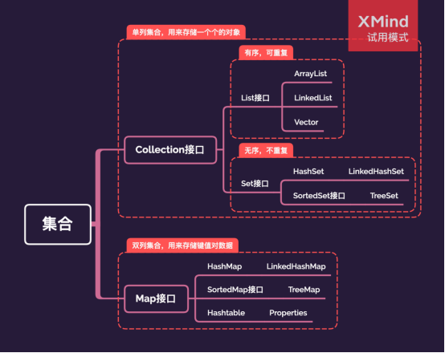

# 1、Collection接口

## 1.1、List接口

**有序可重复。**

### 1.1.1、Vector

1. 初始化：10个单位的`Object[]`；
2. 扩容：2倍，`int newCapacity = oldCapacity + ((capacityIncrement > 0) ? capacityIncrement : oldCapacity);`
3. 线程安全：底层方法使用`synchronized`；

### 1.1.2、ArrayList

1. 初始化：
   - JDK7：饿汉式，即时创建10个单位的`Object[]`；
   - JDK8：懒汉式，延迟数组创建，节省内存空间。`new ArrayList()<>`的时候创建`Object[]`类型的空数组，第一次`add`的时候若容量大小大于10，则按实际大小来，否则容量为10；
2. 扩容：1.5倍，`int newCapacity = oldCapacity + (oldCapacity >> 1);`10的二进制1010右移1位为101；
3. 线程不安全；

### 1.1.3、LinkedList

双向链表，底层维护了一个`Node`类型的两个指针。

对于频繁的插入和删除操作，效率高于`ArrayList`。

## 1.2、Set接口

**无序不重复。**

### 1.2.1、HashSet

1. 初始化：底层通过`HashMap`实现；
2. 可存储`NULL`值；
3. 七上八下；
4. 线程不安全；

#### 1.2.1.1、LinkedHashSet

作为`HashSet`的子类，在添加数据的同时，每个数据还维护了两个指针，分别指向前一个数据和后一个数据。

对于频繁的遍历操作，效率高于`HashSet`。

### 1.2.2、TreeSet

1. 排序：
   - 自然排序：要求`TreeSet`集合中存储的元素所在的类必须实现`Comparable`接口，并重写`compareTo()`方法；
   - 定制排序：通过自定义`Comparator`；
2. 线程不安全；

# 2、Map接口

**双列集合，可用来存储键值对数据。**

## 2.1、HashMap

1. 存储结构：
   - JDK7：数组+链表；
   - JDK8：数组+链表+红黑树；
2. 初始化：
   - JDK7：饿汉式，即时创建16个单位的`Entry<K, V>[]`，加载因子0.75；
   - JDK8：懒汉式，延迟数组创建，节省内存空间。`new HashMap<>()`的时候只初始化了加载因子0.75，并没有初始化数组，第一次`put`的时候才创建16个单位的`Node<K, v>[]`；
3. 扩容：
   - JDK7：实际`size`大于`16*0.75=12`的时候，则进行扩容；
   - JDK8：添加数据的时候，若某一个桶上的链表长度大于8并且数组的长度大于64的时候，则索引位置上的数据则改为红黑树存储；
4. 七上八下；
5. 键值都可以为`NULL`；
6. 线程不安全；

### 2.1.1、LinkedHashMap

作为`HashMap`的子类，在添加数据的同时，每个数据还维护了两个指针，分别指向前一个数据和后一个数据。

对于频繁的遍历操作，效率高于`HashMap`。

## 2.2、TreeMap

1. 排序：
   - 自然排序：要求`TreeMap`集合中`key`存储的元素所在的类必须实现`Comparable`接口，并重写`compareTo()`方法；
   - 定制排序：通过自定义`Comparator`；
2. 线程不安全；

## 2.3、Hashtable

1. 键值都不可以存储`NULL`；
2. 线程安全；

### 2.3.1、Properties

1. `Hashtable`的子类，键值都是`String`类型；
2. 线程安全；