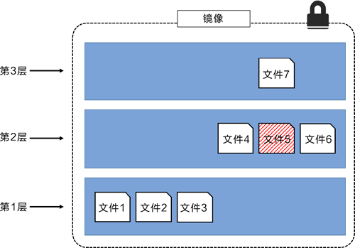

# 1、安装Docker

## 1.1、环境查看

```shell
#查看系统内核
[root@ryualvin107 ~]# uname -r
3.10.0-1160.el7.x86_64
#查看系统版本
[root@ryualvin107 ~]# cat /etc/os-release
NAME="CentOS Linux"
VERSION="7 (Core)"
ID="centos"
ID_LIKE="rhel fedora"
VERSION_ID="7"
PRETTY_NAME="CentOS Linux 7 (Core)"
ANSI_COLOR="0;31"
CPE_NAME="cpe:/o:centos:centos:7"
HOME_URL="https://www.centos.org/"
BUG_REPORT_URL="https://bugs.centos.org/"

CENTOS_MANTISBT_PROJECT="CentOS-7"
CENTOS_MANTISBT_PROJECT_VERSION="7"
REDHAT_SUPPORT_PRODUCT="centos"
REDHAT_SUPPORT_PRODUCT_VERSION="7"
```

## 1.2、安装

- 官网：https://docs.docker.com/engine/install/centos/

  ```shell
  #1、卸载旧版本
  yum remove docker \
                    docker-client \
                    docker-client-latest \
                    docker-common \
                    docker-latest \
                    docker-latest-logrotate \
                    docker-logrotate \
                    docker-engine
  #2、需要的安装包
  yum install -y yum-utils
  #3、设置镜像仓库
  yum-config-manager \
      --add-repo \
      https://download.docker.com/linux/centos/docker-ce.repo
  #3、设置国内镜像仓库
  yum-config-manager --add-repo http://mirrors.aliyun.com/docker-ce/linux/centos/docker-ce.repo
  #4、更新yum软件包索引
  yum makecache fast
  #5、安装docker docker-ce 社区版本 ee 企业版本
  yum install docker-ce-19.03.8-3.el7.x86_64 docker-ce-cli-19.03.8-3.el7.x86_64 containerd.io
  #6、启动docker
  systemctl start docker
  # 配置开机启动项
  systemctl enable docker
  #7、查看docker版本（判断是否安装&启动成功）
  docker version
  
  #8、运行hello-world容器
  [root@ryualvin107 ~]# docker run hello-world
  Unable to find image 'hello-world:latest' locally #找不到镜像
  latest: Pulling from library/hello-world #从仓库中拉取
  2db29710123e: Pull complete #以下为拉取的镜像
  Digest: sha256:faa03e786c97f07ef34423fccceeec2398ec8a5759259f94d99078f264e9d7af
  Status: Downloaded newer image for hello-world:latest
  
  Hello from Docker! #build镜像并运行
  This message shows that your installation appears to be working correctly.
  
  To generate this message, Docker took the following steps:
   1. The Docker client contacted the Docker daemon.
   2. The Docker daemon pulled the "hello-world" image from the Docker Hub.
      (amd64)
   3. The Docker daemon created a new container from that image which runs the
      executable that produces the output you are currently reading.
   4. The Docker daemon streamed that output to the Docker client, which sent it
      to your terminal.
  
  To try something more ambitious, you can run an Ubuntu container with:
   $ docker run -it ubuntu bash
  
  Share images, automate workflows, and more with a free Docker ID:
   https://hub.docker.com/
  
  For more examples and ideas, visit:
   https://docs.docker.com/get-started/
   
  #9、查看docker镜像
  docker images
  
  #10、卸载
  # 卸载依赖
  yum remove docker-ce docker-ce-li containerd.io
  # 删除资源，docker的默认工作路径
  rm -rf /var/lib/docker
  ```

### 1.2.1、阿里云镜像加速

无

# 2、Docker常用命令

## 2.0、其他命令

```shell
#查看Docker CPU状态
docker stats
```

## 2.1、帮助命令

- 帮助文档地址：https://docs.docker.com/reference/

  ```shell
  docker version		#显示docker版本信息
  docker info			#显示docker系统信息，包括镜像和容器的数量
  docker 命令 --help		#帮助命令
  ```

## 2.2、镜像命令

```shell
docker images --all		#显示所有镜像
docker images -a		#显示所有镜像
docker images --quiet	#只显示镜像ID
docker images -q		#只显示镜像ID
docker search mysql --filter=STARS=9000		#搜索过滤镜像，条件：STARS大于9000

#下载/拉取镜像
[root@ryualvin107 ~]# docker pull mysql
Using default tag: latest					#tag：版本，如果不写tag，默认就是latest
latest: Pulling from library/mysql
0bb5c0c24818: Pull complete 				#分层下载：docker的核心，联合文件系统
cbb3106fbb5a: Pull complete 
550536ae1d5e: Pull complete 
33f98928796e: Pull complete 
a341087cff11: Pull complete 
0e26ac5b33f6: Pull complete 
c883b83a7112: Pull complete 
873af5c876c6: Pull complete 
8fe8ebd061d5: Pull complete 
7ac2553cf6b4: Pull complete 
ad655e218e12: Pull complete 
Digest: sha256:96439dd0d8d085cd90c8001be2c9dde07b8a68b472bd20efcbe3df78cff66492		#签名/摘要
Status: Downloaded newer image for mysql:latest
docker.io/library/mysql:latest				#真实地址
#等价于
docker pull docker.io/library/mysql:latest

#指定版本下载
[root@ryualvin107 ~]# docker pull mysql:5.7
5.7: Pulling from library/mysql
9a0b9cd2dfe6: Pull complete 
c637408ee7df: Pull complete 
4c517093c276: Pull complete 
301cc7d68c2a: Pull complete 
17ca9bf9231a: Pull complete 
9ae101e5c786: Pull complete 
04baa409344e: Pull complete 
f0b6015bf853: Pull complete 
6005bb052ef8: Pull complete 
99f303d57050: Pull complete 
307a9a80c1df: Pull complete 
Digest: sha256:0e3435e72c493aec752d8274379b1eac4d634f47a7781a7a92b8636fa1dc94c1
Status: Downloaded newer image for mysql:5.7
docker.io/library/mysql:5.7

[root@ryualvin107 ~]# docker images
REPOSITORY          TAG                 IMAGE ID            CREATED             SIZE
mysql               latest              3842e9cdffd2        12 days ago         538MB
mysql               5.7                 eef0fab001e8        3 weeks ago         495MB
hello-world         latest              feb5d9fea6a5        14 months ago       13.3kB

#通过镜像ID删除
docker rmi -f eef0fab001e8
#通过空格隔离删除多个镜像
docker rmi -f ID1 ID2 ID3
#查出所有镜像ID并作为参数传入，然后通过ID递归删除所有镜像
docker rmi -f $(docker images -aq)
```

## 2.3、容器命令

### 2.3.1、运行

```bash
#拉取镜像
docker pull centos
#通过/bin/bash命令进入容器
[root@ryualvin107 ~]# docker run -it centos /bin/bash
--name="命名"				#容器命名，区分容器
-d						 #后台方式运行
-it						 #使用交互方式运行，进入容器查看内容
-p						 #指定容器的端口 -p 8080:8080
	-p ip:主机端口:容器端口
	-p 主机端口:容器端口（常用）
	-p 容器端口
-P						 #随机指定端口

#查看容器内的centos基础版文件结构，很多命令都是不完善的
[root@0f1d9365229e /]# ls
bin  dev  etc  home  lib  lib64  lost+found  media  mnt  opt  proc  root  run  sbin  srv  sys  tmp  usr  var
#从容器中退回主机
[root@0f1d9365229e /]# exit
```

### 2.3.2、查看

```shell
docker ps
			#列出当前正在运行的容器
-a			#列出当前正在运行的容器+历史运行过的容器
-n=?		#显示最近创建的容器，可指定个数
-q			#显示容器的编号
```

### 2.3.3、退出

```shell
exit		#直接停止容器并退出
Ctrl+P+Q	#不停止容器并退出
[root@ryualvin107 ~]# docker run -it centos /bin/bash
[root@9ef573e4f029 /]# ls
bin  dev  etc  home  lib  lib64  lost+found  media  mnt  opt  proc  root  run  sbin  srv  sys  tmp  usr  var
[root@9ef573e4f029 /]# [root@ryualvin107 ~]# 
[root@ryualvin107 ~]# docker ps -a
CONTAINER ID        IMAGE               COMMAND             CREATED             STATUS                      PORTS               NAMES
9ef573e4f029        centos              "/bin/bash"         25 seconds ago      Up 24 seconds                                   intelligent_babbage
0f1d9365229e        centos              "/bin/bash"         10 minutes ago      Exited (0) 36 seconds ago                       intelligent_sanderson
```

### 2.3.4、删除

```shell
docker rm 容器ID						#删除指定的容器，不能删除正在运行的容器，如果要强制删除-f
docker rm -f $(docker ps -aq) 	 	 #根据容器ID强制递归删除所有容器
docker ps -a -q | xargs docker rm	 #删除所有的容器
```

### 2.3.5、启动&停止

```shell
docker start 容器ID		#启动
docker restart 容器ID		#重启
docker stop 容器ID		#停止正在运行的容器
docker kill 容器ID		#强制停止当前容器，即使正在运行
```

### 2.3.6、后台启动容器

```shell
#关于[-d]的解析：https://blog.csdn.net/qq_25073223/article/details/125135654
docker run -d centos /bin/sh -c "while true;do echo hello world;sleep 1;done"
```

### 2.3.7、查看日志

```shell
docker logs --help
docker logs -t -f --tail 10 容器ID
```

### 2.3.8、查看进程

```shell
[root@ryualvin107 ~]# docker top 15ce58b6eeb4
UID   PID     PPID    C   STIME  TTY   TIME      CMD
root  114999  114983  59  09:14  ?     00:00:07  /bin/sh -c while true;do echo hello world;sleep1;done
```

### 2.3.9、查看容器元数据

```shell
[root@ryualvin107 ~]# docker inspect 15ce58b6eeb4
[
    {
        "Id": "15ce58b6eeb45df5d9015717e145b32e02b6de75c83dc1feb8072b26579d1e59",
        "Created": "2022-11-30T14:09:25.126690846Z",
        "Path": "/bin/sh",
        "Args": [
            "-c",
            "while true;do echo hello world;sleep1;done"
        ],
        "State": {
            "Status": "running",
            "Running": true,
            "Paused": false,
            "Restarting": false,
            "OOMKilled": false,
            "Dead": false,
            "Pid": 114999,
            "ExitCode": 0,
            "Error": "",
            "StartedAt": "2022-11-30T14:14:12.56626528Z",
            "FinishedAt": "2022-11-30T14:10:58.096795285Z"
        },
        "Image": "sha256:5d0da3dc976460b72c77d94c8a1ad043720b0416bfc16c52c45d4847e53fadb6",
        "ResolvConfPath": "/var/lib/docker/containers/15ce58b6eeb45df5d9015717e145b32e02b6de75c83dc1feb8072b26579d1e59/resolv.conf",
        "HostnamePath": "/var/lib/docker/containers/15ce58b6eeb45df5d9015717e145b32e02b6de75c83dc1feb8072b26579d1e59/hostname",
        "HostsPath": "/var/lib/docker/containers/15ce58b6eeb45df5d9015717e145b32e02b6de75c83dc1feb8072b26579d1e59/hosts",
        "LogPath": "/var/lib/docker/containers/15ce58b6eeb45df5d9015717e145b32e02b6de75c83dc1feb8072b26579d1e59/15ce58b6eeb45df5d9015717e145b32e02b6de75c83dc1feb8072b26579d1e59-json.log",
        "Name": "/gifted_curie",
        "RestartCount": 0,
        "Driver": "overlay2",
        "Platform": "linux",
        "MountLabel": "",
        "ProcessLabel": "",
        "AppArmorProfile": "",
        "ExecIDs": null,
        "HostConfig": {
            "Binds": null,
            "ContainerIDFile": "",
            "LogConfig": {
                "Type": "json-file",
                "Config": {}
            },
            "NetworkMode": "default",
            "PortBindings": {},
            "RestartPolicy": {
                "Name": "no",
                "MaximumRetryCount": 0
            },
            "AutoRemove": false,
            "VolumeDriver": "",
            "VolumesFrom": null,
            "CapAdd": null,
            "CapDrop": null,
            "Capabilities": null,
            "Dns": [],
            "DnsOptions": [],
            "DnsSearch": [],
            "ExtraHosts": null,
            "GroupAdd": null,
            "IpcMode": "private",
            "Cgroup": "",
            "Links": null,
            "OomScoreAdj": 0,
            "PidMode": "",
            "Privileged": false,
            "PublishAllPorts": false,
            "ReadonlyRootfs": false,
            "SecurityOpt": null,
            "UTSMode": "",
            "UsernsMode": "",
            "ShmSize": 67108864,
            "Runtime": "runc",
            "ConsoleSize": [
                0,
                0
            ],
            "Isolation": "",
            "CpuShares": 0,
            "Memory": 0,
            "NanoCpus": 0,
            "CgroupParent": "",
            "BlkioWeight": 0,
            "BlkioWeightDevice": [],
            "BlkioDeviceReadBps": null,
            "BlkioDeviceWriteBps": null,
            "BlkioDeviceReadIOps": null,
            "BlkioDeviceWriteIOps": null,
            "CpuPeriod": 0,
            "CpuQuota": 0,
            "CpuRealtimePeriod": 0,
            "CpuRealtimeRuntime": 0,
            "CpusetCpus": "",
            "CpusetMems": "",
            "Devices": [],
            "DeviceCgroupRules": null,
            "DeviceRequests": null,
            "KernelMemory": 0,
            "KernelMemoryTCP": 0,
            "MemoryReservation": 0,
            "MemorySwap": 0,
            "MemorySwappiness": null,
            "OomKillDisable": false,
            "PidsLimit": null,
            "Ulimits": null,
            "CpuCount": 0,
            "CpuPercent": 0,
            "IOMaximumIOps": 0,
            "IOMaximumBandwidth": 0,
            "MaskedPaths": [
                "/proc/asound",
                "/proc/acpi",
                "/proc/kcore",
                "/proc/keys",
                "/proc/latency_stats",
                "/proc/timer_list",
                "/proc/timer_stats",
                "/proc/sched_debug",
                "/proc/scsi",
                "/sys/firmware"
            ],
            "ReadonlyPaths": [
                "/proc/bus",
                "/proc/fs",
                "/proc/irq",
                "/proc/sys",
                "/proc/sysrq-trigger"
            ]
        },
        "GraphDriver": {
            "Data": {
                "LowerDir": "/var/lib/docker/overlay2/97fb2e4eea12586aaf73c64e3c64c25be26cda9402b27c8df94da00f71455b71-init/diff:/var/lib/docker/overlay2/1baafbe6aaa7f4d5b40ec9ebb503213eb2ec081b84d292817b67d48c2d2e9512/diff",
                "MergedDir": "/var/lib/docker/overlay2/97fb2e4eea12586aaf73c64e3c64c25be26cda9402b27c8df94da00f71455b71/merged",
                "UpperDir": "/var/lib/docker/overlay2/97fb2e4eea12586aaf73c64e3c64c25be26cda9402b27c8df94da00f71455b71/diff",
                "WorkDir": "/var/lib/docker/overlay2/97fb2e4eea12586aaf73c64e3c64c25be26cda9402b27c8df94da00f71455b71/work"
            },
            "Name": "overlay2"
        },
        "Mounts": [],
        "Config": {
            "Hostname": "15ce58b6eeb4",
            "Domainname": "",
            "User": "",
            "AttachStdin": false,
            "AttachStdout": false,
            "AttachStderr": false,
            "Tty": false,
            "OpenStdin": false,
            "StdinOnce": false,
            "Env": [
                "PATH=/usr/local/sbin:/usr/local/bin:/usr/sbin:/usr/bin:/sbin:/bin"
            ],
            "Cmd": [
                "/bin/sh",
                "-c",
                "while true;do echo hello world;sleep1;done"
            ],
            "Image": "centos",
            "Volumes": null,
            "WorkingDir": "",
            "Entrypoint": null,
            "OnBuild": null,
            "Labels": {
                "org.label-schema.build-date": "20210915",
                "org.label-schema.license": "GPLv2",
                "org.label-schema.name": "CentOS Base Image",
                "org.label-schema.schema-version": "1.0",
                "org.label-schema.vendor": "CentOS"
            }
        },
        "NetworkSettings": {
            "Bridge": "",
            "SandboxID": "007c4b7d2c8d0bad8922ca84f9a4aa5dbf13f6fa02be86fd7c749cc5ad7efb2c",
            "HairpinMode": false,
            "LinkLocalIPv6Address": "",
            "LinkLocalIPv6PrefixLen": 0,
            "Ports": {},
            "SandboxKey": "/var/run/docker/netns/007c4b7d2c8d",
            "SecondaryIPAddresses": null,
            "SecondaryIPv6Addresses": null,
            "EndpointID": "885ef27c25d5f9b7920f3facd5c7d6f897bf0784d283b6d97a653660a90e7429",
            "Gateway": "172.17.0.1",
            "GlobalIPv6Address": "",
            "GlobalIPv6PrefixLen": 0,
            "IPAddress": "172.17.0.2",
            "IPPrefixLen": 16,
            "IPv6Gateway": "",
            "MacAddress": "02:42:ac:11:00:02",
            "Networks": {
                "bridge": {
                    "IPAMConfig": null,
                    "Links": null,
                    "Aliases": null,
                    "NetworkID": "44c97b708be7cbab868b09448b78e9658a4c52cd16c6247aff48e3d9b24c260a",
                    "EndpointID": "885ef27c25d5f9b7920f3facd5c7d6f897bf0784d283b6d97a653660a90e7429",
                    "Gateway": "172.17.0.1",
                    "IPAddress": "172.17.0.2",
                    "IPPrefixLen": 16,
                    "IPv6Gateway": "",
                    "GlobalIPv6Address": "",
                    "GlobalIPv6PrefixLen": 0,
                    "MacAddress": "02:42:ac:11:00:02",
                    "DriverOpts": null
                }
            }
        }
    }
]
```

### 2.3.10、进入正在运行的容器

```shell
#通常都是使用后台方式运行容器，有时就需要进入容器，修改一些配置
#方式一：进入容器后开启一个新的终端，可以在里面操作（常用）
[root@ryualvin107 ~]# docker exec -it e1612f974e6b /bin/bash
[root@e1612f974e6b /]# 
#方式二：进入容器正在执行的终端，不会启动新的进程！
[root@ryualvin107 ~]# docker attach e1612f974e6b
hello world
hello world
hello world
hello world
```

### 2.3.11、将容器内文件拷贝至主机

```shell
[root@ryualvin107 /]# docker ps -a
CONTAINER ID    IMAGE   COMMAND                  CREATED         STATUS              PORTS               NAMES
e1612f974e6b    centos  "/bin/sh -c 'while t…"   10 minutes ago  Up 10 minutes                           relaxed_sutherland
#进入正在运行的容器内
[root@ryualvin107 /]# docker exec -it e1612f974e6b /bin/bash
#创建一个新文件
[root@e1612f974e6b /]# touch /home/ryutest.java
[root@e1612f974e6b /]# ls /home
ryutest.java
#退出但不停止容器
[root@e1612f974e6b /]# read escape sequence
#将容器内的文件拷贝至主机
[root@ryualvin107 /]# docker cp e1612f974e6b:/home/ryutest.java /home/ryutest111.java
[root@ryualvin107 /]# ls /home
ryualvin  ryutest111.java
[root@ryualvin107 /]# 
```

## 2.4、常用命令小结


```shell
attach		Attach to a running container 										#当前shell下attach连接指定运行镜像
build		Build an image from a Dockerfile 									#通过Dockerfile定制镜像
commit 		Create a new image from a container changes 						#提交当前容器为新的镜像
cp 			Copy files/folders from the containers filesystem to the host path	#从容器中拷贝指定文件或者目录到宿主机中
create 		Create a new container 												#创建一个新的容器，同run，但不启动容器
diff 		Inspect changes on a container's filesystem 						#查看docker容器变化
events 		Get real time events from the server 								#从docker服务获取容器实时事件
exec 		Run a command in an existing container 								#在已存在的容器上运行命令
export 		Stream the contents of a container as a tar archive 				#导出容器的内容流作为一个tar归档文件[对应import]
history 	Show the history of an image 										#展示一个镜像形成历史
images 		List images 														#列出系统当前镜像
import 		Create a new filesystem image from the contents of a tarball 		#从tar包中的内容创建一个新的文件系统映像[对应export]
info 		Display system-wide information 									#显示系统相关信息
inspect 	Return low-level information on a container 						#查看容器详细信息
kill 		Kill a running container 											#kill指定docker容器
load 		Load an image from a tar archive 									#从一个tar包中加载一个镜像[对应save]
login 		Register or Login to the docker registry server 					#注册或者登陆一个docker源服务器
logout 		Log out from a Docker registry server 								#从当前Docker registry退出
logs 		Fetch the logs of a container 										#输出当前容器日志信息
port 		Lookup the public-facing port which is NAT-ed to PRIVATE_PORT 		#查看映射端口对应的容器内部源端口
pause 		Pause all processes within a container 								#暂停容器
ps 			List containers 													#列出容器列表
pull 		Pull an image or a repository from the docker registry server 		#从docker镜像源服务器拉取指定镜像或者库镜像
push 		Push an image or a repository to the docker registry server 		#推送指定镜像或者库镜像至docker源服务器
restart 	Restart a running container 										#重启运行的容器
rm 			Remove one or more containers 										#移除一个或者多个容器
rmi 		Remove one or more images 											#移除一个或多个镜像[无容器使用该镜像才可删除，否则需删除相																				   关容器才可继续或-f强制删除]
run 		Run a command in a new container 									#创建一个新的容器并运行一个命令
save 		Save an image to a tar archive 										#保存一个镜像为一个tar包[对应load]
search 		Search for an image on the Docker Hub 								#在docker hub中搜索镜像
start 		Start a stopped containers 											#启动容器
stop 		Stop a running containers 											#停止容器
tag 		Tag an image into a repository 										#给源中镜像打标签
top 		Lookup the running processes of a container 						#查看容器中运行的进程信息
unpause 	Unpause a paused container 											#取消暂停容器
version 	Show the docker version information 								#查看docker版本号
wait 		Block until a container stops, then print its exit code 			#截取容器停止时的退出状态值
```

## 2.5、练习

### 2.5.1、部署Nginx

1. 查找Nginx镜像；

2. 拉取Nginx镜像；

3. 运行Nginx镜像，后台运行，命名，指定端口（外部端口:容器内部端口）；

4. curl；

5. 开放防火墙端口，如果是阿里云：开放安全组策略；

   ```shell
   #可先检索镜像docker search nginx，然后拉取镜像docker pull nginx
   #运行容器
   [root@ryualvin107 /]# docker run -d --name nginx01 -p 3344:80 nginx
   78552a067062d7e99ceea7e3f36eb8e5c9d8bf2de8682fd107df126c495dc525
   #查看所有容器
   [root@ryualvin107 /]# docker ps -a
   CONTAINER ID   IMAGE   COMMAND                  CREATED             STATUS              PORTS                  NAMES
   78552a067062   nginx   "/docker-entrypoint.…"   4 seconds ago       Up 3 seconds        0.0.0.0:3344->80/tcp   nginx01
   #curl命令相当于命令行的postman，不带有任何参数时，就是发出get请求
   [root@ryualvin107 /]# curl localhost:3344
   <!DOCTYPE html>
   <html>
   <head>
   <title>Welcome to nginx!</title>
   <style>
   html { color-scheme: light dark; }
   body { width: 35em; margin: 0 auto;
   font-family: Tahoma, Verdana, Arial, sans-serif; }
   </style>
   </head>
   <body>
   <h1>Welcome to nginx!</h1>
   <p>If you see this page, the nginx web server is successfully installed and
   working. Further configuration is required.</p>
   
   <p>For online documentation and support please refer to
   <a href="http://nginx.org/">nginx.org</a>.<br/>
   Commercial support is available at
   <a href="http://nginx.com/">nginx.com</a>.</p>
   
   <p><em>Thank you for using nginx.</em></p>
   </body>
   </html>
   #进入nginx容器
   [root@ryualvin107 /]# docker exec -it 78552a067062 /bin/bash
   #查询nginx位置，/etc/nginx为配置文件存放位置，/usr/share/nginx为html存放位置
   root@78552a067062:/# whereis nginx
   nginx: /usr/sbin/nginx /usr/lib/nginx /etc/nginx /usr/share/nginx
   root@78552a067062:/# exit
   exit
   [root@ryualvin107 /]# docker ps -a
   CONTAINER ID   IMAGE   COMMAND                  CREATED             STATUS              PORTS                  NAMES
   78552a067062   nginx   "/docker-entrypoint.…"   57 seconds ago      Up 56 seconds       0.0.0.0:3344->80/tcp   nginx01
   #开启宿主机的3344端口
   [root@ryualvin107 /]# firewall-cmd --zone=public --add-port=3344/tcp --permanent
   success
   ```

   


### 2.5.2、部署Tomcat

```shell
#官方提供的命令：一般用来测试，用完就删除
#我们之前用的都是后台运行，即使停止了，容器还是可以查到，但是上面的命令停止了就删除
docker run -d --rm tomcat:9.0
#先下载
docker pull tomcat
#再启动
docker run -d -p 4455:8080 --name tomcat01
#进入容器
docker exec -it tomcat01 /bin/bash
#官方提供的镜像是阉割版的镜像，需要将webapps.dist下的内容拷贝到webapps下，页面访问才会显示html内容
cp -r webapps.dist/* webapps
```

### 2.5.3、部署ES+Kibana

```shell
#普通启动
docker run -d --name elasticsearch -p 9200:9200 -p 9300:9300 -e "discovery.type=single-node" elasticsearch:7.6.2
#增加内存限制，修改配置文件 -e 环境配置修改
docker run -d --name elasticsearch -p 9200:9200 -p 9300:9300 -e "discovery.type=single-node" -e ES_JAVA_OPTS="-Xms64m -Xms512m" elasticsearch:7.6.2
```

```
docker run -d -p 8088:9000 --restart=always -v /var/run/docker.sock:/var/run/docker.sock --privileged=true portainer/portainer
```

# 3、Docker可视化

## 3.1、Portainer

```shell
docker pull portainer/portainer
docker run -d -p 8088:9000 --restart=always -v /var/run/docker.sock:/var/run/docker.sock --privileged=true --name portainer portainer/portainer
```


## 3.2、Rancher

# 4、Docker镜像讲解

## 4.1、镜像是什么

镜像是一种轻量级、可执行的独立软件包，用来打包软件运行环境和基于运行环境开发的软件。它包含运行某个软件所需的所有内容，包括代码、运行时、库、环境变量和配置文件。

## 4.2、Docker镜像加载原理

### 4.2.1、UnionFS（联合文件系统）

UnionFS（联合文件系统）：是一种分层、轻量级并且高性能的文件系统。它支持对文件系统的修改作为一次提交来一层层的叠加，同时可以将不同目录挂载到同一个虚拟文件系统下（unite several directories into a single virtual filesystem）。联合文件系统是Docker镜像的基础。镜像可以通过分层来进行继承，基于基础镜像（没有父镜像），可以制作各种具体的应用镜像。

特性：一次同时加载多个文件系统，但从外面看起来，只能看到一个文件系统，联合加载会把各层文件系统叠加起来，这样最终的文件系统会包含所有底层的文件喝目录。

### 4.2.2、Docker镜像加载原理

Doker的镜像实际上由一层一层的文件系统组成，这种层级的文件系统叫做UnionFS（联合文件系统）。

bootfs（boot file system）主要包含bootloader和kernel，bootloader主要是引导加载kernel。Linux刚启动时会加载bootfs文件系统，在Docker镜像的最底层是bootfs。这一层与我们典型的Linux/Unix系统是一样的，包含boot加载器和内核。当boot加载完成之后整个内核就都在内存中了，此时内存的使用权已由bootfs转交给内核，此时系统也会加载bootfs。

rootfs（root file system）在bootfs之上，包含的就是典型Linux系统中的/dev，/proc，/bin，/etc等标准目录和文件。rootfs就是各种不同的操作系统发行版，比如Ubuntu，CentOS等等。


平时我们安装进虚拟机的CentOS都是好几个G，为什么Docker这里才200M？


对于一个精简的OS，rootfs可以很小，只需要包含最基本的命令，工具和程序库就可以了。因为底层直接用Host的kernel，自己只需要提供rootfs就可以了。由此可见对于不同的Linux发行版，bootfs基本是一致的，rootfs会有差别，因此不同的发行版可以公用bootfs。

### 4.2.3、分层理解

> 分层的镜像

当下载一个镜像的时候，注意观察下载的日志输出，可以看到是一层一层的在下载。


为什么Docker镜像要采用这种分层的结构？

最大的好处，就是资源共享，比如有多个镜像都从相同的Base镜像构建而来，那么宿主机只需在磁盘上保留一份Base镜像，同时内存中也只需要加载一份Base镜像，这样就可以为所有的容器服务了，而且镜像的每一层都可以被共享。

查看镜像分层的方式可以通过`docker image inspect`

```shell
[root@ryualvin107 ~]# docker images -a
REPOSITORY            TAG                 IMAGE ID            CREATED             SIZE
portainer/portainer   latest              5f11582196a4        12 days ago         287MB
redis                 latest              3358aea34e8c        2 weeks ago         117MB
nginx                 latest              88736fe82739        2 weeks ago         142MB
tomcat                latest              1ca69d1bf49a        2 weeks ago         474MB
centos                latest              5d0da3dc9764        14 months ago       231MB
elasticsearch         7.6.2               f29a1ee41030        2 years ago         791MB
#查看镜像元数据
[root@ryualvin107 ~]# docker images inspect redis
"docker images" requires at most 1 argument.
See 'docker images --help'.

Usage:  docker images [OPTIONS] [REPOSITORY[:TAG]]

List images
[root@ryualvin107 ~]# docker image inspect redis
[
    {
        "Id": "sha256:3358aea34e8c871cc2ecec590dcefcf0945e76ec3f82071f30156ed1be97a5fb",
        "RepoTags": [
            "redis:latest"
        ],
        "RepoDigests": [
            "redis@sha256:1e3207c292225b6dd21cb74d59255748a50e8f739dd983040df38fa913927cf1"
        ],
// ...
        "RootFS": {
            "Type": "layers",
            "Layers": [
                "sha256:ec4a38999118b78eab6899b913a548cb0b2c9b68fd05aff846a56b628b597f38",
                "sha256:84566964bca193ac5c256640dad5288e8169ae5b5e60f41cc701a02acba13a25",
                "sha256:95dff52c35dd01bceeb0b2d6c81effebc235df6f584591ec197c114b587a415c",
                "sha256:1a2d05341f7504682cdc6fdbb99bc7cb4983a7f2cb639494938934266570e29c",
                "sha256:8fc62bcb8f2733c00ba15f8b992d39e9bf1d1c7b2ce3cd0aff3bd5387119561a",
                "sha256:b5e37833e629c35c265d1f4f70633b4f7f8c15436ed31aba7acff1e350d03788"
            ]
        },
        "Metadata": {
            "LastTagTime": "0001-01-01T00:00:00Z"
        }
    }
]
```

所有的Docker镜像都起始于一个基础镜像层，当进行修改或增加新的内容时，就会在当前镜像曾之上，创建新的镜像层。

举一个简单的例子，例如基于Ubuntu Linux 16.04创建一个新的镜像，这就是新镜像的第一层；如果在该镜像中添加Python包，就会在基础镜像层之上创建第二个镜像层；如果继续添加一个安全补丁，就会创建第三个镜像层。

该镜像当前已经包含3个镜像层，如下图所示：


在添加额外的镜像层的同时，镜像始终保持是当前所有镜像的组合。例如下图：每个镜像层包含3个文件，而镜像包含了来自两个镜像层的6个文件。


在需要更新镜像层中的某个文件的时候，可新加一层镜像，在此新镜像层中，对某个文件做替换，这样就使得文件的更新版本作为一个新镜像层添加到镜像当中。例如下图：第3层中的文件7就是对第2层中的文件5的一个更新版本。



Docker通过存储引擎（新版本采用快照机制）的方式来实现镜像层堆栈，并保证多镜像层对外展示为统一的文件系统。

下图展示了与系统显示相同的三层镜像，所有镜像层堆叠合并，对外提供统一的视图。


> 特点

Docker镜像都是只读的，当容器启动时，一个新的可写曾被加载到镜像的顶部！

这一层就是我们通常说的容器曾，容器之下的都叫镜像层！

## 4.3、镜像提交

```shell
[root@ryualvin107 ~]# docker run -it -p 8081:8080 --name tomcat01 tomcat
[root@ryualvin107 ~]# docker exec -it tomcat01 /bin/bash
root@c7ba0eda6625:/usr/local/tomcat# cp -r webapps.dist/* webapps
[root@ryualvin107 ~]# docker ps -a
CONTAINER ID  IMAGE   COMMAND             CREATED        STATUS          PORTS                     NAMES
c7ba0eda6625  tomcat  "catalina.sh run"   2 minutes ago  Up 2 minutes    0.0.0.0:8081->8080/tcp    tomcat01
[root@ryualvin107 ~]# docker commit -a="ryualvin" -m="tomcat with html" c7ba0eda6625  tomcat02:1.1
[root@ryualvin107 ~]# docker run -it -p 8082:8080 --name tomcat02 tomcat02:1.1
```

# 5、容器数据卷

## 5.1、什么是容器数据卷

将应用和运行的环境打包行程容器运行，运行可以伴随着容器，但是我们对于数据的要求，是希望能够持久化的！

就好比，你安装一个MySQL，结果你把容器删了，就相当于删库跑路了。

所以我们希望容器之间有可能可以共享数据，Docker容器产生的数据，如果不通过docker commit生成新的镜像，使得数据作为镜像的一部分保存下来，那么当容器删除后，数据自然也就没有了！这样是行不通的！

为了能保存数据在Docker中我们就可以使用卷！让数据挂载到我们本地！这样数据就不会因为容器删除而丢失了！

> 作用

卷就是目录或者文件，存在一个或者多个容器中，由Docker挂载到容器，但不属于联合文件系统，因此能够绕过联合文件系统，提供一些用于持续存储或共享数据的特性。

卷的设计目的就是数据的持久化，完全独立于容器的生存周期，因此Docker不会再容器删除时删除其挂载的数据卷。

> 特点

1. 数据卷可在容器之间共享或重用数据；
2. 卷中的更改可以直接生效；
3. 数据卷中的更改不会包含在镜像的更新中；
4. 数据卷的生命周期一直持续到没有容器使用它为止；
5. 总结：就是容器的持久化，以及容器间的继承和数据共享！

## 5.2、方式一：通过-v使用数据卷

```shell
[root@ryualvin107 ~]# docker run -it -v /home/volumestest:/home centos /bin/bash
[root@ryualvin107 ~]# docker inspect ffa991257ffe
        "Mounts": [
            {
                "Type": "bind",
                "Source": "/home/volumestest",
                "Destination": "/home",
                "Mode": "",
                "RW": true,
                "Propagation": "rprivate"
            }
        ],

```

即使停止容器，在宿主机的目录上增加文件，或者修改文件后，启动停止的容器，然后查看发现指定的挂载目录上文件或者文件内容依然可以同步。

> 使用Docker安装MySQL

```shell
[root@ryualvin107 ~]# docker run -d -p 3310:3306 -v /home/mysql/conf:/etc/mysql/conf.d -v /home/mysql/data:/var/lib/mysql -e MYSQL_ROOT_PASSWORD=sBen410109 --name mysql01 mysql:5.7
```

### 5.2.1、匿名和具名挂载

```shell
#-v 容器内路径 容器内-P（大写的P）随机分配端口
[root@ryualvin107 test]# docker run -d -P --name nginx01 -v /etc/nginx nginx
#查看所有volume的情况
[root@ryualvin107 test]# docker volume ls
DRIVER    VOLUME NAME
local     499abdb5fe6327be7525ce6e183d854e74885b804a4d09b2540b056cd97a7c85
local     ba82c512f81dadb51083dbfb55a8f97185583c72910e75b6bbd1dafa8ef97f7d
#-v 宿主机路径:容器内路径
#-v /juming-nginx:/etc/nginx，才是指定具体的宿主机路径
#-v 卷名:容器内路径
#-v juming-nginx:/etc/nginx，而是具名挂载
[root@ryualvin107 test]# docker run -d -P --name nginx02 -v juming-nginx:/etc/nginx nginx
[root@ryualvin107 test]# docker volume ls
DRIVER              VOLUME NAME
local               499abdb5fe6327be7525ce6e183d854e74885b804a4d09b2540b056cd97a7c85
local               ba82c512f81dadb51083dbfb55a8f97185583c72910e75b6bbd1dafa8ef97f7d
local               juming-nginx
#查看卷的具体信息
#没有指定具体路径的挂载都位于这个目录："/var/lib/docker/volumes/"
#Docker的核心位置："/var/lib/docker/"
[root@ryualvin107 test]# docker volume inspect juming-nginx
[
    {
        "CreatedAt": "2022-12-04T08:49:06-05:00",
        "Driver": "local",
        "Labels": null,
        "Mountpoint": "/var/lib/docker/volumes/juming-nginx/_data",
        "Name": "juming-nginx",
        "Options": null,
        "Scope": "local"
    }
]
```

> 如何区分是具名挂载、匿名挂载、指定路径挂载

```shell
-v 容器内路径			#匿名挂载
-v 挂载名:容器内路径	  #具名挂载
—v 宿主机路径:容器内路径	 #指定路径挂载
```

### 5.2.2、ro和rw

```shell
#ro：readonly，一旦设置了readonly，只能通过宿主机操作改变，容器内部只有只读的权限
[root@ryualvin107 test]# docker run -d -P --name nginx02 -v juming-nginx:/etc/nginx:ro nginx
#rw：read write，可读可写，默认权限
[root@ryualvin107 test]# docker run -d -P --name nginx02 -v juming-nginx:/etc/nginx:rw nginx
```

## 5.3、方式二：通过DockerFile的VOLUME

```shell
[root@ryualvin107 ~]# vim dockerfile1
# volume test
FROM centos
VOLUME ["/dataVolumeContainer1","/dataVolumeContainer2"]
CMD echo "-------end------"
CMD /bin/bash
```

## 5.3、数据卷容器

给容器1挂载数据卷，其他容器通过挂载容器1实现数据共享。此时，容器1相当于父容器（即数据卷容器），类似与java中类继承的思想。

```shell
#父容器
[root@ryualvin107 ~]# docker run -d -p 3310:3306 -v /etc/mysql -v /var/lib/mysql -e MYSQL_ROOT_PASSWORD=sBen410109 --name mysql01 mysql:5.7
#容器mysql02继承父容器
[root@ryualvin107 ~]# docker run -d -p 3310:3306 -v /etc/mysql -v /var/lib/mysql -e MYSQL_ROOT_PASSWORD=sBen410109 --name mysql02 --volumes-from mysql01 mysql:5.7
#容器mysql03继承容器mysql02
[root@ryualvin107 ~]# docker run -d -p 3310:3306 -v /etc/mysql -v /var/lib/mysql -e MYSQL_ROOT_PASSWORD=sBen410109 --name mysql03 --volumes-from mysql02 mysql:5.7
```

> 结论

容器之间配置信息的传递，可以依靠数据卷容器，数据卷的生命周期会一直持续到没有容器使用它为止。

一旦挂载到宿主机的文件则会一直保留。
