# 0、常见问题

## Permission denied (publickey)

```bash
ryualvin@LAPTOP-1FN99F9S MINGW64 /d/develop/project/rensyu (master)
$ git push -u origin master
git@github.com: Permission denied (publickey).
fatal: Could not read from remote repository.

Please make sure you have the correct access rights
and the repository exists.
```

原因：如果已经配置过公钥密钥，并且在git的配置文件中设置过host，那么在添加新的远程仓库的时候，就通过host名来指定远程仓库。

解决：

```bash
git remote set-url origin github_RyuAlvin:RyuAlvin/Project.git
```

```bash
# 访问github的SSH密钥
# Host别名
Host github_RyuAlvin
# github地址
 	HostName github.com
# git@github.com
 	User git
# 通过.pub文件认证
 	PreferredAuthentications publickey
# 密钥文件地址
 	IdentityFile D:\develop\git\SSH-Key\id_rsa_github_RyuAlvin
```

## Git Bash终端文件名都只显示数字串

原因：在默认设置下，中文文件名在工作区状态输出，中文名不能正确显示，而是显示为八进制的字符编码。

解决：

```bash
git config --global core.quotepath false
```

## fatal：refusing to merge unrelated histories

过程：

1. GitHub上新建仓库A；
2. 本地初始化仓库B，并设置remote orgin为远程仓库A的地址；
3. 本地执行pull或者push操作；

解决：

```bash
git pull origin master --allow-unrelated-histories
```

## Enter passphrase for key '本地SSH私钥地址'

原因：应该是生成公钥和私钥的时候设置了密码，导致每次操作git都需要输入密码。

解决：

```bash
# 命令
ssh-keygen -p [-P old_passphrase] [-N new_passphrase] [-f keyfile]
# sample
ssh-keygen -p -P 123456 -N '' -f ~/.ssh/id_rsa
```

## ^和~的差别

https://blog.csdn.net/albertsh/article/details/106448035

不加数字的情况下或者数字是1的情况下，^和~效果相同，都是指向第一个父节点：

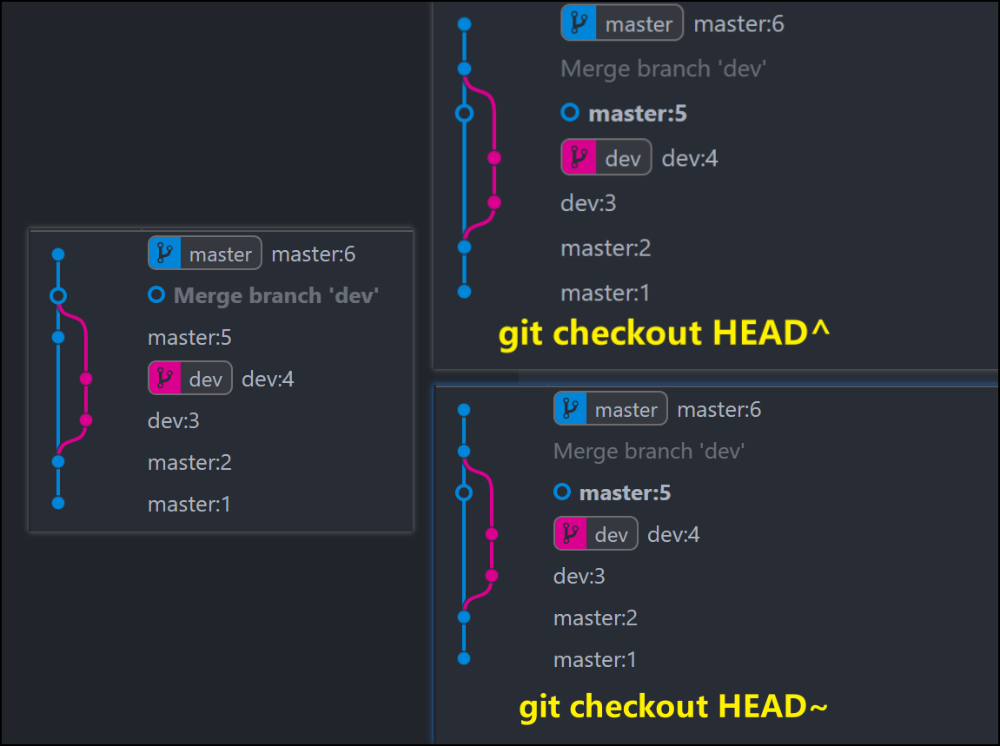

数字大于2的情况下，~永远指向的是第一个父节点，连续退后至第一个父节点；而对于合并后的节点来说，存在2个父节点，所以^2则指向的是第2个父节点：

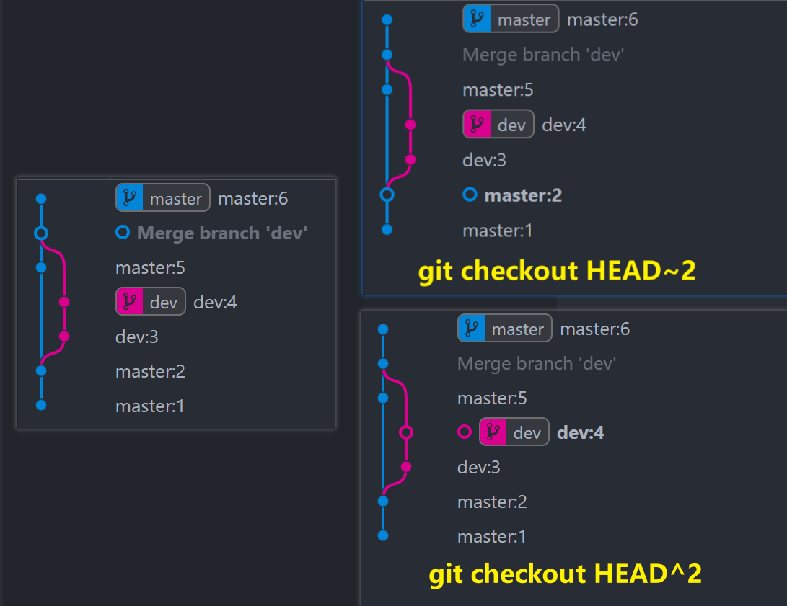

## 合并多个历史提交记录

```bash
$ git log --oneline
b2beb0e (HEAD -> master, origin/master) ryualvin初版构建
85bfc55 ryualvin初版构建
bb056d7 ryualvin初版构建
aa542ca Create .gitignore
```

交互式rebase：

```bash
git rebase -i HEAD~3
```

git会打开一个交互式的编辑器，b2beb0e的HEAD~3指向的是aa542ca，显示从b2beb0e到aa542ca之间的所有提交，但是不包括aa542ca：

```bash
pick bb056d7 comment1
pick 85bfc55 comment2
pick b2beb0e comment3
```

将最近两个提交的pick改成squash（或简写s）：

```bash
pick bb056d7 comment1
squash 85bfc55 comment2
squash b2beb0e comment3
```

保存并关闭编辑器。这样后面的两个提交b2beb0e和85bfc55就会被合并到前面的提交bb056d7中。

接下来，git会打开另一个编辑器，供你编辑合并后的提交消息。

编辑完成后，保存并关闭编辑器。git会应用你的更改，将多个提交合并成一个并提交。

```bash
$ git log --oneline
27d0e69 (HEAD -> master) ryualvin初版构建
aa542ca Create .gitignore
```

如果被合并的提交在之前已经推送到远程仓库，那么，合并提交后需要强制推送来覆盖远程仓库历史：

```bash
git push origin master --force
```

## 关于checkout撤销修改

checkout只能撤销工作空间中的修改，并且该文件存在于本地库版本中。若checkout对象文件不存在本地库版本中，则会报一下错误（路径指定的文件并不匹配git中的任何文件）：

```bash
ryualvin@LAPTOP-1FN99F9S MINGW64 ~/Desktop/gitTest - 副本 (master)
$ git checkout -- 2.txt
error: pathspec '2.txt' did not match any file(s) known to git
```

# 1、工作流程和文件状态

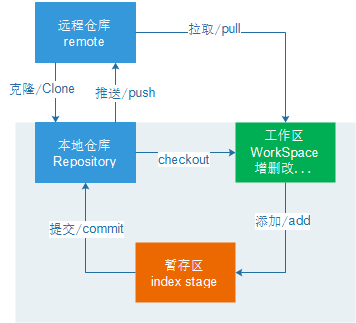

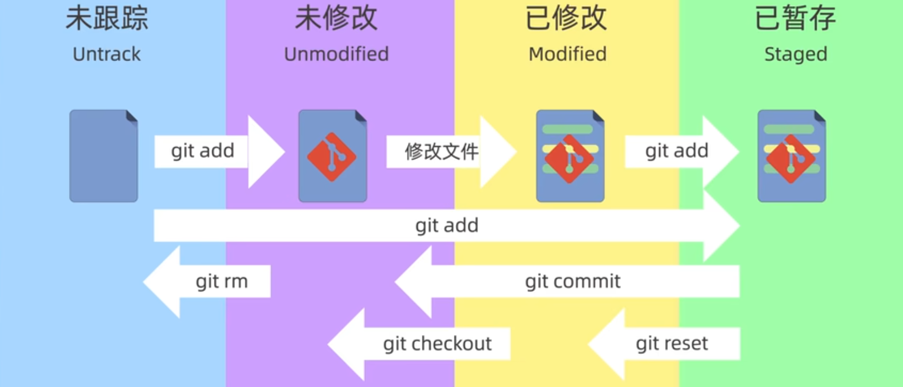

# 2、配置

| 描述                                 | 命令                                                         |
| ------------------------------------ | ------------------------------------------------------------ |
| 全局配置，所有仓库生效               | git config --global user.name ryualvin<br/>git config --global user.email xxx@gmail.com |
| 系统配置，对所有用户生效             | git config --system user.name ryualvin<br/>git config --system user.email xxx@gmail.com |
| 用户名中如果存在空格，需要加双引号   | git config --global user.name “ryu alvin”                    |
| 保存用户名和密码                     | git config --global credential.helper store                  |
| 查看全局配置和系统配置，或者所有配置 | git config --global --list<br/>git config --system --list<br/>git config --list |
| 查看某一项配置                       | git config user.name                                         |
| 获取config命令的手册                 | git help config                                              |
| 简化命令                             | 将命令git status简化为st：<br>git config --global alias.st status |

# 3、创建仓库

| 描述                                             | 命令                                            |
| ------------------------------------------------ | ----------------------------------------------- |
| 创建本地仓库                                     | git init                                        |
| 创建本地仓库，并指定仓库名                       | git init learn-repo                             |
| 克隆一个远程仓库<br>注意：默认以origin为简写名称 | git clone https://github.com/xxx/learn-repo.git |

# 4、文件操作

| 描述                                                         | 命令                                                         |
| ------------------------------------------------------------ | ------------------------------------------------------------ |
| 查看文件状态                                                 | git status                                                   |
| 工作区=>暂存区<br>可使用通配符，或指定文件                   | git add .                                                    |
| 暂存区=>本地仓库                                             | git commit -m "message"                                      |
| 工作区=>本地仓库<br>对于本地仓库中有快照副本的文件才有效     | git commit -am "message"                                     |
| 先从工作区删除再提交                                         | rm temp.txt<br>git add temp.txt<br>git commit -m "message"   |
| 从工作区和暂存区都同时删除                                   | git rm temp.txt<br>相当于：<br>rm temp.txt<br>git add .      |
| 从暂存区删除但保留再工作区<br>删除文件的跟踪状态             | git rm --cached temp.txt                                     |
| 忽略文件<br>.gitignore只能忽略未跟踪状态的文件<br>如果远程仓库已经有了logs文件夹，可以使用该操作删除 | 删除文件的跟踪状态：<br>git rm --cached logs/xx.log<br>此时本地工作区修改还在。<br>更新.gitignore文件后，删除远程仓库对应的文件：<br>git add . & git commit -m "xx" & git push |

```bash
On branch master
# 暂存区中的temp.txt已经被删除
Changes to be committed:
  (use "git restore --staged <file>..." to unstage)
        deleted:    temp.txt
# 由于暂存区中的temp.txt已经被删除，所以工作区中的temp.txt相对于暂存区来说相当于一个新的文件
Untracked files:
  (use "git add <file>..." to include in what will be committed)
        temp.txt
```

| 描述                                                         | 命令                                                         |
| ------------------------------------------------------------ | ------------------------------------------------------------ |
| 递归删除该文件夹下的所有子目录和文件                         | git rm -r *                                                  |
| 更改文件名                                                   | git mv temp.txt xyz.txt<br>相当于：<br>mv temp.txt xyz.txt<br>git rm temp.txt<br>git add xyz.txt |
| 恢复一个文件到之前的版本                                     | git checkout temp.txt 71dks8                                 |
| 撤销工作区的修改<br>只能撤销工作区的修改，且不可恢复，不会撤销暂存区修改 | git checkout .<br>git checkout temp.txt                      |
| 修改（取代）最近一次提交信息：<br>提交后发现漏某些文件或者提交信息写错<br>注意：切勿修改共有提交 | git commit -m "initial commit"<br>git add forget_file.txt<br>git commit --amend<br>弹出vim编辑框，输入提交信息。<br>或者：git commit --amend -m "modify commit" |
| 把当前工作现场储藏起来，等以后恢复现场后继续工作<br>-u参数表示把所有未跟踪的文件也一起存储<br>-a参数表示把所有未跟踪的文件和忽略的文件也一并存储<br>save参数表示存储的信息，可以不写 | git stash save "message"                                     |
| 查看stash列表                                                | git stash list                                               |
| 弹栈，恢复后就从stash list中删除                             | git stash pop                                                |
| 恢复指定的stash<br>stash@{2}表示第三个stash，stash@{0}表示最近的stash | git stash pop stash@{2}                                      |
| 只应用，不弹栈，恢复后不从stash list中删除                   | git stash apply                                              |
| 应用指定的stash                                              | git stash apply stash@{2}                                    |
| 手动删除指定的stash                                          | git stash drop stash@{2}                                     |
| 清空stash list                                               | git stash clear                                              |

# 5、提交历史

| 描述               | 命令                                                         |
| ------------------ | ------------------------------------------------------------ |
| 查看版本信息       | git log                                                      |
| 一行显示版本信息   | git log --oneline<br>git log --oneline --decorate            |
| 查看图形化提交记录 | git log --oneline --graph --decorate --all<br>命令太长，可以起别名：<br>alias graph="git log --oneline --graph --decorate --all" |
| 查看所有操作记录   | git reflog --oneline                                         |

**log和reflog的区别：**

```bash
ryualvin ~/Desktop/GitTest/repo-log (master)
$ git log --oneline
88a7a69 (HEAD -> master) third commit
c6db37e second commit
6fb9bca first commit

ryualvin ~/Desktop/GitTest/repo-log (master)
$ git reflog --oneline
88a7a69 (HEAD -> master) HEAD@{0}: commit: third commit
c6db37e HEAD@{1}: commit: second commit
6fb9bca HEAD@{2}: commit (initial): first commit

# 做回退撤销操作
ryualvin ~/Desktop/GitTest/repo-log (master)
$ git reset --soft 6fb9bca

# 因为回退至第一次提交，第二次和第三次提交都被撤销了，所以git log只显示了第一次提交的版本信息
ryualvin ~/Desktop/GitTest/repo-log (master)
$ git log --oneline
6fb9bca (HEAD -> master) first commit

# 但git reflog会显示用户所有的操作记录，相当于后悔药，任何时候都可以恢复到想要的那个版本
ryualvin ~/Desktop/GitTest/repo-log (master)
$ git reflog --oneline
6fb9bca (HEAD -> master) HEAD@{0}: reset: moving to 6fb9bca
88a7a69 HEAD@{1}: commit: third commit
c6db37e HEAD@{2}: commit: second commit
6fb9bca (HEAD -> master) HEAD@{3}: commit (initial): first commit
```

# 6、查看差异

| 描述                                          | 命令                                    |
| --------------------------------------------- | --------------------------------------- |
| 查看工作区修改（工作区 VS 本地仓库）          | git diff                                |
| 查看本地仓库修改（工作区/暂存区 VS 本地仓库） | git diff HEAD                           |
| 查看暂存区修改（暂存区 VS 本地仓库）          | git diff --cached<br/>git diff --staged |
| 比较版本之间的差异                            | git diff 88a7a69 6fb9bca                |
| 比较当前版本和前个版本之间的差异              | git diff HEAD~ HEAD                     |
| 比较分支之间的差异                            | git diff main dev                       |
| 指定具体文件名                                | git diff 88a7a69 6fb9bca file2.txt      |

# 7、回退和撤销

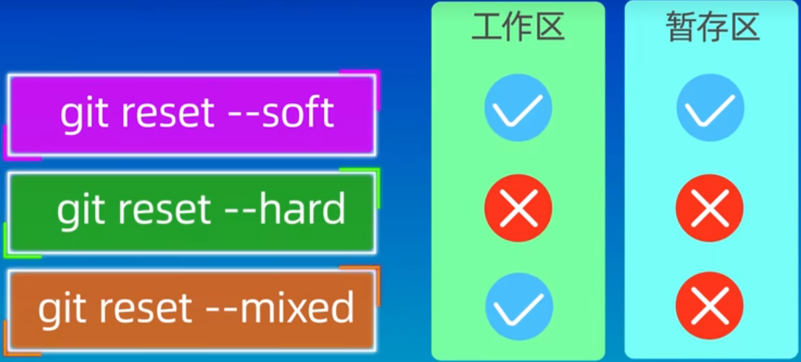

| 描述（回退）                                                 | 命令                                                         |
| ------------------------------------------------------------ | ------------------------------------------------------------ |
| 回退到某一个版本，并且丢弃工作区和暂存区的所有修改内容       | git reset --hard 6fb9bca                                     |
| 回退到某一个版本，并且保留工作区和暂存区的所有修改内容       | git reset --soft 6fb9bca<br>指定具体文件<br>git reset --soft HEAD~2 file1.txt |
| 回退到某一个版本，只保留工作区的修改内容，丢弃暂存区的修改内容 | git reset --mixed 6fb9bca<br>指定具体文件：<br>git reset --mixed HEAD^ file1.txt |
| **描述（撤销）**                                             | **命令**                                                     |
| 撤销最新一次提交                                             | git revert HEAD                                              |
| 撤销前一次提交                                               | git revert HEAD^                                             |
| 撤销某一次提交                                               | git revert 6fb9bca                                           |

回退和撤销的区别：

1. revert是用一次新的提交来回滚之前的提交，reset是直接删除指定提交；

2. 关于是否回退/撤销指定版本的操作：

   - git revert：

     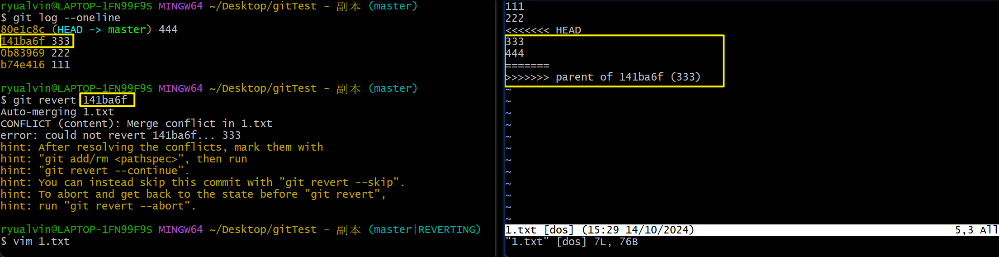

   - git reset：

     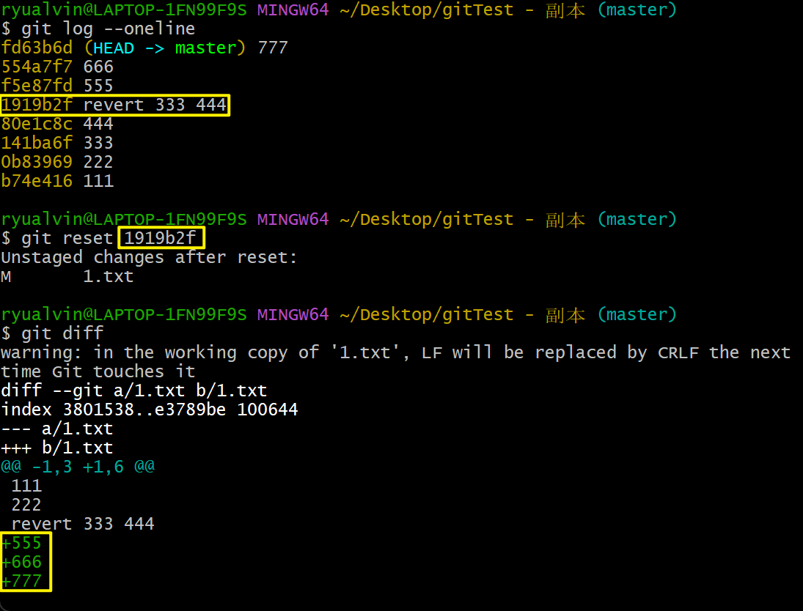

# 8、远程仓库

| 描述                                                         | 命令                                                         |
| ------------------------------------------------------------ | ------------------------------------------------------------ |
| 查看远程仓库地址                                             | git remote -v                                                |
| 添加远程仓库，同时指定简写                                   | git remote add pb https://github...<br>git remote add origin https://github... |
| 取消关联远程仓库                                             | git remote remove origin                                     |
| 设置多个远程仓库<br>不能用git remote add命令，会报错         | git remote set-rul --add pb https://github...                |
| 修改远程仓库地址                                             | git remote set-url origin git@github...git                   |
| fetch：将数据拉取到本地仓库<br>不会合并到本地分支，需要手动合并 | git fetch origin                                             |
| pull：拉取数据并合并到当前所在分支                           | git pull<br>相当于：<br>git fetch<br>git merge FETCH_HEAD    |
| pull-rebase：拉取数据并将当前分支修改嫁接至最新节点上        | git pull --rebase<br>相当于：<br>git fetch<br>git rebase FETCH_HEAD |
| 推送到远程仓库                                               | git push origin master                                       |
| 本地仓库上传git服务器                                        | git init<br>git add .<br>git commit -m "msg"<br>git remote add origin https://...<br>本地分支关联远程分支(远程分支 本地分支)：<br>git branch --set-upstream-to=origin/master master<br>允许合并不相关的历史：<br>git pull origin master --allow-unrelated-histories<br>如果当前分支与多个主机存在追踪关系，<br>则-u会指定一个默认主机，<br>这样后面就可以不加任何参数使用git push<br>git push -u origin master |
| 查看远程仓库                                                 | git remote show origin                                       |
| 移除远程仓库                                                 | git remote rm origin                                         |
| 重命名远程仓库                                               | git remote rename old-name new-name                          |

# 9、分支操作

| 描述                                                         | 命令                                                         |
| ------------------------------------------------------------ | ------------------------------------------------------------ |
| 显示本地所有分支                                             | git branch                                                   |
| 显示远程所有分支                                             | git branch -r                                                |
| 显示本地所有分支的最后一次提交                               | git branch -v                                                |
| 显示本地所有分支的最后一次提交<br>以及跟踪的远程分支信息（如果有） | git branch -vv                                               |
| 查看哪些分支已合并到当前分支                                 | git branch --merged                                          |
| 查看哪些分支未合并到当前分支                                 | git branch --no-merged                                       |
| 创建分支                                                     | git branch test                                              |
| 切换至其他分支                                               | git checkout dev                                             |
| 创建并切换分支                                               | git checkout -b fix                                          |
| 删除本地分支<br>指定的分支已经被完全合并到当前分支时才能成功删除 | git branch -d dev                                            |
| 强制删除本地分支<br>不检查是否合并，强制删除                 | git branch -D dev                                            |
| 删除远程分支                                                 | git push origin --delete master                              |
| 将本地分支推送到远程仓库origin/master分支                    | git push origin master<br>git push origin master:master      |
| 当前本地分支为master，抓取远程仓库数据并合并                 | git fetch origin<br>git merge origin/master                  |
| 将本地所有分支都推送到远程主机                               | git push --all origin                                        |
| 强制推送（最好不用）                                         | git push --force origin                                      |
| 创建一个新的本地分支dev并设置远程追踪                        | git checkout --track origin/dev                              |
| 创建一个与远程分支不同名的本地分支<br>创建切换至本地分支ryu-dev，设置跟踪远程分支origin/dev<br>注意：<br>如果执行pull以后，origin/dev会更新，<br>ryu-dev和origin/dev保持同步，<br>但本地dev并不会被更新 | git checkout -b ryu-dev origin/dev                           |
| 为已有的本地分支设置远程追踪分支                             | git checkout master<br>git branch -u origin/master<br>git branch -u origin/master local-dev<br>前提：本地存在local-dev分支<br>或：<br>git branch --set-upstream-to origin/master |
| 将远程仓库拉取到本地仓库临时分支并手动合并<br>如果本地存在临时分支则覆盖，不存在则创建 | git fetch origin master:tmp<br>比较本地代码和刚下载的代码的区别：<br>git diff tmp<br>合并tmp分支到本地的master分支：<br>git merge tmp<br>如果不想保留tmp，可删除：<br>git branch -d tmp |
| 基于本地分支创建远程分支                                     | git push origin bk_master:bk_master                          |
| 本地新分支和远程新分支关联                                   | git push --set-upstream origin bk_master                     |
| 强制修改分支位置                                             | git branch -f main HEAD~3<br>将main分支强制指向HEAD的第3级parent提交 |

# 10、合并操作

## 10.1、merge

合并分支a到分支b，--no-ff参数表示禁用Fast forward模式，合并后的历史有分支，能看出曾经做过合并。

```bash
git merge --no-ff -m "message" <branch-name>
```

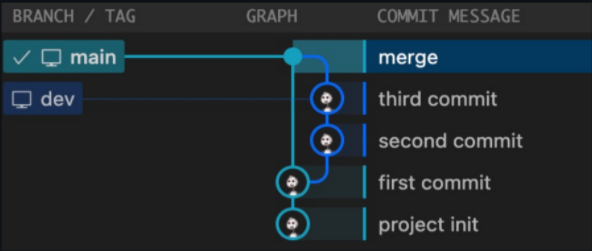

--ff参数表示使用Fast forward模式，合并后的历史会变成一条直线。

```bash
git merge --ff -m "message" <branch-name>
```

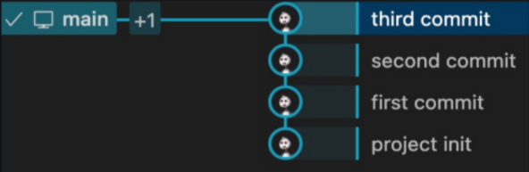

## 10.2、squash merge

合并&压缩所有提交到一个提交。

解决的是什么问题？由于在dev分支上执行的是开发工作，有一些很小的提交，或者是纠正前面的错误的提交，对于这类提交对整个工程来说不需要单独显示出来一次提交，不然导致项目的提交历史过于复杂。所以基于这种原因，我们可以把dev上的所有提交都合并成一个提交，然后提交到主干。

**注意：squash merge并不会替你产生提交，它只是把所有的改动合并，然后放在本地文件，需要你再次手动执行提交操作。**

```bash
ryualvin ~/Desktop/GitTest/local-repo-squash (master)
$ git log --oneline --graph --decorate --all
* d28ac8b (HEAD -> master) master:5
* a868a83 master:4
| * 5429c38 (dev) dev:2
| * b6163a2 dev:1
|/
* 71df0b0 master:3
* 5994758 master:2
* f03bbfd master:1

ryualvin ~/Desktop/GitTest/local-repo-squash (master)
$ git branch
  dev
* master

ryualvin ~/Desktop/GitTest/local-repo-squash (master)
$ git merge --squash dev
Automatic merge went well; stopped before committing as requested
Squash commit -- not updating HEAD

ryualvin ~/Desktop/GitTest/local-repo-squash (master)
$ git status
On branch master
Changes to be committed:
  (use "git restore --staged <file>..." to unstage)
        new file:   dev1.txt
        new file:   dev2.txt

ryualvin ~/Desktop/GitTest/local-repo-squash (master)
$ git commit -m "squash commit"
[master 8d5ced0] squash commit
 2 files changed, 2 insertions(+)
 create mode 100644 dev1.txt
 create mode 100644 dev2.txt

ryualvin ~/Desktop/GitTest/local-repo-squash (master)
$ git log --oneline --graph --decorate --all
* 8d5ced0 (HEAD -> master) squash commit
* d28ac8b master:5
* a868a83 master:4
| * 5429c38 (dev) dev:2
| * b6163a2 dev:1
|/
* 71df0b0 master:3
* 5994758 master:2
* f03bbfd master:1
```

## 10.3、rebase

### 10.3.1、什么是rebase

git会先找到当前分支和目标分支的共同祖先，这里也就是main:3这个节点。再把当前分支上从共同祖先到最新提交节点的所有提交都嫁接移植到目标分支的最新提交节点后面。

**在dev分支上做变基操作：**

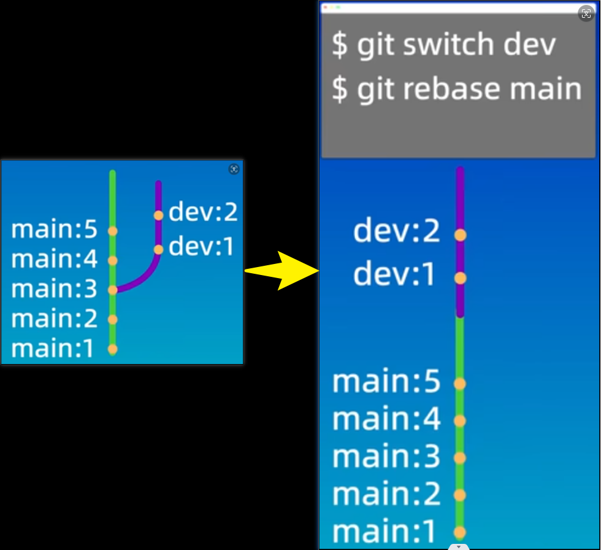

**在main分支上做变基操作：**

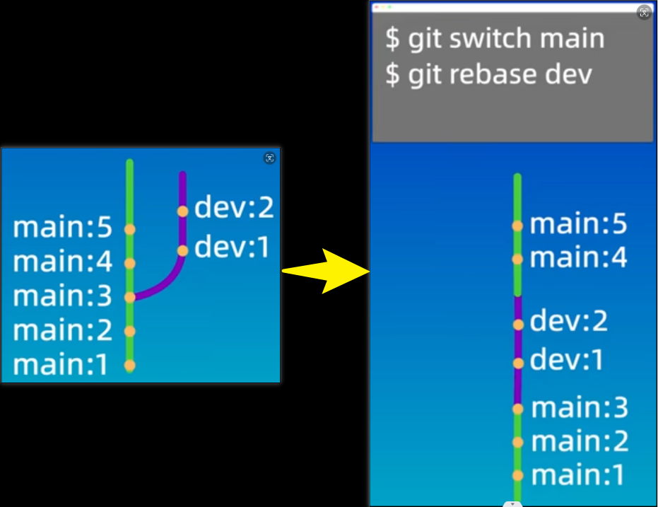

### 10.3.2、rebase和merge比较

rebase不会产生新的提交，而是把当前分支的每一个提交都复制到目标分支上，然后再把当前分支指向目标分支。

merge会产生一个新的提交，这个提交有两个分支的所有修改。

**merge的优缺点：**

优点：不会破坏原分支的提交历史，所有提交记录和合并历史都会保留下来，方便后续查看和回滚。

缺点：会产生额外的提交记录和两条分支线的合并，会使得提交记录变得复杂。

**rebase优缺点：**

优点：不需要新增额外的提交记录到目标分支，可以形成一个线性的提交历史记录，非常直观和干净。

缺点：会改变提交历史，改变当前分支branch out的节点。因此避免在公共分支上进行变基操作，会对和你一起在这个分支上开发的同事造成一些困扰（多人协作时，不要对已经推送到远程的分支执行rebase操作）。

## 10.4、cherry-pick

| 描述                                                         | 命令                                                         |
| ------------------------------------------------------------ | ------------------------------------------------------------ |
| 将特定提交从一个分支应用到另一个分支                         | git  cherry-pick hash1                                       |
| 摘取多个提交                                                 | git cherry-pick hash1 hash2                                  |
| 摘取的过程中可能遇到合并冲突，<br>这种情况下git会暂停操作，要求你手动解决冲突 | 解决冲突后：<br>git add resolved-files<br>git cherry-pick --continue<br>如果决定中止摘取：<br>git cherry-pick --abort |
| 应用提交但不自动提交<br>允许你对多个提交进行摘取，然后一次性提交 | git cherry-pick -n hash1 hash2                               |
| 在提交消息中添加原始提交的哈希值，便于跟踪                   | git cherry-pick -x hash1 hash2                               |
| 设定开始到结束，start-hash在end-hash之前提交<br>1.7.2版本开始才能使用 | git cherry-pick start-hash end-hash                          |

## 10.5、patch

在 Git 中，`git patch` 并不是一个单独的命令，但它通常是指通过使用 `git diff`, `git format-patch`, `git apply`, 和 `git am` 等命令来创建和应用补丁（patch）文件的过程。补丁文件用于记录文件的差异，可以在不同的代码库或分支之间共享和应用这些差异。下面是一个关于如何创建和应用补丁的详细指南。

### 10.5.1、创建补丁文件

补丁文件可以记录工作区的未提交更改或者提交历史中的变更。创建补丁的常用方法有两种：使用 `git diff` 和 `git format-patch`。

**1. 使用 `git diff` 创建补丁**

`git diff` 用于生成工作目录中未提交更改的补丁文件。

```bash
# 生成工作目录与索引之间的差异补丁
git diff > my_patch.patch
# 或者，生成特定文件的补丁
git diff <file_path> > my_patch.patch
```

**2. 使用 `git format-patch` 创建补丁**

`git format-patch` 生成的是基于提交的补丁文件，它通常用于在分支或代码库之间分享提交。

```bash
# 生成从某个提交开始到HEAD的所有提交的补丁文件
git format-patch <start_commit>..<end_commit>
# 示例：生成最近三个提交的补丁文件
git format-patch -3
# 将最近n次提交生成补丁放到指定目录
git format-patch -n -o <Output Folder>
# 将某个提交生成补丁
git format-patch -1 <commit_hash>
```

生成的补丁文件会以 `.patch` 或 `.mbox` 格式保存，每个提交对应一个补丁文件。

### 10.5.2、应用补丁文件

应用补丁文件可以使用 `git apply` 或 `git am` 命令，具体取决于补丁的来源（是未提交的更改还是提交历史的补丁）。

**1. 使用 `git apply` 应用补丁**

`git apply` 通常用于应用由 `git diff` 生成的补丁文件。

```bash
# 应用补丁文件
git apply my_patch.patch
# 你也可以应用补丁并立即将变化添加到索引中
git apply --index my_patch.patch
# 查看某个补丁的情况
git apply --stat temp.patch
# 检查补丁能否被打上
git apply --check temp.patch
```

**2. 使用 `git am` 应用补丁**

`git am` 用于应用由 `git format-patch` 生成的提交补丁文件。它会保留补丁文件中的提交信息。

```bash
# 应用补丁文件到当前分支
git am 0001-some-change.patch
# 或者应用一个目录中的所有补丁文件
git am *.patch
```

### 10.5.3、处理冲突

在应用补丁时，可能会遇到冲突。处理冲突的步骤如下：

1. **查看冲突**：Git 会提示哪些文件存在冲突，你可以通过 `git status` 查看。
2. **手动解决冲突**：打开冲突文件，手动编辑解决冲突。
3. **标记冲突已解决**：使用 `git add <file>` 命令标记冲突文件为已解决。
4. **继续应用补丁**：使用 `git am --continue` 继续应用剩余的补丁。

```bash
git am --continue
```

如果你决定中止应用补丁，可以使用以下命令：

```bash
git am --abort
```

### 10.5.4、总结

- **创建补丁**：使用 `git diff` 创建未提交的更改补丁，使用 `git format-patch` 创建已提交的更改补丁。
- **应用补丁**：使用 `git apply` 应用未提交的更改补丁，使用 `git am` 应用已提交的更改补丁。
- **处理冲突**：手动解决冲突后继续应用补丁。

通过 `git patch` 的流程，你可以灵活地在不同的代码库、分支或团队成员之间共享和应用特定的代码更改。

# 11、标签操作

在 Git 中，`git tag` 命令用于给某个特定的提交（commit）打上一个标签（tag）。标签通常用于标识发布版本或其他重要的快照。标签有两种类型：轻量级标签（lightweight tag）和附注标签（annotated tag）。

## 11.1、基本用法

| 描述                                                         | 命令                                                         |
| ------------------------------------------------------------ | ------------------------------------------------------------ |
| 创建轻量级标签<br>在当前分支最新提交HEAD上创建一个名为v1.0的轻量级标签 | git tag v1.0                                                 |
| 创建附注标签                                                 | git tag -a v1.0 -m "Version 1.0 release"                     |
| 在特定提交上创建标签                                         | git tag v1.0 9fceb02 <br>git tag -a v1.0 9fceb02 -m "Version 1.0 release" |
| 列出所有标签                                                 | git tag                                                      |
| 搜索特定模式的标签                                           | git tag -1 "v1.*"                                            |
| 查看标签信息<br>显示标签所引用的提交及其附加信息             | git show v1.0                                                |

## 11.2、共享标签

标签不会自动推送到远程仓库，你需要手动推送它们。

| 描述                   | 命令                   |
| ---------------------- | ---------------------- |
| 推送单个标签到远程仓库 | git push origin v1.0   |
| 推送所有标签到远程仓库 | git push origin --tags |

## 11.3、删除标签

| 描述         | 命令                                                         |
| ------------ | ------------------------------------------------------------ |
| 删除本地标签 | git tag -d v1.0                                              |
| 删除远程标签 | 先删除本地标签后再推送删除操作到远程仓库：<br>git push origin --delete v1.0 |

## 11.4、重命名标签

Git 不直接支持重命名标签，但你可以通过以下步骤实现：

```bash
git tag <new-tagname> <old-tagname>
git tag -d <old-tagname>
git push origin <new-tagname>
git push origin --delete <old-tagname>
```

# 12、忽略文件

## 12.1、.gitignore

### 12.1.1、应该忽略哪些文件

- 系统或者软件自动生成的文件；
- 编译产生的中间文件和结果文件；
- 运行时生成日志文件、缓存文件、临时文件；
- 涉及身份、密码、口令、密钥等敏感信息文件。

### 12.1.2、匹配规则

**规则：**

- 从上到下逐行匹配，每一行表示一个忽略模式
- 空行或者以#开头的行会被Git忽略。一般空行用于可读性的分离，#一般用作注释；
- 使用标准的Blob模式匹配，例如：
  - 星号*通配任意个字符；
  - 问好?匹配单个字符；
  - 中括号[]表示匹配列表中的单个字符，比如：[abc]表示a/b/c；
- 两个星号**表示匹配任意的中间目录；
- 中括号可以使用短中线链接，比如：
  - [0-9]表示任意一位数字，[a-z]表示任意一位小写字母；
- 感叹号!表示取反。

**举例：**

```bash
# 忽略所有的 .a 文件
*.a
# 但跟踪所有的 lib.a，即便你在前面忽略了 .a 文件
!lib.a
# 只忽略当前目录下的 TODO 文件，而不忽略 subdir/TODO，/ 表示根目录
/TODO
# 忽略任何目录下名为 build 的文件夹
build/
# 忽略 doc/notes.txt，但不忽略 doc/server/arch.txt
doc/*.txt
# 忽略 doc/ 目录及其所有子目录下的 .pdf 文件
doc/**/*.pdf
```

**在Github上提供了各种常用语言的忽略文件的模板，在新建仓库的时候可以直接使用：**

https://github.com/github/gitignore

### 12.1.3、注意点

**即使在.gitignore中增加已经被纳入版本控制的文件，也起不到忽略作用。必须先将文件从版本库中移出，才会起到忽略作用：**

```bash
# 将temp文件忽略
ryualvin ~/Desktop/GitTest/repo-ignore (master)
$ cat .gitignore
temp.txt

# 将文件移出版本库
ryualvin ~/Desktop/GitTest/repo-ignore (master)
$ git rm --cached temp.txt
rm 'temp.txt'

# 对该文件做修改
ryualvin ~/Desktop/GitTest/repo-ignore (master)
$ echo "add line2" >> temp.txt

# 修改被忽略
ryualvin ~/Desktop/GitTest/repo-ignore (master)
$ git status
On branch master
nothing to commit, working tree clean
```

**空文件夹，不会被纳入版本控制：**

```bash
# 创建空文件夹
ryualvin ~/Desktop/GitTest/repo-ignore (master)
$ mkdir emptyfolder

# 空文件夹不被跟踪
ryualvin ~/Desktop/GitTest/repo-ignore (master)
$ git status
On branch master
nothing to commit, working tree clean

# 在文件夹中添加文件
ryualvin ~/Desktop/GitTest/repo-ignore (master)
$ echo "line1" >> emptyfolder/newfile1.txt

# 状态显示有未被跟踪的文件
ryualvin ~/Desktop/GitTest/repo-ignore (master)
$ git status
On branch master
Untracked files:
  (use "git add <file>..." to include in what will be committed)
        emptyfolder/

nothing added to commit but untracked files present (use "git add" to track)
```

## 12.2、assume-unchanged

| 描述               | 命令                                             |
| ------------------ | ------------------------------------------------ |
| 忽略               | git update-index --assume-unchanged file1.txt    |
| 取消假定未更改     | git update-index --no-assume-unchanged file1.txt |
| 查看忽略了哪些文件 | git ls-files -v \| grep '^h\ '                   |

**作用：**

- 该命令告诉 Git 假定某个文件没有更改，即使该文件实际上已经被修改；
- 适用于临时修改某些文件且不希望这些修改被 Git 跟踪的情况；
- 该文件在本地不会被跟踪到新状态，也不会影响其他分支或同一分支的其他副本。

**适用场景：**

- 性能优化：在处理大文件或频繁变化的文件时，通过 `assume-unchanged` 可以减少 Git 需要处理的文件数量，从而提升性能；
- 临时配置：适用于临时修改的配置文件。

**注意事项：**

- 该命令主要用于告诉 Git 跳过文件的变化检测，通常在本地使用，目的是提高性能；
- 本地作用：只在本地生效，不影响其他协作者。

## 12.3、skip-worktree

| 描述                  | 命令                                          |
| --------------------- | --------------------------------------------- |
| 忽略                  | git update-index --skip-worktree file1.txt    |
| 取消跳过工作目录检查  | git update-index --no-skip-worktree file1.txt |
| 查看skip-worktree列表 | git ls-files -v \| grep '^S\ '                |

**作用：**

- 该命令告诉 Git 跳过工作目录中的文件，不要检查该文件的变化；
- 主要用于已提交的文件，在需要修改这些文件但又不希望这些修改被提交时使用；
- Git 不会检查文件的变化，也不会显示这些文件的状态。

**适用场景：**

- 忽略不相关的本地改动：适用于在多人协作项目中忽略对配置文件等做的本地修改；
- 保持特定文件的本地修改：避免特定文件的本地修改被提交或干扰其他开发者的工作。

**注意事项：**

- 该命令适用于那些你不希望被 Git 跟踪变化的文件，例如在一个多人项目中忽略本地特有的配置文件；
- 在某些情况下，`skip-worktree` 可能导致意外行为，因为 Git 完全忽略了这些文件的变化。

**assume-unchanged和skip-worktree主要区别：**

1. 行为和目的：
   - `--assume-unchanged`：假定文件没有变化，主要用于提高性能，不适用于文件内容需要长期忽略的场景，用于临时告诉 Git 假定文件没有变化；
   - `--skip-worktree`：跳过工作目录的文件检查，主要用于忽略特定文件的变化，使其不会出现在 `git status` 中，用于长期忽略特定文件的变化。

2. 适用场景：
   - `--assume-unchanged`：适用于临时忽略文件变化的场景，例如本地配置文件或临时修改的文件；
   - `--skip-worktree`：适用于需要长期忽略文件变化的场景，例如项目中的特定配置文件。

3. 恢复正常跟踪：
   - `--assume-unchanged`：`git update-index --no-assume-unchanged <file>`
   - `--skip-worktree`：`git update-index --no-skip-worktree <file>`

# 13、克隆远程仓库

HTTPS方式在把本地代码push到远程仓库的时候，需要验证用户名和密码。

SSH方式在推送的时候不需要验证用户名和密码，但是需要在GitHub上添加SSH公钥（锁）的配置。

**注意：在2021年8月13日以后，HTTPS的这种方式已经被GitHub停止使用，所以推荐大家使用SSH的方式。**

## 13.1、生成公钥（锁）和密钥

```bash
ryualvin /d/develop/git/SSH-Key
# -t rsa：指定协议
# -f：指定文件名
# -C：备注
$ ssh-keygen -t rsa -f id_rsa_github_Ryuxxx -C "github ryualvin ssh"
Generating public/private rsa key pair.
Enter passphrase (empty for no passphrase):
Enter same passphrase again:
Your identification has been saved in id_rsa_github_Ryuxxx
Your public key has been saved in id_rsa_github_Ryuxxx.pub
The key fingerprint is:
SHA256:5Qlk+NdULurwxxxxxIMCPA9Mj72J7QpZPrUHM github ryualvin ssh
The key's randomart image is:
+---[RSA 3072]----+
| xxxxxxxxxxxxxxx |
+----[SHA256]-----+
```

## 13.2、配置公钥（锁）

将公钥（锁）配置到GitHub：

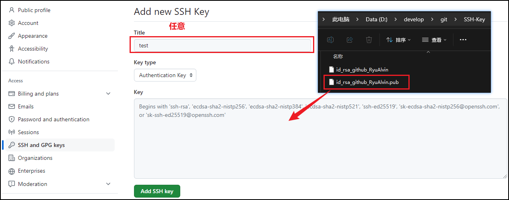

## 13.3、指定私钥

如果是第一次配置，并且在创建密钥的时候没有修改过默认的文件名的话，SSH密钥的配置到这里就完成了。

但是如果在生成密钥的时候指定新的文件名，或者对于不同的网站需要配套不同的SSH密钥的时候，就需要进一步在config文件中配置：D:\develop\git\Git\etc\ssh\ssh_config

```bash
# 访问gitee的SSH密钥
# Host别名
Host gitee_Ryuxxx
# gitee地址
 	HostName gitee.com
# git@gitee.com
 	User git
# 通过.pub文件认证
 	PreferredAuthentications publickey
# 密钥文件地址
 	IdentityFile D:\develop\git\SSH-Key\id_rsa_gitee_Ryuxxx

# 访问github的SSH密钥
# Host别名
Host github_Ryuxxx
# github地址
 	HostName github.com
# git@github.com
 	User git
# 通过.pub文件认证
 	PreferredAuthentications publickey
# 密钥文件地址
 	IdentityFile D:\develop\git\SSH-Key\id_rsa_github_Ryuxxx
```

## 13.4、克隆

```bash
ryualvin ~/Desktop/GitTest
# git@github.com:Ryuxxx/remote-repo.git ->
# github_Ryuxxx:Ryuxxx/remote-repo.git
$ git clone github_Ryuxxx:Ryuxxx/remote-repo.git
Cloning into 'remote-repo'...
# 输入创建SSH密钥时候的密码
Enter passphrase for key 'D:\develop\git\SSH-Key\id_rsa_github_Ryuxxx':
remote: Enumerating objects: 3, done.
remote: Counting objects: 100% (3/3), done.
remote: Total 3 (delta 0), reused 0 (delta 0), pack-reused 0
# 克隆成功
Receiving objects: 100% (3/3), done.
```

# 14、Git Flow

GitFlow是一种流程模型，用于在Git上管理软件开发项目。

| 分支                | 描述                                                         |
| ------------------- | ------------------------------------------------------------ |
| 主分支<br>master    | 代表项目的稳定版本。<br>每个提交到主分支的代码都应该是经过测试和审核的。 |
| 开发分支<br>develop | 用于日常开发。<br>所有功能分支、发布分支和修补分支都应该从develop分支派生。 |
| 功能分支<br>feature | 用于开发单独的功能或特性。<br>每个功能分支应该从develop分支派生，并在开发完成后合并回develop分支。 |
| 发布分支<br>release | 用于准备项目发布。<br>发布分支应该从develop分支派生，并在准备好发布版本后合并回master和develop分支。 |
| 修补分支<br>hotfix  | 用于修复主分支上的紧急问题。<br>修补分支应该从master分支派生，并在修复完成后合并回master和develop分支。 |

