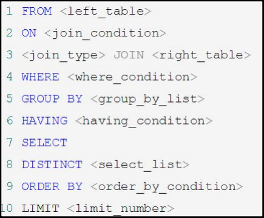
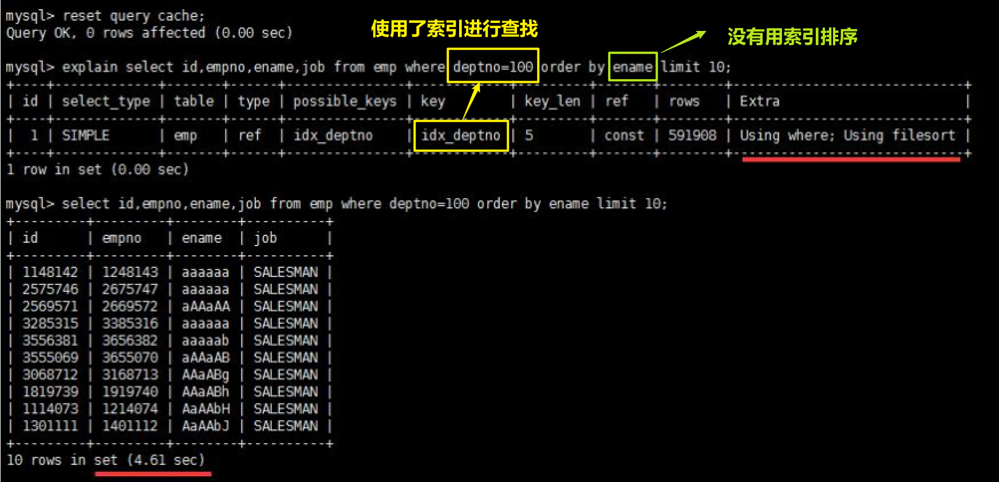
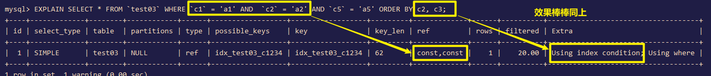
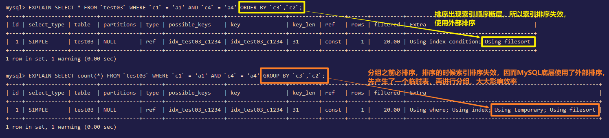
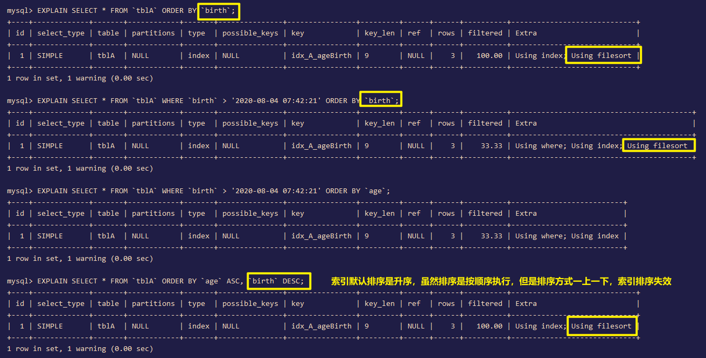

# 1、MySQL的架构介绍

##  1.1、Linux版安装

### 1.1.1、下载

```shell
#先检查linux是几位的操作系统
[root@ryualvin100 opt]# uname -a
Linux ryualvin100 3.10.0-1160.el7.x86_64 #1 SMP Mon Oct 19 16:18:59 UTC 2020 x86_64 x86_64 x86_64 GNU/Linux
[root@ryualvin100 mysql5.7.26]# pwd
/opt/mysql/mysql5.7.26
[root@ryualvin100 mysql5.7.26]# ll
总用量 196764
-rw-r--r--. 1 root root  25381952 2月  12 04:14 mysql-community-client-5.7.26-1.el7.x86_64.rpm
-rw-r--r--. 1 root root    280904 2月  12 04:14 mysql-community-common-5.7.26-1.el7.x86_64.rpm
-rw-r--r--. 1 root root   2274268 2月  12 04:14 mysql-community-libs-5.7.26-1.el7.x86_64.rpm
-rw-r--r--. 1 root root 173541272 2月  12 04:14 mysql-community-server-5.7.26-1.el7.x86_64.rpm
```

### 1.1.2、安装

```shell
#检查已安装的与mysql相关的包，再逐个删除
[root@ryualvin100 opt]# rpm -qa|grep -i mysql
#也可通过这个指令一次性删除
[root@ryualvin100 opt]# rpm -e $(rpm -qa|grep -i mysql)
#查找所有mysql目录并删除 https://blog.csdn.net/lyouhuan/article/details/124868523
[root@ryualvin100 opt]# find / -name mysql 
[root@ryualvin100 mysql5.7.26]# rpm -ivh mysql-community-common-5.7.26-1.el7.x86_64.rpm
[root@ryualvin100 mysql5.7.26]# rpm -ivh mysql-community-libs-5.7.26-1.el7.x86_64.rpm
[root@ryualvin100 mysql5.7.26]# rpm -ivh mysql-community-cilent-5.7.26-1.el7.x86_64.rpm
[root@ryualvin100 mysql5.7.26]# rpm -ivh mysql-community-server-5.7.26-1.el7.x86_64.rpm
[root@ryualvin100 mysql5.7.26]# firewall-cmd --add-port=3306/tcp --permanent
[root@ryualvin100 mysql5.7.26]# firewall-cmd --reload
[root@ryualvin100 mysql5.7.26]# firewall-cmd --list-ports
[root@ryualvin100 mysql5.7.26]# service mysqld start
[root@ryualvin100 mysql5.7.26]# service mysqld status
#查看是否是开机启动项
[root@ryualvin100 mysql5.7.26]# ntsysv
#查找随机生成的密码
[root@ryualvin100 mysql5.7.26]# cat /var/log/mysqld.log | grep password
#输入密码登录
[root@ryualvin100 mysql5.7.26]# mysql -u root -p
Enter password: 
mysql> alter user 'root'@'localhost' identified by 'sBenxxxx@ryxxx';
#设置允许远程连接
mysql> grant all privileges on *.* to 'root'@'%' identified by 'newpasswd' with grant option;
mysql> flush privileges;
```

### 1.1.3、修改字符集

```sql
#列出所有数据库
show databases;
#创建数据库
create database db01;
#创建数据库，顺便设置书库的字符集
create database db01 character set utf8;
#查看数据库的字符集
show create database db01;
#查询所有跟字符集相关的信息
show variables like '%char%';
#设置响应的字符集属性为utf8，只对当前有效，服务重启后失效
set [字符集属性]=utf8;
#修改数据库的字符集
alter database db01 character set 'utf8';
#修改表的字符集
alter table tb01 convert to character set 'utf8';
#永久修改，重启服务，但是在这次修改前已经创建的库或表的字符集不可更改
[root@ryualvin100 mysql5.7.26]# vim /etc/my.cnf
[mysqld]
character_set_server=utf8
[mysql]
default-character-set=utf8
```

## 1.2、配置文件

### 1.2.1、主要配置文件

1. 二进制日志log-bin：主从复制；

2. 错误日志log-error：默认是关闭的，记录严重的警告和错误信息，每次启动和关闭的详细信息等；

   

3. 查询日志log：默认关闭，记录查询的SQL语句，如果开启回减低MySQL的整体性能，因为记录日志也是需要消耗系统资源；

4. 数据文件：

   - 当前系统中的全部库：`/var/lib/mysql`

   - frm文件：存放表结构；  

   - myd文件：存放表数据；

   - myi文件：存放表索引；

     

### 1.2.2、如何配置

- Windows：my.ini文件；
- Linux：/etc/my.cnf文件；

## 1.3、逻辑架构

和其它数据库相比，MySQL有点与众不同，它的架构可以在多种不同场景中应用并发挥良好作用。主要体现在存储引擎的架构上，**插件式的存储引擎架构将查询处理和其它的系统任务以及数据的存储提取相分离**。这种架构可以根据业务的需求和实际需要选择合适的存储引擎。


## 1.4、存储引擎

```sql
-- 显示所有的存储引擎
SHOW ENGINES;
```


```mysql
-- 显示默认的存储引擎
SHOW VARIABLES LIKE '%storage_engine%';
```


> MyISAM和InnoDB对比

| 对比项   | MyISAM                                                       | InnoDB                                                       |
| -------- | ------------------------------------------------------------ | ------------------------------------------------------------ |
| 主外键   | 不支持                                                       | 支持                                                         |
| 事务     | 不支持                                                       | 支持                                                         |
| 行表锁   | 表锁，即使操作一条记录也会锁住整个表，<br/>不适合高并发的操作 | 行锁，操作时只锁某一行，不对其它行有影响，<br/>适合高并发操作 |
| 缓存     | 只缓存索引，不缓存真实数据                                   | 不仅缓存索引还要缓存真实数据，<br/>对内存要求较高，<br/>而且内存大小对性能有决定性的影响 |
| 表空间   | 小                                                           | 大                                                           |
| 关注点   | 性能                                                         | 事务                                                         |
| 默认安装 | Y                                                            | Y                                                            |

# 2、索引优化分析

## 2.1、SQL性能下降原因

主要体现在执行时间长、等待时间长。具体的原因有如下几点：

1. 查询语句写的烂；
2. 索引失效（单值、符合）；
3. 关联查询太多JOIN（设计缺陷或不得已的需求）；
4. 服务器调优及各个参数设置（缓冲、线程数等）；

##  2.2、SQL执行顺序




## 2.3、七种JOIN理论


```mysql
CREATE TABLE `t_dept` (
`id` INT(11) NOT NULL AUTO_INCREMENT, `deptName` VARCHAR(30) DEFAULT NULL, `address` VARCHAR(40) DEFAULT NULL, PRIMARY KEY (`id`)
) ENGINE=INNODB AUTO_INCREMENT=1 DEFAULT CHARSET=utf8;
CREATE TABLE `t_emp` (
`id` INT(11) NOT NULL AUTO_INCREMENT, `name` VARCHAR(20) DEFAULT NULL, `age` INT(3) DEFAULT NULL, `deptId` INT(11) DEFAULT NULL, empno int not null, PRIMARY KEY (`id`), KEY `idx_dept_id` (`deptId`)
#CONSTRAINT `fk_dept_id` FOREIGN KEY (`deptId`) REFERENCES `t_dept` (`id`)
) ENGINE=INNODB AUTO_INCREMENT=1 DEFAULT CHARSET=utf8;
INSERT INTO t_dept(deptName,address) VALUES('华山','华山');
INSERT INTO t_dept(deptName,address) VALUES('丐帮','洛阳');
INSERT INTO t_dept(deptName,address) VALUES('峨眉','峨眉山');
INSERT INTO t_dept(deptName,address) VALUES('武当','武当山');
INSERT INTO t_dept(deptName,address) VALUES('明教','光明顶');
INSERT INTO t_dept(deptName,address) VALUES('少林','少林寺');
INSERT INTO t_emp(NAME,age,deptId,empno) VALUES('风清扬',90,1,100001);
INSERT INTO t_emp(NAME,age,deptId,empno) VALUES('岳不群',50,1,100002);
INSERT INTO t_emp(NAME,age,deptId,empno) VALUES('令狐冲',24,1,100003);
INSERT INTO t_emp(NAME,age,deptId,empno) VALUES('洪七公',70,2,100004);
INSERT INTO t_emp(NAME,age,deptId,empno) VALUES('乔峰',35,2,100005);
INSERT INTO t_emp(NAME,age,deptId,empno) VALUES('灭绝师太',70,3,100006);
INSERT INTO t_emp(NAME,age,deptId,empno) VALUES('周芷若',20,3,100007);
INSERT INTO t_emp(NAME,age,deptId,empno) VALUES('张三丰',100,4,100008);
INSERT INTO t_emp(NAME,age,deptId,empno) VALUES('张无忌',25,5,100009);
INSERT INTO t_emp(NAME,age,deptId,empno) VALUES('韦小宝',18,null,100010);
```

## 2.4、索引简介

### 2.4.1、索引是什么

官方定义：索引（Index）是帮助MySQL高效获取数据的**数据结构**。

索引的目的在于提高查询效率，可以类比字典。可以简单理解为**"排好序的快速查找数据结构"**。所以，索引会影响到你`where`语句后的查找，以及`order by`语句后的排序。 

在数据之外，数据库系统还维护着满足特定查找算法的数据结构，这些数据结构以某种方式引用（指向）数据，这样就可以在这些数据结构上实现高级查找算法。这种数据结构，就是索引。下图就是一种可能的索引方式示例：


左边是数据表，一共有两列七条记录，最左边的是数据记录的物理地址。为了加快 Col2 的查找，可以维护一个右边所示的二叉查找树，每个节点分别包含索引键值和一个指向对应数据记录物理地址的指 针，这样就可以运用二叉查找在一定的复杂度内获取到相应数据，从而快速的检索出符合条件的记录。

一般来说索引本身也很大，不可能全部存储在内存中，因此**索引往往以索引文件的形式存储的磁盘上**。

### 2.4.2、索引的优势劣势

> 优势

- 提高数据检索效率，降低数据库的IO效率；
- 通过索引对数据进行排序，降低数据排序成本，降低CPU消耗；

> 劣势

- 虽然索引大大提高了查询效率，但是在通过INSERT、UPDATE、DELETE更新数据的同时，MySQL不但需要保存表数据，还要更新索引信息，会消耗一部分性能，所以降低了更新数据的效率；
- 实际上索引也是一张表，该表中保存了主键与索引字段，并指向实体表数据物理地址的记录，所以索引也是需要占用空间的；

### 2.4.3、索引分类

#### 2.4.3.1、单值索引

即一个索引只包含单个列，一个表可以有多个单值索引。

```mysql
-- 随表一起创建
CREATE TABLE customer (
    id INT(10) UNSIGNED AUTO_INCREMENT,
    customer_no VARCHAR(200),
    customer_name VARCHAR(200),
    PRIMARY KEY(id),
    -- 单值索引
    KEY (customer_name)
);
-- 单独建单值索引
CREATE INDEX idx_customer_name ON customer(customer_name);
```

#### 2.4.3.2、唯一索引

索引列的值必须唯一，但允许有空值。

```mysql
-- 随表一起创建
CREATE TABLE customer (
    id INT(10) UNSIGNED AUTO_INCREMENT,
    customer_no VARCHAR(200),
    customer_name VARCHAR(200),
    PRIMARY KEY(id), 
    KEY (customer_name), 
    -- 唯一索引
    UNIQUE (customer_no)
);
-- 单独建唯一索引
CREATE UNIQUE INDEX idx_customer_no ON customer(customer_no);
```

#### 2.4.3.3、主键索引

设定为主键后数据库会自动建立索引，但不允许有空值，innodb为聚簇索引。

```mysql
-- 随表一起创建
CREATE TABLE customer (
    id INT(10) UNSIGNED AUTO_INCREMENT,
    customer_no VARCHAR(200),
    customer_name VARCHAR(200), 
    -- 主键索引
    PRIMARY KEY(id)
);
-- 单独建主键索引
ALTER TABLE customer add PRIMARY KEY customer(customer_no);
```

#### 2.4.3.4、复合索引

即一个索引包含多个列。

```mysql
CREATE TABLE customer (
    id INT(10) UNSIGNED AUTO_INCREMENT,
    customer_no VARCHAR(200),
    customer_name VARCHAR(200), 
    PRIMARY KEY(id), 
    KEY (customer_name), 
    UNIQUE (customer_name), 
    -- 复合索引
    KEY (customer_no,customer_name)
);
-- 单独建复合索引
CREATE INDEX idx_no_name ON customer(customer_no,customer_name);
```

**注意：一张表最好不要建超过5个索引。**

### 2.4.4、基本语法

```mysql
-- 创建
CREATE [UNIQUE] INDEX [indexName] ON table_name(column))
-- 删除
DROP INDEX [indexName] ON mytable;
-- 查看
SHOW INDEX FROM table_name\G
-- 该语句添加一个主键，这意味着索引值必须是唯一的，且不能为NULL
ALTER TABLE tbl_name ADD PRIMARY KEY (column_list);
-- 添加普通索引，索引值可出现多次
ALTER TABLE tbl_name ADD INDEX index_name (column_list);
-- 该语句指定了索引为 FULLTEXT ，用于全文索引
ALTER TABLE tbl_name ADD FULLTEXT index_name (column_list);
```

### 2.4.5、索引结构与检索原理

MySQL索引结构有：BTree索引、Hash索引、full-text全文索引、R-Tree索引。


一颗B树，浅蓝色的块我们称之为一个磁盘块，可以看到每个磁盘块包含几个数据项（深蓝色所示）和指针（黄色所示）。

如磁盘块1包含数据项17和35，包含指针P1、P2、P3，P1表示小于17的磁盘块，P2表示在17和35之间的磁盘块，P3表示大于35的磁盘块。真实的数据存在于叶子节点即3、5、9、10、13、15、28、29、36、60、75、79、90、99。非叶子节点不存储真实的数据，只存储指引搜索方向的数据项，如17、35并不真实存在于数据表中

> 查找过程

如果要查找数据项 29，那么首先会把磁盘块 1 由磁盘加载到内存，此时发生一次 IO，在内存中用二分查找确定 29 在 17 和 35 之间，锁定磁盘块 1 的 P2 指针，内存时间因为非常短（相比磁盘的 IO）可以忽略不计，通过磁盘块 1 的 P2 指针的磁盘地址把磁盘块 3 由磁盘加载到内存，发生第二次 IO，29 在 26 和 30 之间，锁定磁盘块 3 的 P2 指针，通过指针加载磁盘块 8 到内存，发生第三次 IO，同时内存中做二分查找找到 29，结束查询，总计三次 IO。

真实的情况是，3 层的 b+树可以表示上百万的数据，如果上百万的数据查找只需要三次 IO，性能提高将是巨大的，如果没有索引，每个数据项都要发生一次 IO，那么总共需要百万次的 IO，显然成本非常非常高。

### 2.4.6、哪些情况需要创建索引

1. 主键自动建立唯一索引；
2. 频繁作为查询条件的字段应该创建索引；
3. 查询中与其它表关联的字段，外键关系建立索引；
4. 频繁更新的字段不适合创建索引（因为每次更新不单单是更新了记录还会更新索引文件）；
5. WHERE条件里用不到的字段不创建索引；
6. 单值/复合索引的选择问题（在高并发下倾向创建组合索引）；
7. 查询中排序的字段，排序字段若通过索引去访问将大大提高排序速度；
8. 查询中统计或者分组（GROUP BY ... HAVING）字段；

### 2.4.7、哪些情况不要创建索引

1. 表记录太少（300万记录左右性能开始下降）；
2. 经常增删改的表（索引虽然提高了查询速度，同时却会降低更新表的速度，如对表进行INSERT、UPDATE和DELETE。因为更新表时，MySQL不仅要保存数据，还要保存索引文件）；
3. 数据重复且分布平均的表字段。比如，一张客户表中的国籍字段，大多客户都是10万条的客户记录几乎只有中国、日本、韩国，那这样分布率（3/100000）太低，不适合建索引。分布率近乎于1，索引带来的性能提升也就越高；

## 2.5、性能分析Explain

### 2.5.1、是什么

使用EXPLAIN关键字可以模拟优化器执行SQL查询语句，从而知道MySQL是如何处理你的SQL语句的。分析你的查询语句或是表结构的性能瓶颈。

### 2.5.2、能干嘛

1. 表的读取顺序（id）；
2. 数据读取操作的操作类型；
3. 哪些索引可以使用；
4. 哪些索引被实际使用；
5. 表之间的引用；
6. 每张表有多少行被优化器查询；

### 2.5.3、怎么玩

EXPLAIN + SQL语句

```mysql
EXPLAIN SELECT * FROM t_dept;
```


### 2.5.4、EXPLAIN之id介绍

【表的读取顺序】**SELECT查询的序列号，包含一组数字，表示查询中执行SELECT子句或操作表的顺序。**

#### 2.5.4.1、id相同

id相同的情况下，从上往下顺序执行：


#### 2.5.4.2、id不同

id不同的情况下，id值越大，优先级越高，越先被执行：


#### 2.5.4.3、id有相同也有不同

id值大的优先执行，剩下相同的按从上到下顺序执行：


**注意：FROM后的嵌套查询优先查询（即第三条记录），查询之后作为衍生表S3（即第一条记录）。**

### 2.5.5、EXPLAIN之select_type和table介绍

【数据读取操作的操作类型】**select_type代表查询的类型，主要是用于区别普通查询、联合查询、子查询等的复杂查询。**

**这个数据是基于哪张表的。**

#### 2.5.5.1、SIMPLE

简单的SELECT查询，查询中不包含子查询或者UNION。


#### 2.5.5.2、PRIMARY

查询中若包含任何复杂的子部分，最外层查询则被标记为Primary。


#### 2.5.5.3、DERIVED

在FROM列表中包含的子查询被标记为DERIVED（衍生），MySQL会递归执行这些子查询，把结果放在临时表里。


#### 2.5.5.4、SUBQUERY

在SELECT或WHERE列表中包含了子查询。


#### 2.5.5.5、UNION

若第二个SELECT出现在UNION之后，则被标记为UNION；若UNION包含在FROM子句的子查询中，外层SELECT将被标记为：DERIVED。


#### 2.5.5.6、UNION RESULT

从UNION表获取结果的SELECT。


### 2.5.6、EXPLAIN之type介绍

type是查询的访问类型。是较为重要的一个指标，结果值从最好到最坏依次是：

**system > const > eq_ref > ref> range > index > all**

#### 2.5.6.1、system

若只有一行记录（等于系统表），这是const类型的特例，平时不会出现这个也可以忽略不计。

#### 2.5.6.2、const

表示通过索引一次就找到了，const用于比较primary key或者unique索引。因为只匹配一行数据（像常量一样），所以很快。

如：将主键置于WHERE列表中，MySQL就能将该查询转换为一个常量。


#### 2.5.6.3、eq_ref

唯一性索引扫描，对于每个索引键，表中只有一条记录与之匹配。常见于主键和唯一索引扫描。

如：一家科技公司，你去叫岗位为CEO的人出来，那肯定只有一个人。


#### 2.5.6.4、ref

非唯一性索引扫描，返回匹配某个单独值的所有行。本质上也是一种索引访问，它返回所有匹配某个单独值的行，然后，它可能会找到多个符合条件的行，所以他应该属于查找和扫描的混合体。

如：一家科技公司，你去叫岗位为开发工程师的人出来，那肯定出来一群人。

> 建立索引前


> 建立索引后


#### 2.5.6.5、range

只检索给定的范围的行，使用一个索引来选择行。key列显示使用了哪个索引一般就是在你的WHERE语句中出现了between、<、>、in等的查询这种范围索引扫描比全表扫描要好，因为它只需要开始于索引的某一点，而结束于另一点，不用扫描全部索引。


#### 2.5.6.6、index

出现index是SQL使用了索引但是**没有通过索引进行过滤**，一般是使用了覆盖索引（即查询列被索引覆盖）或者是**利用索引进行了排序分组**。


#### 2.5.6.7、all

全表扫描，便利全表以找到匹配的行。


### 2.5.7、EXPLAIN之possible_keys和key

【哪些索引可以使用】possible_keys：显示可能应用在这张表中的索引，一个或多个。查询涉及到的字段上若存在索引，则该索引将被列出，但不一定被查询实际使用。

【哪些索引被实际使用】key：实际使用的索引。如果为NULL，则没有使用索引。查询中若使用了覆盖索引，则该索引**仅仅**出现在key列表中。覆盖索引：索引或复合索引按**顺序**出现在查询列中。

### 2.5.8、EXPLAIN之key_len介绍

表示索引中使用的字节数，可通过该列计算查询中使用的索引的长度。在不损失精确性的情况下，长度越短越好。

key_len显示的值为索引字段的最大可能长度，**并非实际使用长度**，即key_len是根据表定义计算而得，不是通过表内检索出的。

同样的查询结果，key_len用的越少越好。


### 2.5.9、EXPLAIN之ref

【表之间的引用】显示索引的哪一列被使用了，如果可能的话，是一个常数。哪些列或常量被用于查找索引列上的值。


### 2.6.0、EXPLAIN之rows

【每张表有多少行被优化器查询】根据表统计信息及索引选用抢矿，大致估算出找到所需的记录所需要读取的行数。

### 2.6.1、EXPLAIN之Extra

包含不适合在其他列中显示但十分重要的额外信息。

#### 2.6.1.1、Using filesort（不好）

说明MySQL会对数据使用一个外部的索引排序，而不是按照表内的索引排序进行读取。MySQL中无法利用索引完成的排序操作称为文件排序。

> 优化前



> 优化后

查询中排序的字段若通过索引去访问将大大提高排序速度。


#### 2.6.1.2、Using temporary（不好）

使用临时表保存中间结果，MySQL在对查询结果排序时使用临时表。常见于排序ORDER BY和分组GROUP BY查询。

> 优化前


> 优化后


#### 2.6.1.3、Using index（好）

表示响应的SELECT操作中使用了覆盖索引（Covering Index），避免访问了表的数据行，效率不错！如果同时出现Using where，表明索引被用来执行索引键值的查找；如果没有同时出现Using where，表明索引只是用来读取数据而非利用索引执行查找。

#### 2.6.1.4、Using where

表明使用了WHERE过滤。

#### 2.6.1.5、Using join buffer（也不太好）

太多连接查询，因而使用了连接缓存。


#### 2.6.1.6、Impossible WHERE

WHERE子句的值总是false，也就是查询条件不成立，不能用来获取任何元组。

#### 2.6.1.7、Select tables optimized away

在没有GROUP BY子句的情况下，基于索引优化MIN/MAX操作或者对于MyISAM存储引擎优化COUNT(*)操作，不必等到执行阶段再进行计算，查询执行计划生成的阶段即完成优化。

> InnoDB中


> MyISAM中


#### 2.6.1.8、distinct

优化distinct操作，在找到第一匹配的元组后即停止找同样值的动作。

## 2.6、索引优化

### 2.6.1、单表优化案例

```mysql
CREATE TABLE IF NOT EXISTS `article`(
`id` INT(10) UNSIGNED NOT NULL PRIMARY KEY AUTO_INCREMENT,
`author_id` INT (10) UNSIGNED NOT NULL,
`category_id` INT(10) UNSIGNED NOT NULL , 
`views` INT(10) UNSIGNED NOT NULL , 
`comments` INT(10) UNSIGNED NOT NULL,
`title` VARBINARY(255) NOT NULL,
`content` TEXT NOT NULL
);

insert into `article`(author_id,category_id,views,comments,title,content) values
(1,1,1,1,'1','1'),
(2,2,2,2,'2','2'),
(1,1,3,3,'3','3');
```

> 题目

查询category_id为1且comments大于1的情况下，views最多的article_id。

> 第一次

```mysql
explain select a.id, a.author_id from article a where a.category_id = 1 and a.comments > 1 order by a.views desc limit 1;
```

使用了全表扫面+外部排序，不能忍！


> 第二次

```mysql
-- 创建category_id + comments + views的复合索引
create index idx_article_ccv on article(category_id, comments, views);
```

使用了范围检索+外部排序，不能忍！

为啥建立了索引，但是没有用？一i那位按照BTree索引的工作原理，先排序category_id，如果遇到相同的category_id则再排序comments，如果遇到相同的comments则再排序views。当comments字段在联合索引里处于中间位置时，因为comments>1条件是一个范围值（所谓range），MySQL无法利用索引再对后面的views部分进行检索，即range类型查询字段后面的索引无效。


> 第三次

```mysql
-- 删除第二次创建的三列的复合索引
drop index idx_article_ccv on article;
-- 只创建category_id + views的复合索引
create index idx_article_cv on article(category_id, views);
```

通过索引扫描+引用常量检索，并且消除了外部检索，OK！


### 2.6.2、两表优化案例

```mysql
CREATE TABLE IF NOT EXISTS `class`(
`id` INT(10) UNSIGNED NOT NULL PRIMARY KEY AUTO_INCREMENT,
`card` INT (10) UNSIGNED NOT NULL
);
CREATE TABLE IF NOT EXISTS `book`(
`bookid` INT(10) UNSIGNED NOT NULL PRIMARY KEY AUTO_INCREMENT,
`card` INT (10) UNSIGNED NOT NULL
);

insert into class(card) values(floor(1+(rand()*20)));
insert into class(card) values(floor(1+(rand()*20)));
insert into class(card) values(floor(1+(rand()*20)));
insert into class(card) values(floor(1+(rand()*20)));
insert into class(card) values(floor(1+(rand()*20)));
insert into class(card) values(floor(1+(rand()*20)));
insert into class(card) values(floor(1+(rand()*20)));
insert into class(card) values(floor(1+(rand()*20)));
insert into class(card) values(floor(1+(rand()*20)));
insert into class(card) values(floor(1+(rand()*20)));
insert into class(card) values(floor(1+(rand()*20)));
insert into class(card) values(floor(1+(rand()*20)));
insert into class(card) values(floor(1+(rand()*20)));
insert into class(card) values(floor(1+(rand()*20)));
insert into class(card) values(floor(1+(rand()*20)));
insert into class(card) values(floor(1+(rand()*20)));
insert into class(card) values(floor(1+(rand()*20)));
insert into class(card) values(floor(1+(rand()*20)));
insert into class(card) values(floor(1+(rand()*20)));
insert into class(card) values(floor(1+(rand()*20)));

insert into book(card) values(floor(1+(rand()*20)));
insert into book(card) values(floor(1+(rand()*20)));
insert into book(card) values(floor(1+(rand()*20)));
insert into book(card) values(floor(1+(rand()*20)));
insert into book(card) values(floor(1+(rand()*20)));
insert into book(card) values(floor(1+(rand()*20)));
insert into book(card) values(floor(1+(rand()*20)));
insert into book(card) values(floor(1+(rand()*20)));
insert into book(card) values(floor(1+(rand()*20)));
insert into book(card) values(floor(1+(rand()*20)));
insert into book(card) values(floor(1+(rand()*20)));
insert into book(card) values(floor(1+(rand()*20)));
insert into book(card) values(floor(1+(rand()*20)));
insert into book(card) values(floor(1+(rand()*20)));
insert into book(card) values(floor(1+(rand()*20)));
insert into book(card) values(floor(1+(rand()*20)));
insert into book(card) values(floor(1+(rand()*20)));
insert into book(card) values(floor(1+(rand()*20)));
insert into book(card) values(floor(1+(rand()*20)));
insert into book(card) values(floor(1+(rand()*20)));
```

> 内连接

对于内连接来说，索引建在哪张表上，哪张表则是通过索引查询`type=ref`，另一张没建索引的表则全表扫描，为驱动表。

```mysql
explain select * from book b inner join class c on b.card = c.card;
create index idx_X on book(card);
drop index idx_X on book;
create index idx_Y on class(card);
drop index idx_Y on class;
```

> 左连接or右连接

将索引建在左表，则有总共40行数据被优化器查询，而且虽然使用了索引，但是没有用索引进行过滤。

```mysql
explain select * from book left join class on book.card = class.card;
create index idx_X on book(card);
drop index idx_X on book;
```


将索引建在右表，则只有21行数据被优化器查询，而且使用了索引查询，大大提高效率。

```mysql
create index idx_Y on class(card);
drop index idx_Y on class;
```

```mysql
explain select * from book left join class on book.card = class.card;
explain select * from class right join book on book.card = class.card;
```


**总结：左连接，在右表创建索引；右连接，在左表创建索引。**

### 2.6.3、三表优化案例

```mysql
CREATE TABLE IF NOT EXISTS `phone`(
`phoneid` INT(10) UNSIGNED NOT NULL PRIMARY KEY AUTO_INCREMENT,
`card` INT (10) UNSIGNED NOT NULL
)ENGINE = INNODB;

insert into phone(card) values(floor(1+(rand()*20)));
insert into phone(card) values(floor(1+(rand()*20)));
insert into phone(card) values(floor(1+(rand()*20)));
insert into phone(card) values(floor(1+(rand()*20)));
insert into phone(card) values(floor(1+(rand()*20)));
insert into phone(card) values(floor(1+(rand()*20)));
insert into phone(card) values(floor(1+(rand()*20)));
insert into phone(card) values(floor(1+(rand()*20)));
insert into phone(card) values(floor(1+(rand()*20)));
insert into phone(card) values(floor(1+(rand()*20)));
insert into phone(card) values(floor(1+(rand()*20)));
insert into phone(card) values(floor(1+(rand()*20)));
insert into phone(card) values(floor(1+(rand()*20)));
insert into phone(card) values(floor(1+(rand()*20)));
insert into phone(card) values(floor(1+(rand()*20)));
insert into phone(card) values(floor(1+(rand()*20)));
insert into phone(card) values(floor(1+(rand()*20)));
insert into phone(card) values(floor(1+(rand()*20)));
insert into phone(card) values(floor(1+(rand()*20)));
insert into phone(card) values(floor(1+(rand()*20)));
```

> 左连接

```mysql
explain select * from class left join book on book.card = class.card left join phone on book.card =  phone.card;
create index idx_X on book(card);
create index idx_Y on phone(card);
drop index idx_X on book;
drop index idx_Y on phone;
```


总结：

1. 尽可能减少Join语句中的NestedLoop的循环总次数；
2. 永远用小结果集驱动大的结果集；
3. 优先优化NestedLoop的内层循环；
4. 保证Join语句中被驱动表上Join条件字段已经被索引；
5. 当无法保证被驱动表的Join条件字段被索引且内存资源充足的前提下，不要太吝惜JoinBuffer的设置；

### 2.6.4、索引失效（应该避免）

```mysql
CREATE TABLE staffs(
id INT PRIMARY KEY AUTO_INCREMENT,
`name` VARCHAR(24)NOT NULL DEFAULT'' COMMENT'姓名',
`age` INT NOT NULL DEFAULT 0 COMMENT'年龄',
`pos` VARCHAR(20) NOT NULL DEFAULT'' COMMENT'职位',
`add_time` TIMESTAMP NOT NULL DEFAULT CURRENT_TIMESTAMP COMMENT'入职时间'
)CHARSET utf8 COMMENT'员工记录表';

insert into staffs(NAME,age,pos,add_time) values('z3',22,'manager',NOW());
insert into staffs(NAME,age,pos,add_time) values('July',23,'dev',NOW());
insert into staffs(NAME,age,pos,add_time) values('2000',23,'dev',NOW());
```

#### 2.6.4.1、索引失效的情况

1. 全值匹配我最爱；
2. 最佳左前缀法则；
3. 不在索引列上做任何操作（计算、函数、(自动or手动)类型转换），会导致索引失效而转向全表扫描；
4. 索引中范围条件右边的字段会全部失效；
5. 尽量使用覆盖索引（只访问索引的查询，索引列和查询列一致），减少`SELECT *`；
6. MySQL在使用`!=`或者`<>`的时候无法使用索引会导致全表扫描；
7. `is null`、`is not null`也无法使用索引；
8. `like`以通配符开头`%abc`索引失效会变成全表扫描（使用覆盖索引就不会全表扫描了）；
9. 字符串不加单引号索引失效；
10. 少用`or`，用它来连接时会索引失效；

#### 2.6.4.2、最佳前缀要遵守

如果索引了多列，要遵守最左前缀法则。指的是查询从索引的最左前列开始并且不跳过索引中的列（中间兄弟不能断），顺序可乱 。


#### 2.6.4.3、索引列上少计算

不在索引列上做任何操作（计算、函数、（自动or手动）类型转换），会导致索引失效而转向全表扫描。


#### 2.6.4.4、范围之后全失效

存储引擎不能使用索引中范围条件右边的列。


#### 2.6.4.5、LIKE百分写最右

`LIKE`以通配符开头（`'%abc...'`）MySQL索引失效会变成全表扫描的操作。


```mysql
CREATE TABLE tbl_user(
`id` INT(11) NOT NULL AUTO_INCREMENT,
`name` VARCHAR(20) DEFAULT NULL,
`age`INT(11) DEFAULT NULL,
`email` VARCHAR(20) DEFAULT NULL,
PRIMARY KEY(`id`)
)ENGINE=INNODB AUTO_INCREMENT=1 DEFAULT CHARSET=utf8;

insert into tbl_user(NAME,age,email) values('1aa1',21,'b@163.com');
insert into tbl_user(NAME,age,email) values('2aa2',222,'a@163.com');
insert into tbl_user(NAME,age,email) values('3aa3',265,'c@163.com');
insert into tbl_user(NAME,age,email) values('4aa4',21,'d@163.com');
```


#### 2.6.4.6、覆盖索引不写星

尽量使用覆盖索引（只访问索引的查询（索引列和查询列一致）），减少`select *`。


#### 2.6.4.7、不等空值还有OR

MySQL在使用不等于（`!=`或者`<>`）的时候无法使用索引会导致全表扫描。

`is null`，`is not null`也无法使用索引，尽量避免空值；


少用or，用它来连接时会索引失效。


#### 2.6.4.8、VAR引号不可丢

字符串不加单引号索引失效。


### 2.6.5、索引面试题分析

```mysql
create table test03(
    id int primary key not null auto_increment,
    c1 char(10),
    c2 char(10),
    c3 char(10),
    c4 char(10),
    c5 char(10)
);

insert into test03(c1,c2,c3,c4,c5) values('a1','a2','a3','a4','a5');
insert into test03(c1,c2,c3,c4,c5) values('b1','b2','b3','b4','b5');
insert into test03(c1,c2,c3,c4,c5) values('c1','c2','c3','c4','c5');
insert into test03(c1,c2,c3,c4,c5) values('d1','d2','d3','d4','d5');
insert into test03(c1,c2,c3,c4,c5) values('e1','e2','e3','e4','e5');
-- 建索引
create index idx_test03_c1234 on test03(c1,c2,c3,c4);
show index from test03;
```







**注意：**

1. **定值、范围还是排序，一般ORDER BY是给个范围；**
2. **分组之前必排序，所以GROUP BY基本上在分组前都需要进行排序，会有临时表产生；**

### 2.6.6、一般性建议

1. 对于单键索引，尽量选择针对当前Query过滤性更好的索引；
2. 在选择组合索引的时候，当前Query中过滤性最好的字段在索引字段顺序中，位置越靠前越好；
3. 在选择组合索引的时候，尽量选择可以能够包含当前Query中的WHERE子句中更多字段的索引；
4. 尽可能通过分析统计信息和调整Query的写法来达到选择合适索引的目的；

### 2.6.7、索引优化总结


**口诀：**

全值匹配我最爱，最左前缀要遵守；

带头大哥不能死，中间兄弟不能断；

索引列上少计算，范围之后全失效；

Like百分写最右，覆盖索引不写星；

不等空值还有or，索引失效要少用；

VAR引号不可丢，SQL高级也不难！

# 3、查询截取分析

## 3.1、慢SQL优化步骤

1. 慢查询的开启并捕获：观察生产环境，至少跑一天，看看生产的慢SQL情况；
2. explain+慢SQL分析：开启慢查询日志，设置阙值，比如超过5秒钟的就是慢SQL，并将它抓取出来；
3. show profile：查询SQL在MySQL服务器里面的执行细节和生命周期情况；
4. 运维经理或者DBA，进行SQL数据库服务器的参数调优；

## 3.2、查询优化

### 3.2.1、小表驱动大表 

永远小表驱动大表，类似嵌套循环Nested Loop。

例如下面两种循环，对于程序来说都是循环5000次，但是对于数据库来说，底层是和数据库建立连接，建立连接对资源的开销比较大，所以对于数据库来说，建立5次连接强于建立1000次连接。同理，在MySQL优化的时候需要用小表驱动大表，即小的数据集驱动大的数据集。

```java
for ( int i = 0; i < 5; i++ ) {
    for ( int j = 0; j < 1000; j++ ) {
        // ...
    }
}

for ( int i = 0; i < 1000; i++ ) {
    for ( int j = 0; j < 5; j++ ) {
        // ...
    }
}
```

### 3.2.2、EXISTS和IN

> IN用法

当B表的数据集小于A表的数据集，用IN优于EXISTS，因为此时是由IN后的子查询B表的小数据集去驱动A表的大数据集。

```mysql
select * from A where id in (select id from B)
-- 等价于
-- 外层循环：select id from B;
-- 内层循环：select * from A where A.id = B.id;
```

> EXISTS用法

当A表的数据集小于B表的数据集，用EXISTS优于IN，因此此时是由EXISTS前的子查询A表的小数据集去驱动B表的大数据集。

```mysql
-- 此时exists中的子查询select什么内容无所谓，因为整个exists后的子查询只是返回true或者false
select * from A where exists (select 1 from B where B.id = A.id)
-- 等价于
-- 外层循环：select * from A;
-- 内层循环：select * from B where B.id = A.id;
```

注意：A表与B表的ID字段应建立索引。

### 3.2.3、ORDER BY关键字优化

#### 3.2.3.1、优化目标

ORDER BY子句，尽量使用Index方式排序，**尽量避免FileSort方式排序**。

```mysql
create table tblA(
    age int,
    birth timestamp not null
);

insert into tblA(age,birth) values(22,now());
insert into tblA(age,birth) values(23,now());
insert into tblA(age,birth) values(24,now());

CREATE INDEX idx_A_ageBirth ON tblA(age, birth);
```





#### 3.2.3.2、尽可能在索引列上完成排序

MySQL支持两种方式的排序，FileSort和Index，Index效率高（指MySQL扫描索引本身完成排序），FileSort方式效率低。

ORDER BY满足两情况，会使用Index方式排序：

1. ORDER BY语句使用索引最左前列；
2. 使用WHERE子句与ORDER BY子句条件列组合满足索引最左前列；

#### 3.2.3.3、无法在索引列上完成排序

如果无法在索引列上完成排序，FileSort有两种算法：MySQL就要启动双路排序和单路排序

##### 3.2.3.3.1、双路排序

MySQL4.1之前是使用双路排序，字面意思就是两次扫描磁盘，最终得到数据，读取行指针和ORDER BY列，对他们进行排序，然后扫描已经排序好的列表，按照列表中的值重新从列表中读取对应的数据输出。 

从磁盘取排序字段，在buffer进行排序，再从磁盘取其他字段。

##### 3.2.3.3.2、单路排序

取一批数据，要对磁盘进行两次扫描，众所周知，I\O是很耗时的，所以在MySQL4.1之后，出现了第二种改进的算法，就是单路排序。

从磁盘读取查询需要的所有列，按照ORDER BY列在buffer对它们进行排序，然后扫描排序后的列表进行输出，它的效率更快一些，避免了第二次读取数据。并且把随机IO变成了顺序IO，但是它会使用更多的空间，因为它把每一行都保存在内存中了。

由于单路是后出的，总体而言好过双路。 但是用单路有问题，在sort_buffer中，方法B比方法A要多占用很多空间，因为方法B是把所有字段都取出，所以有可能取出的数据的总大小超过了sort_buffer的容量，导致每次只能取sort_buffer容量大小的数据，进行排序（创建tmp文件，多路合并），排完再取sort_buffer容量大小，再排...从而多次I/O。本来想省一次I/O操作，反而导致了大量的I/O操作，反而得不偿失。

> 优化策略

- 增大`sort_buffer_size`参数的设置；
- 增大`max_length_for_sort_data`参数的设置；

#### 3.2.3.4、总结

为排序使用索引：

- MySQL两种排序方式：文件排序FileSort或扫描有序索引排序Index；
- MySQL能为排序与查询使用相同的索引。查询使用了索引后，在排序也使用了相同的索引，将会事半功倍。毕竟索引是一种能够查询以及快速排序的数据结构；


### 3.2.4、GROUP BY关键字优化

1. GROUP BY实质是先排序后进行分组，遵照索引建的最佳左前缀；
2. 当无法使用索引列，增大`max_length_for_sort_data`参数的设置+增大`sort_buffer_size`参数的设置；
3. WHERE优先级高于HAVING，能写在WHERE限定的条件就不要取HAVING限定了；

## 3.3、慢查询日志

### 3.3.1、是什么

- MySQL的慢查询日志是MySQL提供的一种日志记录，它用来记录在MySQL中响应时间超过阈值的语句，具体指运行时间超过`long_query_time`值的SQL，则会被记录到慢查询日志中；
- `long_query_time`的默认值为10，意思是运行10秒以上的语句；
- 由慢查询日志来查看哪些SQL超出了我们的最大忍耐时间值，比如一条SQL执行超过5秒钟，我们就算慢SQL，希望能收集超过5秒钟的SQL，结合之前`explain`进行全面分析；

### 3.3.2、怎么玩

#### 3.3.2.1、说明

默认情况下，MySQL数据库没有开启慢查询日志，需要我们手动来设置这个参数。

当然，如果不是调优需要的话，一般不建议启动该参数，因为开启慢查询日志会或多或少带来一定的性能影响。慢查询日志支持将日志记录写入文件。

#### 3.3.2.2、如何开启

> 只对当前数据库有效，重启后失效

```mysql
mysql> SHOW VARIABLES LIKE '%slow_query_log%';
+---------------------+-------------------------------------+
| Variable_name       | Value                               |
+---------------------+-------------------------------------+
| slow_query_log      | OFF                                 |
| slow_query_log_file | /var/lib/mysql/ryualvin100-slow.log |
+---------------------+-------------------------------------+
2 rows in set (0.01 sec)

mysql> SET GLOBAL slow_query_log = 1;
Query OK, 0 rows affected (0.02 sec)
```

> 永久开启

```shell
[root@ryualvin100 ~]# vim /etc/my.cnf

[mysqld]
# 1、开启慢查询日志，ON大写
slow_query_log=ON
# 2、这个是存储慢查询的日志文件。这个文件不存在的话，需要自己创建
slow_query_log_file=/var/lib/mysql/slow.log
```

#### 3.3.2.3、记录时机

开启了慢查询日志后，什么样的SQL才会被记录到慢查询日志里呢？这个是由参数`long_query_time`控制的，默认情况下`long_query_time`的值为10秒：

```mysql
mysql> SHOW VARIABLES LIKE 'long_query_time%';
+-----------------+-----------+
| Variable_name   | Value     |
+-----------------+-----------+
| long_query_time | 10.000000 |
+-----------------+-----------+
1 row in set (0.00 sec)
```

更改`long_query_time`的值：

```shell
[root@ryualvin100 ~]# vim /etc/my.cnf
[mysqld]
# 这个是设置慢查询的时间，我设置的为1秒
long_query_time=1

# 重启MySQL
[root@ryualvin100 ~]# service mysqld stop
[root@ryualvin100 ~]# service mysqld start
mysql> SHOW VARIABLES LIKE 'long_query_time%';
+-----------------+----------+
| Variable_name   | Value    |
+-----------------+----------+
| long_query_time | 1.000000 |
+-----------------+----------+
1 row in set (0.01 sec)
```

查询慢查询日志的总记录条数：

```mysql
mysql> SHOW GLOBAL STATUS LIKE '%Slow_queries%';
+---------------+-------+
| Variable_name | Value |
+---------------+-------+
| Slow_queries  | 3     |
+---------------+-------+
1 row in set (0.00 sec)
```

### 3.3.3、日志分析工具mysqldumpslow

在生产环境中，如果要手工分析日志，查找、分析SQL显然是个体力活，MySQL提供了日志分析工具`mysqldumpslow`：

```shell
[root@ryualvin100 bin]# /usr/bin/mysqldumpslow --help
Usage: mysqldumpslow [ OPTS... ] [ LOGS... ]

Parse and summarize the MySQL slow query log. Options are

  --verbose    verbose
  --debug      debug
  --help       write this text to standard output

  -v           verbose
  -d           debug
  -s ORDER     what to sort by (al, at, ar, c, l, r, t), 'at' is default
                al: average lock time
                ar: average rows sent
                at: average query time
                 c: count
                 l: lock time
                 r: rows sent
                 t: query time  
  -r           reverse the sort order (largest last instead of first)
  -t NUM       just show the top n queries
  -a           don't abstract all numbers to N and strings to 'S'
  -n NUM       abstract numbers with at least n digits within names
  -g PATTERN   grep: only consider stmts that include this string
  -h HOSTNAME  hostname of db server for *-slow.log filename (can be wildcard),
               default is '*', i.e. match all
  -i NAME      name of server instance (if using mysql.server startup script)
  -l           don't subtract lock time from total time
```

使用案例：

```shell
# 得到返回记录集最多的10个SQL
mysqldumpslow -s r -t 10 /var/lib/mysql/slow.log
# 得到访问次数最多的10个SQL
mysqldumpslow -s c -t 10 /var/lib/mysql/slow.log
# 得到按照时间排序的前10条里面含有左连接的查询语句
mysqldumpslow -s t -t 10 -g "left join" /var/lib/mysql/slow.log 
# 另外建议使用这些命令时结合|和more使用，否则出现爆屏的情况
mysqldumpslow -s r -t 10 /var/lib/mysql/slow.log | more
```

## 3.4、批量数据脚本

### 3.4.1、环境准备

> 数据表准备

```mysql
CREATE DATABASE bigData;
USE bigData;

CREATE TABLE `dept` (
  `id` int(10) unsigned NOT NULL AUTO_INCREMENT COMMENT '主键',
  `deptno` int(10) unsigned NOT NULL DEFAULT '0' COMMENT '部门id',
  `dname` varchar(20) NOT NULL DEFAULT '' COMMENT '部门名字',
  `loc` varchar(13) NOT NULL DEFAULT '' COMMENT '部门地址',
  PRIMARY KEY (`id`)
) ENGINE=InnoDB DEFAULT CHARSET=utf8 COMMENT='部门表'

CREATE TABLE `emp` (
  `id` int(10) unsigned NOT NULL AUTO_INCREMENT COMMENT '主键',
  `empno` int(10) unsigned NOT NULL DEFAULT '0' COMMENT '员工编号',
  `ename` varchar(20) NOT NULL DEFAULT '' COMMENT '员工名字',
  `job` varchar(9) NOT NULL DEFAULT '' COMMENT '职位',
  `mgr` int(10) unsigned NOT NULL DEFAULT '0' COMMENT '上级编号',
  `hiredata` date NOT NULL COMMENT '入职时间',
  `sal` decimal(7,2) NOT NULL COMMENT '薪水',
  `comm` decimal(7,2) NOT NULL COMMENT '分红',
  `deptno` int(10) unsigned NOT NULL DEFAULT '0' COMMENT '部门id',
  PRIMARY KEY (`id`)
) ENGINE=InnoDB DEFAULT CHARSET=utf8 COMMENT='员工表'
```

> 防止使用函数报错

由于开启慢查询日志，开启了`bin-log`，我们就必须为函数指定一个参数`log_bin_trust_function_creators`，否则使用函数会报错。在MySQL中默认关闭，可以将其开启。通过以下方式开启只对当前有效，重启MySQL则失效。

```mysql
mysql> SHOW VARIABLES LIKE 'log_bin_trust_function_creators';
+---------------------------------+-------+
| Variable_name                   | Value |
+---------------------------------+-------+
| log_bin_trust_function_creators | OFF   |
+---------------------------------+-------+
1 row in set (0.00 sec)

mysql> SET GLOBAL log_bin_trust_function_creators=1;
Query OK, 0 rows affected (0.00 sec)
```

永久有效的配置方式需要修改配置文件：

```shell
[root@ryualvin100 ~]# vim /etc/my.cnf

[mysqld]
log_bin_trust_function_creators=ON
```

### 3.4.2、创建函数

创建随机生成字符串和随机生成部门编号的两个函数，函数与存储过程不同的地方在于，函数有返回值，存储过程没有。

```mysql
-- 随机生成字符串
DELIMITER $$
CREATE FUNCTION rand_string(n INT) RETURNS VARCHAR(255)
BEGIN
    DECLARE chars_str VARCHAR(100) DEFAULT 'abcdefghijklmnopqrstuvwsyzABCDEFGHIJKLMNOPQRSTUVWXYZ';
    DECLARE return_str VARCHAR(255) DEFAULT '';
    DECLARE i INT DEFAULT 0;
    WHILE i < n DO
    SET return_str = CONCAT(return_str,SUBSTRING(chars_str,FLOOR(1+RAND()*52),1));
    SET i = i + 1;
    END WHILE;
    RETURN return_str;
END $$

-- 随机生成部门编号
DELIMITER $$
CREATE FUNCTION rand_num() RETURNS INT(5)
BEGIN
    DECLARE i INT DEFAULT 0;
    SET i = FLOOR(100 + RAND() * 10);
    RETURN i;
END $$
```

### 3.4.3、创建存储过程

创建批量插入数据的存储过程。

```mysql
-- 向dept表批量插入数据
DELIMITER $$
CREATE PROCEDURE insert_dept(IN START INT(10),IN max_num INT(10))
BEGIN
DECLARE i INT DEFAULT 0;
    SET autocommit = 0;
    REPEAT
    SET i = i + 1;
    INSERT INTO dept(deptno,dname,loc) VALUES((START + i),rand_string(10),rand_string(8));
    UNTIL i = max_num
    END REPEAT;
    COMMIT;
END $$

-- 向emp表批量插入数据
DELIMITER $$
CREATE PROCEDURE insert_emp(IN START INT(10),IN max_num INT(10))
BEGIN
DECLARE i INT DEFAULT 0;
    SET autocommit = 0;
    REPEAT
    SET i = i + 1;
    INSERT INTO emp(empno,ename,job,mgr,hiredata,sal,comm,deptno) VALUES((START + i),rand_string(6),'SALESMAN',0001,CURDATE(),2000,400,rand_num());
    UNTIL i = max_num
    END REPEAT;
    COMMIT;
END $$
```

### 3.4.4、调用存储过程

```mysql
-- 调用存储过程向dept表插入10个部门。
DELIMITER ;
CALL insert_dept(100,10);

-- 调用存储过程向emp表插入50万条数据。
DELIMITER ;
CALL insert_emp(100001,500000);
```

## 3.5、Show Profile

### 3.5.1、是什么

Show Profile是MySQL提供可以用来分析当前会话中语句执行的资源消耗情况，详细记录整个SQL语句执行的生命周期，可以用于SQL的调优。默认情况下，参数处于关闭状态，若开启后，默认保存最近15次的运行结果。

### 3.5.2、如何开启

```mysql
# 查看当前版本是否支持Show Profile功能
mysql> SHOW VARIABLES LIKE 'profiling';
+---------------+-------+
| Variable_name | Value |
+---------------+-------+
| profiling     | OFF   |
+---------------+-------+
1 row in set (0.00 sec)
# 开启Show Profile功能
mysql> SET profiling=ON;
Query OK, 0 rows affected, 1 warning (0.00 sec)
```

### 3.5.3、查看运行结果

```mysql
mysql> SHOW PROFILES;
```


### 3.5.4、查看诊断结果

```mysql
mysql> SHOW PROFILE cpu,block io FOR QUERY 30;
```


`Show Profile`查询参数备注：

- `ALL`：显示所有的开销信息；
- `BLOCK IO`：显示块IO相关开销（通用）；
- `CONTEXT SWITCHES`：上下文切换相关开销；
- `CPU`：显示CPU相关开销信息（通用）；
- `IPC`：显示发送和接收相关开销信息；
- `MEMORY`：显示内存相关开销信息；
- `PAGE FAULTS`：显示页面错误相关开销信息；
- `SOURCE`：显示和Source_function；
- `SWAPS`：显示交换次数相关开销的信息；

### 3.5.5、诊断结果分析

`Show Profile`查询列表，日常开发需要注意的结论：

- `converting HEAP to MyISAM`：查询结果太大，内存都不够用了，往磁盘上搬了；
- `Creating tmp table`：创建临时表（拷贝数据到临时表，用完再删除），非常耗费数据库性能；
- `Copying to tmp table on disk`：把内存中的临时表复制到磁盘，危险；
- `locked`：死锁；

## 3.6、全局查询日志

**（略）永远不要在生产环境开启这个功能。**

# 4、MySQL锁机制

## 4.1、概述

### 4.1.1、定义

锁是计算机协调多个进程或线程并发访问某一资源的机制。说白了，就是防止争抢。

### 4.1.2、锁的分类

#### 4.1.2.1、从对数据操作的类型分

读锁（共享锁）：针对同一份数据，多个读操作可以同时进行而不会互相影响。

写锁（排他锁）：当前写操作没有完成前，它会阻断其他写锁和读锁。

#### 4.1.2.2、从对数据操作的粒度分

？？？？

##  4.2、三锁

开销、加锁速度、死锁、粒度、并发性能等等，只能就具体应用的特点来说哪种锁更合适。

### 4.2.1、表锁（偏读）

#### 4.2.1.1、特点

偏向MyISAM存储引擎，开销小，加锁块；无死锁；锁定粒度大，发生锁冲突的概率最高，并发读最低。

#### 4.2.1.2、锁表语句

```mysql
# 查看数据库中的所有表锁
mysql> SHOW OPEN TABLES;
```


```mysql
# 给mylock表上读锁，给book表上写锁
mysql> LOCK TABLE `mylock` READ, `book` WRITE;
```


```mysql
# 释放给表添加的锁
mysql> UNLOCK TABLES;
```


#### 4.2.1.3、加读锁案例分析

```mysql
-- 这里使用的是MyISAM引擎
-- 1、创建表
CREATE TABLE `mylock`(
    `id` INT NOT NULL PRIMARY KEY AUTO_INCREMENT,
    `name` VARCHAR(20)
)ENGINE=MYISAM DEFAULT CHARSET=utf8 COMMENT='测试表锁';

-- 2、插入数据
INSERT INTO `mylock`(`name`) VALUES('ZhangSan');
INSERT INTO `mylock`(`name`) VALUES('LiSi');
INSERT INTO `mylock`(`name`) VALUES('WangWu');
INSERT INTO `mylock`(`name`) VALUES('ZhaoLiu');
```

**会话1：可读自己锁的表，可读其他表；不可以修改自己锁的表，不可以修改其他表：**

```mysql
# 会话1给mylock上读锁
mysql> lock table mylock read;
Query OK, 0 rows affected (0.00 sec)
# 会话1可以读mylock
mysql> select * from mylock limit 1;
+----+----------+
| id | name     |
+----+----------+
|  1 | ZhangSan |
+----+----------+
1 row in set (0.00 sec)
# 会话1可以读其他表book
mysql> select * from book limit 1;
ERROR 1100 (HY000): Table 'book' was not locked with LOCK TABLES
# 会话1不可以修改mylock
mysql> update mylock set name = 'aaa' where id = 2;
ERROR 1099 (HY000): Table 'mylock' was locked with a READ lock and can't be updated
# 会话1更不可以修改其他表book
mysql> update book set name = 'bbb' where id = 2;
ERROR 1100 (HY000): Table 'book' was not locked with LOCK TABLES
```

**会话2：可读会话1锁的表，可读其他表；不可以修改会话1锁的表（阻塞中，要等会话1释放读锁），可修改其他表：**

```mysql
# 会话2可读会话1锁的表mylock
mysql> select * from mylock limit 1;
+----+----------+
| id | name     |
+----+----------+
|  1 | ZhangSan |
+----+----------+
1 row in set (0.01 sec)
# 会话2可读其他表
mysql> select * from book limit 1;
+--------+------+
| bookid | card |
+--------+------+
|      1 |   15 |
+--------+------+
1 row in set (0.00 sec)
# 会话2可更改其他表
mysql> update book set card = 15 where bookid = 1;
Query OK, 0 rows affected (0.00 sec)
Rows matched: 1  Changed: 0  Warnings: 0
```


#### 4.2.1.4、加写锁案例分析

**会话1：可读自己锁的表，可修改自己锁的表；不可以读其他表，不可以修改其他表：**

```mysql
# 会话1给mylock上写锁
mysql> lock table mylock write;
Query OK, 0 rows affected (0.00 sec)
# 会话1可读mylock
mysql> select * from mylock where id = 3;
+----+--------+
| id | name   |
+----+--------+
|  3 | WangWu |
+----+--------+
1 row in set (0.00 sec)
# 会话1不可读其他表
mysql> select * from book where id = 1;
ERROR 1100 (HY000): Table 'book' was not locked with LOCK TABLES
# 会话1可以更改mylock
mysql> update mylock set name = 'abcdef' where id = 3;
Query OK, 1 row affected (0.01 sec)
Rows matched: 1  Changed: 1  Warnings: 0
```

**会话2：可读其他表，可修改其他表；不可以读不可以修改会话1锁的表（阻塞中，要等待会话1释放写锁）：**

```mysql
# 会话2可读其他表
mysql> select * from book where bookid =16;
+--------+------+
| bookid | card |
+--------+------+
|     16 |    4 |
+--------+------+
1 row in set (0.00 sec)
# 会话2可修改其他表
mysql> update book set card = 17 where bookid = 4;
Query OK, 0 rows affected (0.00 sec)
Rows matched: 1  Changed: 0  Warnings: 0
```


#### 4.2.1.5、表锁总结

MyISAM在执行查询语句（SELECT）前，会自动给涉及到的所有表加读锁，在执行增删改操作前，会自动给涉及的表加写锁。

MySQL的表级锁有两种模式：

- 表共享读锁（Table Read Lock）；

- 表独占写锁（Table Write Lock）；

  | 锁类型 | 可否兼容 | 读锁 | 写锁 |
  | ------ | -------- | ---- | ---- |
  | 读锁   | 是       | 是   | 否   |
  | 写锁   | 是       | 否   | 否   |

结合上表，所以对MyISAM表进行操作，会有以下情况：

1. 对MyISAM表的读操作（加读锁），不会阻塞其他进程对同一表的读请求，但会阻塞对同一表的写请求。只有当读锁释放后，才会执行其他进程的写操作；
2. 对MyISAM表的写操作（加写锁），会阻塞其他进程对同一表的读和写操作，只有当写锁释放后，才会执行其他进程的读写操作；

**简而言之，就是读锁会阻塞写，但是不会阻塞读，而写锁则会把读和写都阻塞。**

#### 4.2.1.6、表锁分析

```mysql
mysql> SHOW STATUS LIKE 'table_locks%';
+----------------------------+-------+
| Variable_name              | Value |
+----------------------------+-------+
| Table_locks_immediate      | 179   |
| Table_locks_waited         | 0     |
+----------------------------+-------+
5 rows in set (0.00 sec)
```

可以通过`Table_locks_immediate`和`Table_locks_waited`状态变量来分析系统上的表锁定。具体说明如下：

- `Table_locks_immediate`：产生表级锁定的次数，表示可以立即获取锁的查询次数，每立即获取锁值加1；
- `Table_locks_waited`：出现表级锁定争用而发生等待的次数（不能立即获取锁的次数，每等待一次锁值加1），此值高则说明存在较严重的表级锁争用情况；

**此外，`MyISAM`的读写锁调度是写优先，这也是`MyISAM`不适合作为主表的引擎。因为写锁后，其他线程不能进行任何操作，大量的写操作会使查询很难得到锁，从而造成永远阻塞。**

### 4.2.2、行锁（偏写）

#### 4.2.2.1、特点

偏向InnoDB存储引擎，开销大，加锁慢；会出现死锁；锁定粒度最小，发生锁冲突的概率最低，并发度也最高。

InnoDB与MyISAM的最大不同有两点：

1. 支持事务（TRANSACTION）；
2. 采用了行级锁（行锁支持事务）；

#### 4.2.2.2、行锁案例分析

```mysql
-- 建表语句
CREATE TABLE `test_innodb_lock`(
    `a` INT,
    `b` VARCHAR(16)
)ENGINE=INNODB DEFAULT CHARSET=utf8 COMMENT='测试行锁'; 

-- 插入数据
INSERT INTO `test_innodb_lock`(`a`, `b`) VALUES(1, 'b2');
INSERT INTO `test_innodb_lock`(`a`, `b`) VALUES(2, '3');
INSERT INTO `test_innodb_lock`(`a`, `b`) VALUES(3, '4000');
INSERT INTO `test_innodb_lock`(`a`, `b`) VALUES(4, '5000');
INSERT INTO `test_innodb_lock`(`a`, `b`) VALUES(5, '6000');
INSERT INTO `test_innodb_lock`(`a`, `b`) VALUES(6, '7000');
INSERT INTO `test_innodb_lock`(`a`, `b`) VALUES(7, '8000');
INSERT INTO `test_innodb_lock`(`a`, `b`) VALUES(8, '9000');

-- 创建索引
CREATE INDEX idx_test_a ON `test_innodb_lock`(a);
CREATE INDEX idx_test_b ON `test_innodb_lock`(b);
```

**读已提交：**


**两个会话同时对一行记录进行写操作，由于InnoDB采用了行级锁，左会话修改成功后，右会话想要修改的话则会收到阻塞，必须等到左会话提交事务以后，右会话才可执行UPDATE语句：**


**两个会话对不同记录进行操作，分别持有不同的行锁，互不影响：**


#### 4.2.2.3、无索引行锁升级为表锁


#### 4.2.2.4、间隙锁危害

> 是什么

当我们用范围条件而不是相等条件检索数据，并请求共享或排他锁时，InnoDB会给符合条件的已有数据记录的**索引项**加锁；对于键值在条件范围内但并不存在的记录，叫做**"间隙（GAP）"**，InnoDB也会对这个"间隙"加锁，这种锁机制就是所谓的间隙锁（Next-Key锁）。

> 危害

因为Query执行过程中通过范围查找的话，他会锁定整个范围内所有的索引键值，即使这个键值并不存在。

间隙锁有一个比较致命的弱点，就是当锁定一个范围键值之后，即使某些不存在的键值也会被无辜的锁定，而造成在锁定的时候无法插入锁定键值范围内的任何数据。在某些场景下这可能会对性能造成很大的危害。


#### 4.2.2.5、面试题：如何锁定一行


#### 4.2.2.6、行锁总结

InnoDB存储引擎由于实现了行级锁定，虽然在锁定机制的实现方面所带来的性能损耗可能比表级锁定会要更高一些，但是在整体并发处理能力方面要远远优于MyISAM的表级锁定的。当系统并发量较高的时候，InnoDB的整体性能和MyISAM相比就会有比较明显的优势了。

但是，InnoDB的行级锁定同样也有其虽弱的一面，当我们使用不当的时候，可能会让InnoDB的整体性能表现不仅不能比MyISAM高，甚至可能会更差。

#### 4.2.2.7、行锁分析

```mysql
mysql> SHOW STATUS LIKE 'innodb_row_lock%';
+-------------------------------+--------+
| Variable_name                 | Value  |
+-------------------------------+--------+
| Innodb_row_lock_current_waits | 0      |
| Innodb_row_lock_time          | 168610 |
| Innodb_row_lock_time_avg      | 21076  |
| Innodb_row_lock_time_max      | 51041  |
| Innodb_row_lock_waits         | 8      |
+-------------------------------+--------+
5 rows in set (0.00 sec)
```

対各个状态量的说明如下：

- `Innodb_row_lock_current_waits`：当前正在等待锁定的数量；
- **`Innodb_row_lock_time`：从系统启动到现在锁定总时间长度（重要）；**
- **`Innodb_row_lock_time_avg`：每次等待所花的平均时间（重要）；**
- `Innodb_row_lock_time_max`：从系统启动到现在等待最长的一次所花的时间；
- **`Innodb_row_lock_waits`：系统启动后到现在总共等待的次数（重要）；**

尤其是当等待次数很高，而且每次等待时长也不小的时候，我们就需要分析系统中为什么会有如此多的等待，然后根据分析结果着手制定优化策略。

#### 4.2.2.8、优化建议

1. 尽可能让所有数据检索都通过索引来完成，避免无索引行锁升级为表锁；
2. 合理设计索引，尽量缩小锁的范围（间隙锁的危害）；
3. 尽可能较少检索条件，避免间隙锁；
4. 尽量控制事务大小，减少锁定资源量和时间长度；
5. 尽可能低级别事务隔离；

### 4.2.3、页锁

开销和加锁时间界于表锁和行锁之间；会出现死锁；锁定粒度界于表锁和行锁之间，并发度一般。

# 5、主从复制

https://www.yuque.com/cessstudy/mysql/rpk7m3