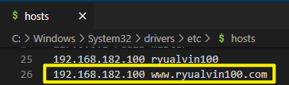

# 1、简介

## 1.1、什么是nginx

- Nginx（”engine x“）是一个高性能的HTTP和反向代理服务器，特点是占用内存少，并发能力强，事实上nginx的并发能力确实再同类型的网页服务器中表现较好；

- Nginx专为性能优化而开发，性能是其最重要的考量，实现上非常注重效率，能经受搞负载的考验，有报告表明能支持高达50,000个并发连接数；

## 1.2、反向代理

### 1.2.1、正向代理

- 在客户端（浏览器）配置代理服务器，通过代理服务器进行互联网访问；

  

### 1.2.2、反向代理

- 客户端只需要将请求发送到反向代理服务器，由反向代理服务器去选择目标服务器获取数据后，再返回给客户端。此时，反向服务器和目标服务器对外就是一个服务器，暴露的是代理服务器地址，隐藏了真实服务器IP地址；

  

## 1.3、负载均衡

- 单个服务器解决不了，我们增加服务器的数量，然后将请求分发到各个服务器上，将原先请求集中到单个服务器上的情况改为将请求分发到多个服务器上，将负载分发到不同的服务器，也就是我们所说的负载均衡；
- 通俗一点理解就是，让一匹马去拉一车的木头，在拉不动的情况下，用三匹马去拉；

## 1.4、动静分离

- 为了加快网站的解析速度，可以把动态页面和静态页面由不同的服务器来解析，加快解析速度。降低原来单个服务器的压力；

  

# 2、安装

## 2.1、pcre依赖安装

```shell
#拷贝 pcre-8.37.tar.gz 至这个目录
cd /usr/src
#解压
tar -xvf pcre-8.37.tar.gz
#进入解压目录
cd pcre-8.37/
#检查文件
./configure
#安装并编译
make && make install
#报错的话安装gcc之后再执行 make && make install
yum install gcc-c++ -y
yum -y install gcc
#查看版本
pcre-config --version
```

## 2.2、其他依赖安装

```shell
yum -y install make zlib zlib-devel gcc-c++ libtool  openssl openssl-devel
```

## 2.3、nginx安装

```shell
#拷贝 nginx-1.12.2.tar.gz 至这个目录
cd /usr/src
#解压
tar -xvf nginx-1.12.2.tar.gz 
#进入解压目录
./configure
#安装并编译
make && make install
#进入安装目录
cd /usr/local/nginx

```

## 2.4、nginx启动

```shell
#查看开放的端口号
firewall-cmd --list-all
#设置开放的端口号
firewall-cmd --add-service=http --permanent
firewall-cmd --add-port=80/tcp --permanent
#重启防火墙
firewall-cmd --reload
#进入启动程序所在目录
cd /usr/local/nginx/sbin/
#启动
./nginx
#检查启动进程
[root@ryualvin100 sbin]# ps -ef | grep nginx
root      48500      1  0 08:51 ?        00:00:00 nginx: master process ./nginx
nobody    48501  48500  0 08:51 ?        00:00:00 nginx: worker process
root      48832   3392  0 08:52 pts/0    00:00:00 grep --color=auto nginx
#查看配置文件
[root@ryualvin100 conf]# cat /usr/local/nginx/conf/nginx.conf
```

以上，通过`192.168.182.100:80`访问：


# 3、常用命令

```shell
#使用nginx操作命令前提条件：必须进入nginx的目录
cd /usr/local/nginx/sbin
#查看版本号
[root@ryualvin100 sbin]# ./nginx -v
nginx version: nginx/1.12.2
#关闭nginx
[root@ryualvin100 sbin]# ./nginx -s stop
#启动nginx
[root@ryualvin100 sbin]# ./nginx
#如果修改配置文件，可以不用重启nginx服务而重加载配置文件
#热部署
[root@ryualvin100 sbin]# ./nginx -s reload
```

# 4、配置文件

1. 

```nginx
#user  nobody;
worker_processes  1;

#error_log  logs/error.log;
#error_log  logs/error.log  notice;
#error_log  logs/error.log  info;

#pid        logs/nginx.pid;


events {
    worker_connections  1024;
}


http {
    include       mime.types;
    default_type  application/octet-stream;

    #log_format  main  '$remote_addr - $remote_user [$time_local] "$request" '
    #                  '$status $body_bytes_sent "$http_referer" '
    #                  '"$http_user_agent" "$http_x_forwarded_for"';

    #access_log  logs/access.log  main;

    sendfile        on;
    #tcp_nopush     on;

    #keepalive_timeout  0;
    keepalive_timeout  65;

    #gzip  on;

    server {
        listen       80;
        server_name  localhost;

        #charset koi8-r;

        #access_log  logs/host.access.log  main;

        location / {
            root   html;
            index  index.html index.htm;
        }

        #error_page  404              /404.html;

        # redirect server error pages to the static page /50x.html
        #
        error_page   500 502 503 504  /50x.html;
        location = /50x.html {
            root   html;
        }

        # proxy the PHP scripts to Apache listening on 127.0.0.1:80
        #
        #location ~ \.php$ {
        #    proxy_pass   http://127.0.0.1;
        #}

        # pass the PHP scripts to FastCGI server listening on 127.0.0.1:9000
        #
        #location ~ \.php$ {
        #    root           html;
        #    fastcgi_pass   127.0.0.1:9000;
        #    fastcgi_index  index.php;
        #    fastcgi_param  SCRIPT_FILENAME  /scripts$fastcgi_script_name;
        #    include        fastcgi_params;
        #}

        # deny access to .htaccess files, if Apache's document root
        # concurs with nginx's one
        #
        #location ~ /\.ht {
        #    deny  all;
        #}
    }


    # another virtual host using mix of IP-, name-, and port-based configuration
    #
    #server {
    #    listen       8000;
    #    listen       somename:8080;
    #    server_name  somename  alias  another.alias;

    #    location / {
    #        root   html;
    #        index  index.html index.htm;
    #    }
    #}


    # HTTPS server
    #
    #server {
    #    listen       443 ssl;
    #    server_name  localhost;

    #    ssl_certificate      cert.pem;
    #    ssl_certificate_key  cert.key;

    #    ssl_session_cache    shared:SSL:1m;
    #    ssl_session_timeout  5m;

    #    ssl_ciphers  HIGH:!aNULL:!MD5;
    #    ssl_prefer_server_ciphers  on;

    #    location / {
    #        root   html;
    #        index  index.html index.htm;
    #    }
    #}

}
```

## 4.1、全局块

- 从配置文件开始到events块之间的内容，主要会设置一些影响nginx服务器整体运行的配置指令；

  ```nginx
  #worker_processes值越大，可以支持的并发处理量也越多
  worker_processes  1;
  ```

## 4.2、events块

- events块涉及的指令主要影响nginx服务器与用户的网络连接；

  ```nginx
  events {
      #支持的最大连接数
      worker_connections  1024;
  }
  ```

## 4.3、http块

- nginx服务器配置中最频繁的部分，代理、缓存和日志定义等绝大多数功能和第三方模块的配置都在这里；

- 在这里面又包含两部分内容：http全局块和server块；

  - http全局块：配置的指令包括文件引入、MIME-TYPE定义、日志自定义、连接超时时间、单链接请求数上限等；
  - server块：这块和虚拟主机有密切关系，虚拟主机从用户角度看，和一台独立的硬件主机是完全一样的，该技术的产生是为了节省互联网服务器硬件成本；
    - 每个http块可以包含多个server块，而每个server块就相当于一个主机；
    - 而每个server块也分为全局server块，以及可以同时包含多个location块；

  ```nginx
  http {
      include       mime.types;
      default_type  application/octet-stream;
  
      sendfile        on;
  
      keepalive_timeout  65;
  
      server {
          listen       80;#目前监听端口号
          server_name  localhost;#主机名称，本地是localhost
  
          location / {
              root   html;
              index  index.html index.htm;
          }
  
          error_page   500 502 503 504  /50x.html;
          location = /50x.html {
              root   html;
          }
      }
  }
  ```

# 5、配置实例

## 5.1、反向代理实例1

> 准备工作

```shell
#使用tomcat默认端口，开放端口8080
#查看开放的端口号
firewall-cmd --list-all
#设置开放的端口号
firewall-cmd --add-service=http --permanent
firewall-cmd --add-port=8080/tcp --permanent
#重启防火墙
firewall-cmd --reload
#安装JDK
#上传tomcat压缩包至这个目录
[root@ryualvin100 /]# cd /usr/src
#进入压缩目录
[root@ryualvin100 src]# tar -xvf apache-tomcat-8.5.82.tar.gz
#进入tomcat启动目录
[root@ryualvin100 src]# cd /usr/src/apache-tomcat-8.5.82/bin
#启动tomcat
[root@ryualvin100 bin]# ./startup.sh 
#进入日志目录
[root@ryualvin100 bin]# cd ../logs
[root@ryualvin100 logs]# ls
catalina.2022-12-14.log  catalina.out  host-manager.2022-12-14.log  localhost.2022-12-14.log  localhost_access_log.2022-12-14.txt  manager.2022-12-14.log
#查看日志，检查是否正常启动
[root@ryualvin100 logs]# tail -f catalina.out
14-Dec-2022 18:30:17.229 信息 [localhost-startStop-1] org.apache.catalina.startup.HostConfig.deployDirectory 把web 应用程序部署到目录 [/usr/src/apache-tomcat-8.5.82/webapps/docs]
#...
```

以上，通过`192.168.182.100:8080`访问：


> 实现步骤


1. 配置域名IP映射：

   浏览器地址栏输入url点击后，浏览器会先到本地的hosts文件中查看是否有相应的配置，有的话按照hosts文件中的IP地址执行，没有的话到网络上找DNS域名解析服务器，找网络中的IP。因为现在没有域名，就先在hosts中配置域名映射的IP地址，让其转发至nginx`ryualvin100 192.168.182.100`

   

2. 配置nginx代理转发规则：

   ```nginx
       server {
           listen       80;
           server_name  192.168.182.100;
   
           #charset koi8-r;
   
           #access_log  logs/host.access.log  main;
   
           location / {
               root   html;
               proxy_pass http://127.0.0.1:8080;
               index  index.html index.htm;
           }
   ```

   以上，通过`www.ryualvin100.com`访问：

   

## 5.2、方向代理实例2

> 准备工作

```shell
#开放端口8081
firewall-cmd --add-port=8081/tcp --permanent
#重启防火墙
firewall-cmd --reload
#进入压缩包目录
[root@ryualvin100 /]# cd /usr/src
#创建目录
[root@ryualvin100 src]# mkdir tomcat8081
#将压缩包拷贝至tomcat8081解压
[root@ryualvin100 src]# cp apache-tomcat-8.5.82.tar.gz tomcat8081/
[root@ryualvin100 tomcat8081]# tar -xvf apache-tomcat-8.5.82.tar.gz
```

```shell
#进入8080的文件夹
[root@ryualvin100 tomcat8080]# cd /usr/src/apache-tomcat-8.5.82/webapps
#创建edu文件夹
[root@ryualvin100 webapps]# mkdir edu
#进入edu文件夹
[root@ryualvin100 webapps]# cd edu
#创建一个html页面
[root@ryualvin100 edu]# vim edu.html
[root@ryualvin100 edu]# cat edu.html
<h1>EDU</h1>
```

以上，通过`ryualvin100:8080/edu/edu.html`访问：


```shell
#进入8081的文件夹
[root@ryualvin100 /]# cd /usr/src/tomcat8081/apache-tomcat-8.5.82/webapps
#创建vod文件夹
[root@ryualvin100 webapps]# mkdir vod
#进入vod文件夹
[root@ryualvin100 webapps]# cd vod
#创建一个html页面
[root@ryualvin100 vod]# vim vod.html
[root@ryualvin100 vod]# cat vod.html
<h1>VOD</h1>
```

以上，通过`ryualvin100:8081/vod/vod.html`访问：


> 配置nginx

```nginx
    server {
    	#对外暴露9001访问端口
        listen       9001;
        server_name  192.168.182.100;
	    # "~" 代表通过正则匹配请求转发地址
        location ~ /edu/ {
            # 代理路径，转发至哪儿
            proxy_pass http://127.0.0.1:8080;
        }
        location ~ /edu/ {
            proxy_pass http://127.0.0.1:8081;
        }
    }
```

> 验证


### 5.2.1、location指令说明

1. =：用于不含正则表达式的uri前，要求请求字符串与uri严格匹配，如果匹配成功，就停止继续向下搜索并立即处理该请求；
2. ~：用于表示uri包含正则表达式，并且区分大小写；
3. ~*：用于表示uri包含正则表达式，并且不区分大小写；
4. ^~：用于不含正则表达式的uri前，要求nginx服务器找到标识uri和请求字符串匹配度最高的location后，立即使用此location处理请求，而不再使用location块中的uri和请求字符串做匹配；
5. 注意：如果uri包含正则表达式，则必须要有~或者~*标识；

## 5.3、负载均衡实例

### 5.3.1、实现

> 准备工作

分别在`tomcat/8080`和`tomcat/8081`中的`webapps`下新建一个`edu`工程，`edu`里各新建一个`lb.html`，内容分别为`8080`和`8081`，接着配置nginx：

```nginx
http {
    include       mime.types;
    default_type  application/octet-stream;

    #log_format  main  '$remote_addr - $remote_user [$time_local] "$request" '
    #                  '$status $body_bytes_sent "$http_referer" '
    #                  '"$http_user_agent" "$http_x_forwarded_for"';

    #access_log  logs/access.log  main;

    sendfile        on;
    #tcp_nopush     on;

    #keepalive_timeout  0;
    keepalive_timeout  65;

    #gzip  on;

    upstream myserver {
        server 192.168.182.100:8080;
        server 192.168.182.100:8081;
    }

    server {
        listen       80;
        server_name  192.168.182.100;

        #charset koi8-r;

        #access_log  logs/host.access.log  main;

        location / {
            proxy_pass http://myserver;
            root   html;
            index  index.html index.htm;
        }
```

以上，依次访问`http://ryualvin100/edu/lb.html`，`tomcat/8080`下的`lb.html`和`tomcat8081`下的`lb.html`会交替着返回；

### 5.3.2、什么是负载均衡

随着互联网信息的爆炸性增长，负载均衡（load balance）已经不再是一个很陌生的话题。顾名思义，负载均衡即是将负载分摊到不同的服务单元，既保证服务的可用性，又保证响应足够快，给用户很好的体验。快速增长的访问量和数据流量催生了各式各样的负载均衡产品，很多专业的负载均衡硬件提供了很好的功能，但却价格不菲，这使得负载均衡软件大受欢迎，nginx就是其中的一个，在linux下有Nginx、LVS、Haproxy等等可以提供负载均衡服务，而且Nginx提供了几种分配方式（策略）：

#### 1、轮询（默认）

每个请求按时间顺序逐一分配到不同的后端服务器，如果后端服务器down掉，能自动剔除；

#### 2、weight

- 代表权重，默认为1，权重越高被分配的客户端越多；

- 指定轮询几率，weight和访问比率成正比，用于后端服务器性能不均的情况。例如：

  ```nginx
      upstream myserver {
          server 192.168.182.100:8080 weight=5;
          server 192.168.182.100:8081 weight=10;
      }
  ```

#### 3、ip_hash

每个请求按访问IP的hash结果分配，这样每个访客固定访问一个后端服务器，可以解决session共享的问题。例如：

```nginx
    upstream myserver {
    	ip_hash;
        server 192.168.182.100:8080;
        server 192.168.182.100:8081;
    }
```

- 同一个IP访问服务器，如果负载均衡至服务器8080端口，则之后一直访问的都是8080，通过IP来指定访问的服务器；

#### 4、fair（第三方）

按后端服务器的响应时间来分配请求，响应时间短的优先分配；

```nginx
    upstream myserver {
        server 192.168.182.100:8080;
        server 192.168.182.100:8081;
        fair;
    }
```

## 5.5、动静分离

Nginx动静分离，简单来说就是把动态跟静态请求分开，不能理解成只是单纯的把动态页面和静态页面物理分离。严格意义上来说应该是动态请求跟静态请求分开，可以理解成使用Nginx处理静态页面，Tomcat处理动态页面。动静分离从目前实现角度来讲大致分为两种：

1. 一种是动态跟静态文件混合在一起发布，通过nginx来分开；

2. 一种是纯粹把静态文件独立成单独的域名，放在独立的服务器上，也是目前主流推崇的方案（主流且常用）；

   - 通过location指定不同的后缀名实现不同的请求转发。通过expires参数设置，可以使浏览器缓存过期时间，减少与服务器之间的请求和流量。具体expires定义：是给一个资源设定一个过期时间，也就是说无需去服务端验证，直接通过浏览器自身确认是否过期即可，所以不会产生额外的流量。此种方法非常适合不经常变动的资源（如果经常更新的文件，不建议使用expires来缓存)。这里设置3d，表示在这3天之内访问这个url，发送一个请求，比对服务器该文件最后更新时间没有变化，则不会从服务器抓取，返回 状态码304。如果有修改，则直接从服务器重新下载，返回状态码200；

     

> 准备工作

在`/data/image`下放一个静态资源`static.image`，在`/data/www`下放一个动态资源`dynamic.html`；

> 实现

```nginx
    server {
        listen       80;
        server_name  192.168.182.100;

    	#设置字符集
    	charset utf-8;
    	#根据server_name/www/dynamic.html去访问/data/www/下的动态资源
        location /www/ {
            root /data/;
            index index.html index.htm;
        	#设置字符集
          	charset utf-8;
        }
    
		#根据server_name/image去访问/data/image/下的静态资源
        location /image/ {
            root /data/;
        	#将/data/image/下的静态资源罗列出来
            autoindex on;
        }
```


# 6、配置高可用集群

## 6.1、准备工作

1. 准备第二台服务器，按照`2、安装`配置nginx环境并启动；

2. 在两台服务器上都安装keepalived：`yum install keepalived -y`

   ```shell
   #安装keepalived
   [root@ryualvin100 usr]# yum install keepalived -y
   #检查是否已经安装
   [root@ryualvin100 usr]# rpm -q -a keepalived
   keepalived-1.3.5-19.el7.x86_64
   #keepalived安装目录
   [root@ryualvin107 keepalived]# pwd
   /etc/keepalived
   ```


## 6.2、高可用配置（主从配置）

> 主服务器

1. 编写`keepalived.conf`配置文件：

   ```nginx
   #全局配置
   global_defs {
      notification_email {
        acassen@firewall.loc
        failover@firewall.loc
        sysadmin@firewall.loc
      }
      notification_email_from Alexandre.Cassen@firewall.loc
      smtp_server 192.168.182.100
      smtp_connect_timeout 30
      #RYUALVIN，唯一的值，也可以设置成IP，通过RYUALVIN可以访问到主机，/etc/hosts里配置
      router_id RYUALVIN
      script_user root
      enable_script_security
   }
   
   vrrp_script chk_http_port {
   
     script "/usr/local/src/nginx_check.sh"
   
     interval 2    # (检测脚本执行的间隔，检测nginx主服务是否还活着，宕机了则切换成备服务，每隔2秒执行一次)
   
     weight -20	#当脚本中的条件成立，就把当前主机的权重减低20，即当主服务器挂了，让从服务器做主服务器
   
   }
   
   vrrp_instance VI_1 {
       state MASTER  #备份服务器上将 MASTER 改为 BACKUP
       interface ens33 #当前网卡名称
       virtual_router_id 51  #主、备机的virtual_router_id必须相同，唯一标识
       priority 100  #主、备机取不同的优先级，主机值较大，备份机值较小
       advert_int 1	#每隔1秒发送一个心跳，检查服务器是否还活着
       authentication {
           auth_type PASS
           auth_pass 1111
       }
       virtual_ipaddress {
           #在这里可以绑定多个虚拟IP
           192.168.182.50 #VRRP H虚拟地址
       }
   }
   ```

2. 编写检测脚本`/usr/local/src/nginx_check.sh`

   ```shell
   #!/bin/bash
   A=`ps -C nginx -no-header |wc -l`
   if [ $A -eq 0 ];then
   	#主服务器挂了，让从服务器替代主服务器
       /usr/local/nginx/sbin/nginx
       sleep 2
       if [ `ps -C nginx --no-header |wc -l` -eq 0 ];then
           killall keepalived
       fi
   fi
   ```

> 备服务器

1. 编写`keepalived.conf`配置文件：只需要更改`priority 90`和`state BACKUP`

   ```shell
   #全局配置
   global_defs {
      notification_email {
        acassen@firewall.loc
        failover@firewall.loc
        sysadmin@firewall.loc
      }
      notification_email_from Alexandre.Cassen@firewall.loc
      smtp_server 192.168.182.100
      smtp_connect_timeout 30
      #RYUALVIN，唯一的值，也可以设置成IP，通过RYUALVIN可以访问到主机，/etc/hosts里配置
      router_id RYUALVIN
      script_user root
      enable_script_security
   }
   #脚本配置
   vrrp_script chk_http_port {
   
     script "/usr/local/src/nginx_check.sh"
   
     interval 2    # (检测脚本执行的间隔，检测nginx主服务是否还活着，宕机了则切换成备服务)
   
     weight 2
   
   }
   #虚拟IP配置
   vrrp_instance VI_1 {
       state BACKUP  #备份服务器上将 MASTER 改为 BACKUP
       interface ens33 #网卡
       virtual_router_id 51  #主、备机的virtual_router_id必须相同
       priority 90  #主、备机取不同的优先级，主机值较大，备份机值较小
       advert_int 1
       authentication {
           auth_type PASS
           auth_pass 1111
       }
       virtual_ipaddress {
           192.168.182.50 #VRRP H虚拟地址
       }
   }
   ```

   

2. 编写检测脚本`/usr/local/src/nginx_check.sh`（无需更改）

   ```shell
   #!/bin/bash
   A=`ps -C nginx -no-header |wc -l`
   if [ $A -eq 0 ];then
       /usr/local/nginx/sbin/nginx
       sleep 2
       if [ `ps -C nginx --no-header |wc -l` -eq 0 ];then
           killall keepalived
       fi
   fi
   ```

3. 分别启动两台服务器的nginx和keepalived：

   ```shell
   [root@ryualvin100 sbin]# ./nginx -s stop
   [root@ryualvin100 sbin]# ./nginx
   [root@ryualvin100 sbin]# systemctl start keepalived.service
   #查看keepalived是否启动成功
   [root@ryualvin100 sbin]# systemctl status keepalived.service
   #或者查询是否有进程在执行
   [root@ryualvin100 sbin]# ps -ef | grep keepalived
   ```


> 测试

1. 访问虚拟IP`http://192.168.182.50/`

   ```shell
   [root@ryualvin100 sbin]# ip a
   1: lo: <LOOPBACK,UP,LOWER_UP> mtu 65536 qdisc noqueue state UNKNOWN group default qlen 1000
       link/loopback 00:00:00:00:00:00 brd 00:00:00:00:00:00
       inet 127.0.0.1/8 scope host lo
          valid_lft forever preferred_lft forever
       inet6 ::1/128 scope host 
          valid_lft forever preferred_lft forever
   2: ens33: <BROADCAST,MULTICAST,UP,LOWER_UP> mtu 1500 qdisc pfifo_fast state UP group default qlen 1000
       link/ether 00:0c:29:b0:42:8b brd ff:ff:ff:ff:ff:ff
       inet 192.168.182.100/24 brd 192.168.182.255 scope global noprefixroute ens33
          valid_lft forever preferred_lft forever
       # 虚拟主机 绑定网卡ens33
       inet 192.168.182.50/32 scope global ens33
          valid_lft forever preferred_lft forever
   ```

   

2. 停止主服务的nginx和keepalived：

   ```shell
   [root@ryualvin100 sbin]# ./nginx -s stop
   [root@ryualvin100 sbin]# systemctl stop keepalived.service
   ```

   

# 7、nginx原理


- master主进程发送信号给worker进程，多个worker进程争抢处理请求；

- master-workers机制的好处：首先，对于每个worker进程来说，独立的进程，不需要加锁，所以省掉了锁带来的开销，同时在编程以及问题查找时，也会方便很多。其次，采用独立的进程，可以让互相之间不会影响，一个进程退出后，其它进程还在工作，服务不会终端，master进程则很快启动新的woker。当然，worker进程的异常退出，肯定是程序又bug了，异常退出，会导致当前worker上的所有请求失败，不过不会影响到所有请求，所以降低了风险；

- `./nginx -s reload`热加载机制就是通过其中一个worker进程去争抢加载更新后的配置文件，其他worker进程争抢处理请求；

- 需要设置多少个worker：nginx同redis类似都采用了IO多路复用机制，即每个woker都是一个独立的进程，但每个进程里只有一个主线程，通过异步非阻塞的方式来处理请求，即使是千上万个请求也不再话下。每个worker的线程可以把一个cpu的性能发挥到极致。所以worker数和服务器的cpu数相等时最为适宜的。设少了会浪费cpu，设多了会造成cpu频繁切换上下文带来的损耗；

- 设置worker数量（全局块中设置）：

  ```nginx
  #worker_processes值越大，可以支持的并发处理量也越多
  worker_processes  4;
  ```

- 设置worker的连接数（events块中设置）：

  ```nginx
  events {
      #支持的最大连接数
      worker_connections  1024;
  }
  ```

- 发送一个请求，占用了worker的几个连接数？答案是2或者4；

  

  

- nginx有1个master，有4个worker，每个worker支持最大的连接数是1024，则该nginx支持的最大并发数是多少？

  - 普通的静态访问最大并发数是：worker数*最大连接数/2=2048；
  - 而如果是是HTTP作为反向代理来说（即动态请求），最大并发数是：woker数*最大连接数/4=1024；