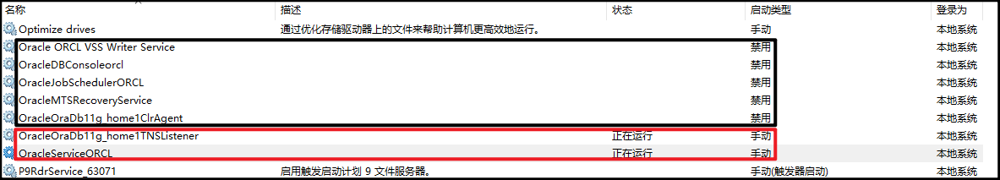
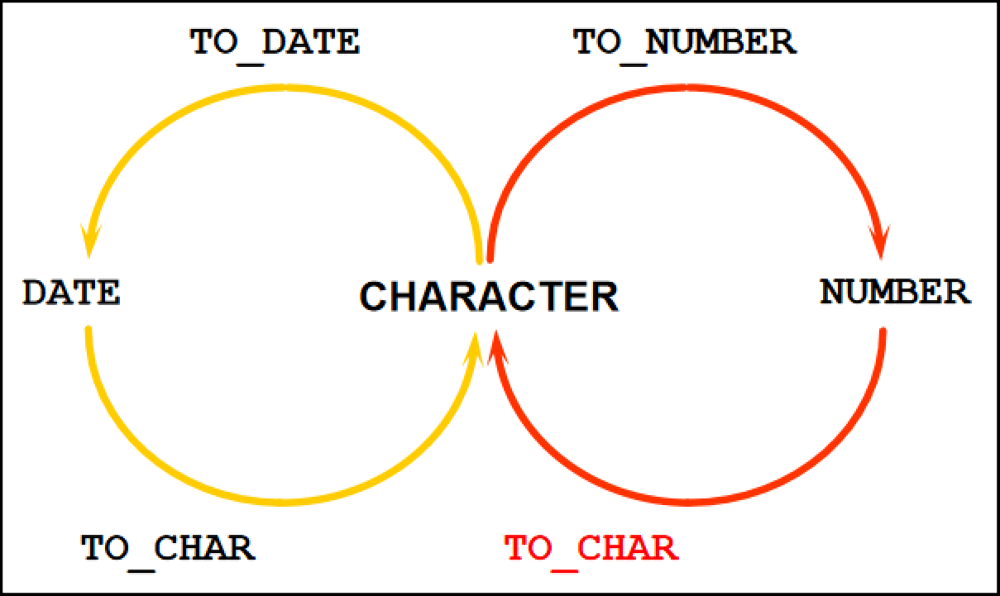
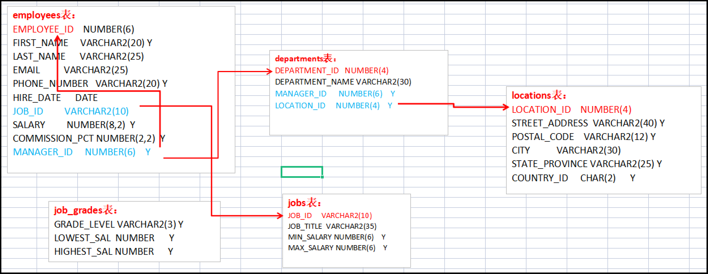

# 1、数据库管理

## 1.1、服务确认



## 1.2、数据准备

依次执行以下SQL，有报错忽略：

```sql
SQL> @C:/Users/ryualvin/Desktop/01_del_data.sql
SQL> @C:/Users/ryualvin/Desktop/02_hr_cre.sql
SQL> @C:/Users/ryualvin/Desktop/03_hr_popul.sql
SQL> select * from employees;
107 rows selected
```


# 2、基本的SQL-SELECT语句

> 查询列起别名

1. 起别名需注意：别名上加双引号，可返回指定大小写的别名，不加双引号，则都返回大写别名：

   ```sql
   -- 不加双引号时，返回的别名都是“ID”
   select employee_id id from employees;
   select employee_id as id from employees;
   -- 双引号时，返回的别名大小写可任意指定
   -- 返回“Id”
   select employee_id "Id" from employees;
   -- 返回“ID”
   select employee_id "ID" from employees;
   ```

2. 别名中存在空格，也需要用双引号：

   ```sql
   select salary*12 "Annual Salary" from employees
   ```

> 连接符

用单引号连接。

**注意：在SQL中只有在起别名的时候会用到双引号。**

```sql
select last_name || '`s JOB_ID is ' || JOB_ID as detail from employees;
```

```sql
DETAIL
------------------------------------------------
Weiss`s JOB_ID is ST_MAN
```

> SQL语句与SQL *Plus命令

1. SQL：
   - 一种语言、ANSI标准、关键字不能缩写、使用语句空值数据库中的表的定义信息和表中的数据；
2. SQL *Plus：
   - 一种环境、Oracle的特性之一、关键字可以缩写、命令不能改变数据库中的数据的值（即不能控制数据库）、集中运行；

# 3、过滤和排序数据

> 转义字符

```sql
select employee_id, last_name from employees where last_name like '%\_%' escape '\'
```

```sql
EMPLOYEE_ID LAST_NAME
----------- -------------------------
        120 W_eiss
```

# 4、单行函数

> 什么是单行函数？

- 操作数据对象；
- 接受参数返回一个结果；
- **只对一行进行交换；**
- **每行返回一个结果；**
- 可以转换数据类型；
- 可以嵌套；
- 参数可以是一列或一个值；

> 单行函数的类型

字符、数值、日期、转换、通用。

## 4.1、字符函数

### 4.1.1、大小写控制函数

#### LOWER

```sql
SQL> select lower('HELLO WORLD') from dual;

LOWER('HELLOWORLD')
-------------------
hello world
```

#### UPPER

```sql
SQL> select upper('hello world') from dual;

UPPER('HELLOWORLD')
-------------------
HELLO WORLD
```

#### INITCAP

单词首字母大写。

```sql
SQL> select initcap('hello world') from dual;

INITCAP('HELLOWORLD')
---------------------
Hello World
```

### 4.1.2、字符控制函数

#### CONCAT

相当于`||`，只有两个参数。

```sql
SQL> select concat('hello', 'world') from dual;

CONCAT('HELLO','WORLD')
-----------------------
helloworld
```

#### SUBSTR

目标字符串，截取的起始位置（字符索引从1开始），截取长度。

```sql
SQL> select substr('helloworld', 2, 3) from dual;

SUBSTR('HELLOWORLD',2,3)
------------------------
ell
```

#### LENGTH

```sql
SQL> select length('hello world ryualvin') from dual;

LENGTH('HELLOWORLDRYUALVIN')
----------------------------
                          20
```

#### INSTR

找到返回字符索引值，找不到返回0。

```sql
SQL> select instr('helloworld', 'W') from dual;

INSTR('HELLOWORLD','W')
-----------------------
                      0

SQL> select instr('helloworld', 'o') from dual;

INSTR('HELLOWORLD','O')
-----------------------
                      5
```

#### LPAD

```sql
SQL> select lpad('hello', 10, '*') from dual;

LPAD('HELLO',10,'*')
--------------------
*****hello

SQL> select lpad('hello', 2, '*') from dual;

LPAD('HELLO',2,'*')
-------------------
he
```

#### RPAD

```sql
SQL> select rpad('hello', 10, '*') from dual;

RPAD('HELLO',10,'*')
--------------------
hello*****

SQL> select rpad('hello', 2, '*') from dual;

RPAD('HELLO',2,'*')
-------------------
he
```

#### TRIM

去除**头尾**指定字符。

```sql
SQL> select trim('h' from 'helloworld hfdafdah') from dual;

TRIM('H'FROM'HELLOWORLDHFDAFDAH')
---------------------------------
elloworld hfdafda
```

#### REPLACE

替换字符串中**所有**指定字符。

```sql
SQL> select replace('hello world hafdaf owf h', 'h', '*') from dual;

REPLACE('HELLOWORLDHAFDAFOWFH','H','*')
---------------------------------------
*ello world *afdaf owf *
```

## 4.2、数字函数

### ROUND

```sql
SQL> select round(435.245, 2), round(435.245), round(435.245, -2) from dual;

ROUND(435.245,2) ROUND(435.245) ROUND(435.245,-2)
---------------- -------------- -----------------
          435.25            435               400
```

### TRUNC

```sql
SQL> select trunc(435.245,0), trunc(435.245, 2), trunc(435.245, -2), trunc(435,245) from dual;

TRUNC(435.245,0) TRUNC(435.245,2) TRUNC(435.245,-2) TRUNC(435,245)
---------------- ---------------- ----------------- --------------
             435           435.24               400            435
```

### MOD

```sql
SQL> select mod(1600, 300), mod(1600, 100) from dual;

MOD(1600,300) MOD(1600,100)
------------- -------------
          100             0
```

## 4.3、日期函数

### SYSDATE

该函数包含日期和时间：

```sql
SQL> select sysdate from dual;

SYSDATE
-----------
2023/4/18 1
```

对SYSDATE进行加减运算：

```sql
SQL> select sysdate+1, sysdate-3 from dual;

SYSDATE+1   SYSDATE-3
----------- -----------
2023/4/19 1 2023/4/15 1
```

```sql
SQL> select trunc(sysdate-hire_date) "Work Days" from employees;
 Work Days
----------
      8496
     10542
```

### MONTHS_BETWEEN

```sql
SQL> select hire_date, months_between(hire_date, sysdate) from employees;
HIRE_DATE   MONTHS_BETWEEN(HIRE_DATE,SYSDATE)
----------- ---------------------------------
2000/1/13                   -279.176967592593

SQL> select hire_date, months_between(sysdate, hire_date) from employees;
HIRE_DATE   MONTHS_BETWEEN(SYSDATE,HIRE_DATE)
----------- ---------------------------------
2000/1/13                    279.176975059737
```

### ADD_MONTHS

```sql
SQL> select hire_date, add_months(hire_date, 1) from employees;
HIRE_DATE   ADD_MONTHS(HIRE_DATE,1)
----------- -----------------------
2000/1/13   2000/2/13

SQL> select hire_date, add_months(hire_date, -1) from employees;
HIRE_DATE   ADD_MONTHS(HIRE_DATE,-1)
----------- ------------------------
2000/1/13   1999/12/13
```

### NEXT_DAY

当前日期为周二，则下一个星期一，则为下周的星期一：

```sql
SQL> select sysdate, next_day(sysdate, '星期一') from dual;

SYSDATE     NEXT_DAY(SYSDATE,'星期一')
----------- -----------------------
2023/4/18 1 2023/4/24 11:44:42
```

当前日期为周二，则下一个星期二，则为当前日期：

```sql
SQL> select sysdate, next_day(sysdate, '星期二') from dual;

SYSDATE     NEXT_DAY(SYSDATE,'星期二')
----------- -----------------------
2023/4/18 1 2023/4/25 11:45:01
```

当前日期为周二，则下一个星期三，则为这周的星期三：

```sql
SQL> select sysdate, next_day(sysdate, '星期三') from dual;

SYSDATE     NEXT_DAY(SYSDATE,'星期三')
----------- -----------------------
2023/4/18 1 2023/4/19 11:45:46
```

### LAST_DAY

```sql
SQL> select sysdate, last_day(sysdate), last_day(sysdate)-1 from dual;

SYSDATE     LAST_DAY(SYSDATE) LAST_DAY(SYSDATE)-1
----------- ----------------- -------------------
2023/4/18 1 2023/4/30 11:47:3 2023/4/29 11:47:35
```

### ROUND & TRUNC

Assume sysdate = '25-JUL-95'：

- ROUND(SYSDATE, 'MONTH') => 01-AUG-95
- ROUND(SYSDATE, 'YEAR') => 01-JAN-96
- TRUNC(SYSDATE, 'MONTH') => 01-JUL-95
- TRUNC(SYSDATE, 'YEAR') => 01-JAN-95

### 日期格式

| yyyy | 年   |
| ---- | ---- |
| mm   | 月   |
| dd   | 日   |
| day  | 星期 |
| hh   | 小时 |
| mi   | 分钟 |
| ss   | 秒   |

## 4.4、转换函数

### 4.4.1、隐式数据类型转换

Oracle会自动完成下列转换（DATE <=> VARCHAR2 <=> NUMBER）：

| 源数据类型       | 目标数据类型 |
| ---------------- | ------------ |
| VARCHAR2 or CHAR | NUMBER       |
| VARCHAR2 or CHAR | DATE         |
| NUMBER           | VARCHAR2     |
| DATE             | VARCHAR2     |

> 例子

Java中通过`12+'2'`最后得到的结果是字符串`122`，而在Oracle中可通过`||`实现，`+`号则是转换成字符以外的数据类型：

```sql
SQL> select 12 + '2' from dual;

    12+'2'
----------
        14
```

```sql
SQL> select sysdate + 2 from dual;

SYSDATE+2
-----------
2023/4/20 1
```

### 4.4.2、显示数据类型转换



#### DATE 2 CHARACTER

```sql
SQL> select to_char(sysdate) from dual;

TO_CHAR(SYSDATE)
----------------
18-4月 -23

SQL> select to_char(123) from dual;

TO_CHAR(123)
------------
123

SQL> select to_char(sysdate, 'yyyy-mm-dd hh:mi:ss') from dual;

TO_CHAR(SYSDATE,'YYYY-MM-DDHH:MI:SS')
-------------------------------------
2023-04-18 12:17:08
```

```sql
SQL> select employee_id, hire_date from employees where hire_date = '7-6月-94';

EMPLOYEE_ID HIRE_DATE
----------- -----------
        203 1994/6/7
        204 1994/6/7
        
SQL> select employee_id, hire_date from employees where to_char(hire_date, 'yyyy-mm-dd') = '1994-06-07';

EMPLOYEE_ID HIRE_DATE
----------- -----------
        203 1994/6/7
        204 1994/6/7
```

当格式中需要用到另外的字符时，要用双引号将其包裹：

```sql
SQL> select employee_id, hire_date from employees where to_char(hire_date, 'yyyy"年"mm"月"dd"日"') = '1994年06月07日';

EMPLOYEE_ID HIRE_DATE
----------- -----------
        203 1994/6/7
        204 1994/6/7
```

#### CHARACTER 2 DATE

```sql
SQL> select employee_id, hire_date from employees where hire_date = '7-6月-94';

EMPLOYEE_ID HIRE_DATE
----------- -----------
        203 1994/6/7
        204 1994/6/7

SQL> select employee_id, hire_date from employees where to_date('1994-06-07', 'yyyy-mm-dd') = hire_date;

EMPLOYEE_ID HIRE_DATE
----------- -----------
        203 1994/6/7
        204 1994/6/7
```

#### NUMBER 2 CHARACTER

```sql
SQL> select to_char(1234567.78, '9,999,999.99') from dual;

TO_CHAR(1234567.78,'9,999,999.99')
----------------------------------
 1,234,567.78
 
SQL> select to_char(1234567.78, '999,999.99') from dual;

TO_CHAR(1234567.78,'999,999.99')
--------------------------------
###########

SQL> select to_char(1234567.78, '000,999,999.99') from dual;

TO_CHAR(1234567.78,'000,999,999.99')
------------------------------------
 001,234,567.78
```

美元符号：

```sql
SQL> select to_char(1234567.78, '$9,999,999.99') from dual;

TO_CHAR(1234567.78,'$9,999,999.99')
-----------------------------------
 $1,234,567.78
```

本地货币符号：

```sql
SQL> select to_char(1234567.78, 'L9,999,999.99') from dual;

TO_CHAR(1234567.78,'L9,999,999.99')
-----------------------------------
         ￥1,234,567.78
```

#### CHARACTER 2 NUMBER

```sql
SQL> select to_number('￥1,234,567.78', 'L9,999,999.99') + 1 from dual;

TO_NUMBER('￥1,234,567.78','L9,999,999.99')+1
--------------------------------------------
                                  1234568.78
```

## 4.5、通用函数

### NVL(expr1, expr2)

为空返回`expr2`：

```sql
SQL> select commission_pct, nvl(commission_pct, 0) from employees;
```

### NVL2(expr1, expr2, expr3)

不为空返回`expr2`，为空返回`expr3`：

```sql
SQL> select commission_pct, nvl2(commission_pct, commission_pct * 0.2, 0.01) from employees;
```

### NULLIF(expr1, expr2)

相等返回空，不等返回`expr1`：

```sql
SQL> select length(first_name), length(last_name), nullif(length(first_name), length(last_name)) result from employees;
```

### COALESCE(expr1, expr2, ..., exprn)

多个值交替处理，`expr1`不为空则返回`expr1`，`expr1`为空则返回`expr2`，`expr2`为空则返回...

```sql
SQL> select last_name, commission_pct, salary, coalesce(commission_pct, salary, 10) result from employees order by commission_pct;
```

## 4.6、条件表达式

### CASE

```sql
select 
  department_id, salary, 
  case department_id 
    when 10 then salary * 1.1 
    when 20 then salary * 1.2
    when 30 then salary * 1.3
    else salary
  end result
from employees
```

### DECODE

```sql
select 
  department_id, salary, 
  decode(department_id,
                 10, salary*1.1, 
                 20, salary*1.2,
                 30, salary*1.3) "Result"
from employees
```

## 4.7、练习

```sql
--打印出 “2009年10月14日 9:25:40” 格式的当前系统的日期和时间
select to_char(sysdate, 'yyyy"年"mm"月"dd"日" hh:mi:ss') from dual

--格式化数字：1234567.89转为999,999,999.99
select to_char('1234567.89', '999,999,999.99') from dual;

--字符串转数字，若没有特殊字符，可以进行隐式转换
select '1234567.89' + 100 from dual;

--字符串转数字，若存在特殊字符，则无法进行隐式转换，需要按照格式转换成数字
select to_number('1,234,567.89', '999,999,999.99') from dual;

--每个月倒数第二天入职的员工信息
select hire_date, last_day(hire_date) from employees where hire_date = last_day(hire_date);

--计算公司员工年薪
select last_name, salary * 12 * (1 + nvl(commission_pct, 0)) from employees;

--显示系统时间（注：日期+时间）
select to_char(sysdate, 'yyyy-mm-dd hh:mi:ss') from dual;

--查询员工号，姓名，工资，以及工资提高百分之20%后的结果（new salary）
select employee_id, last_name, salary, nvl(salary, 0) * 1.2 "New Salary" from employees;

--将员工的姓名按首字母排序，并写出姓名的长度
select last_name, length(last_name) "Length" from employees order by substr(last_name, 1, 1);

--查询各员工的姓名，并显示出各员工在公司工作的月份数
select last_name, hire_date, round(months_between(sysdate, hire_date)) "Worked Month" from employees;

--查询员工的姓名，以及在公司工作的月份数（worked_month），并按月份数降序排列
select last_name, hire_date, round(months_between(sysdate, hire_date)) "Worked Month" from employees order by "Worked Month" desc;

--King earns $24000 monthly but wants $72000
select last_name || ' earns ' || to_char(nvl(salary,0), '$99999999999999') || ' monthly, but wants ' || to_char(nvl(salary, 0)*3, '$999999999999999') "Dream Salary" from employees;

--job:AD_PRES(A),ST_MAN(B),IT_PROG(C),SA_REP(D),ST_CLERK(E)
select last_name, job_id, decode(job_id, 'AD_PRES', 'A', 'ST_MAN', 'B', 'IT_PROG', 'C', 'SA_REP', 'D', 'ST_CLERK', 'E') grade from employees;
select last_name, job_id, case job_id when 'AD_PRES' then 'A' when 'ST_MAN' then 'B' when 'IT_PROG' then 'C' when 'SA_REP' then 'D' when 'ST_CLERK' then 'E' else 'F' end grade from employees;
```

# 5、多表查询



## 5.3、内连接

**表里满足条件的记录才输出。**

合并具有同一列的两个以上的表的行，**结果集中不包含一个表与另一个表不匹配的行**。

### 5.3.1、等值连接

N个表，至少要有N-1个条件。

```sql
select 
	e.employee_id, 
	e.last_name, 
	e.department_id, 
    d.department_name 
from employees e, departments d
where 
	e.department_id = d.department_id;
```

```sql
select 
	e.employee_id, 
	e.last_name, 
	e.department_id, 
  d.department_name,
  l.city
from employees e, departments d, locations l
where 
	e.department_id = d.department_id and
  d.location_id = l.location_id
```

### 5.3.2、非等值连接

```sql
select 
  e.last_name, 
  e.salary, 
  j.grade_level 
from employees e, job_grades j 
where
  e.salary between j.lowest_sal and j.highest_sal
```

### 5.3.3、自然连接（99）

会以两个表中具有相同名字的列为条件创建等值连接。

如果只是列名相同而**数据类型不同**，则会产生错误。

比如员工表和部门表中都有【department_id】和【manager_id】，返回二者都相同的结果。

```sql
select
  last_name,
  department_id,
  department_name
from employees natural join departments
```

### 5.3.4、使用USING子句创建连接（99）

在NATURAL JOIN子句创建等值连接时，可以**使用USING子句指定等值连接中需要用到的列**。

使用USING可以在有多个列满足条件时进行选择。

**不要给选中的列中加上表名前缀或别名**。

**JOIN和USING子句经常同时使用**，USING子句适用于两个表中具有相同列名的关系列。

以下查询结果为106条记录，效果与等值连接一样。

```sql
select
  last_name,
  department_id,
  department_name
from employees join departments
using(department_id)
```

### 5.3.5、使用ON子句创建连接（99）

自然连接中是以具有相同名字的列为连接条件的。

**可以使用ON子句指定额外的连接条件。**

这个连接条件是与其他条件分开的。

**ON子句使语句具有更高的易读性。**

以下查询结果均为106条记录，效果与等值连接一样。

```sql
select
  e.employee_id,
  e.last_name,
  d.department_id,
  d.department_name
from departments d join employees e
on(e.department_id = d.department_id)

select
  e.employee_id,
  e.last_name,
  d.department_id,
  d.department_name
from employees e join departments d
on(e.department_id = d.department_id)
```

## 5.4、外连接

**表里不满足条件的记录也输出。**

两个表在连接过程中除了返回满足连接条件的行以外**还返回左（或右）表中不满足条件的行，这种连接称为左（或右）外连接**。没有匹配的行时，结果集中相应的列为空（NULL）。外连接的WHERE子句条件类似于内部连接，但**连接条件中没有匹配行的表的列后面**要加**外连接运算符，即用圆括号括起来的加号(+)**。

### 5.4.1、左外连接

#### 5.4.1.1、92

返回与员工表中匹配的所有数据，包含了部门ID为空的员工数据：

```sql
select 
  e.employee_id, 
  e.last_name, 
  e.department_id, 
    d.department_name 
from employees e, departments d
where 
  e.department_id = d.department_id(+)
```

#### 5.4.1.2、99

```sql
select 
  e.employee_id, 
  e.last_name, 
  e.department_id, 
    d.department_name 
from employees e 
left join departments d on e.department_id = d.department_id
```

### 5.4.2、右外连接

#### 5.4.2.1、92

返回与部门表中匹配的所有数据（存在多条员工数据对应一条部门数据），包含了未被引用的部门数据：

```sql
select 
  e.employee_id, 
  e.last_name, 
  e.department_id, 
    d.department_name 
from employees e, departments d
where 
  e.department_id(+) = d.department_id
```

#### 5.4.2.2、99

```sql
select 
  e.employee_id, 
  e.last_name, 
  e.department_id, 
    d.department_name 
from employees e 
right join departments d on e.department_id = d.department_id
```

### 5.4.3、满外连接

两个表在连接过程中除了返回满足连接条件的行以外还返回两个表中不满足条件的行，这种连接称为满外连接。

```sql
select 
  e.employee_id, 
  e.last_name, 
  e.department_id, 
    d.department_name 
from departments d
full join employees e on e.department_id = d.department_id

select 
  e.employee_id, 
  e.last_name, 
  e.department_id, 
    d.department_name 
from employees e
full join departments d on e.department_id = d.department_id
```

## 5.5、叉集和笛卡尔积

不带条件的内连接和CROSS JOIN（99）都会产生笛卡尔集。

以下语句产生的效果一致，记录数都是两表的记录数相乘。

```sql
select * from employees, departments;
select * from employees cross join departments;
```

## 5.6、练习

```sql
--查询出公司员工的 last_name, department_name, city
select
  e.last_name, 
  d.department_name, 
  l.city 
from 
  employees e, departments d, locations l
where 
  e.department_id = d.department_id
and d.location_id = l.location_id

--查询出 last_name 为 'Chen' 的 manager 的信息
select m.*
from employees e, employees m
where e.manager_id = m.employee_id and m.last_name = 'Chen'

--查询每个员工的 last_name 和 GRADE_LEVEL(在 JOB_GRADES 表中). ---- 非等值连接
select
  e.last_name,
  j.grade_level
from employees e, job_grades j
where e.salary between j.lowest_sal and j.highest_sal

--查询每个员工的 last_name 和 GRADE_LEVEL(在 JOB_GRADES 表中). ---- 左外连接
select
  e.last_name,
  j.grade_level
from employees e, job_grades j
where e.salary between j.lowest_sal(+) and j.highest_sal(+)
```

