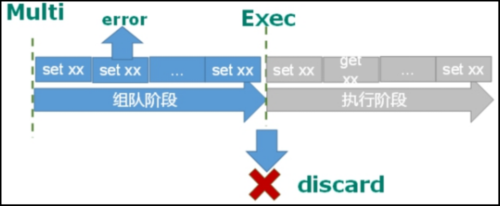
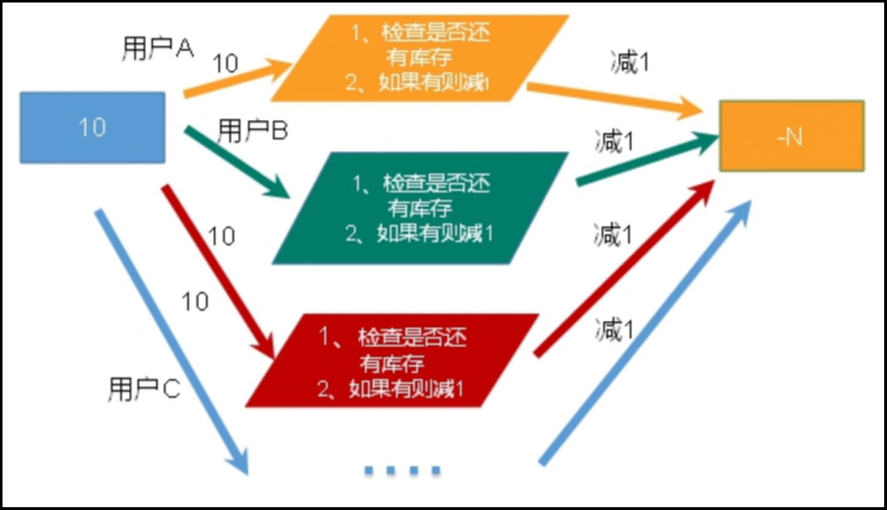
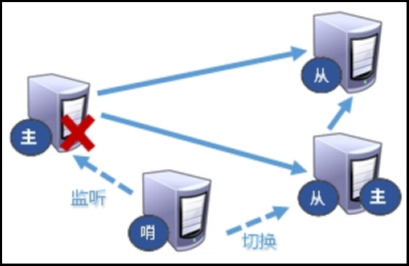
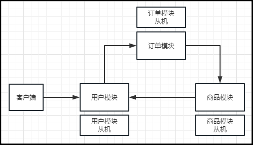
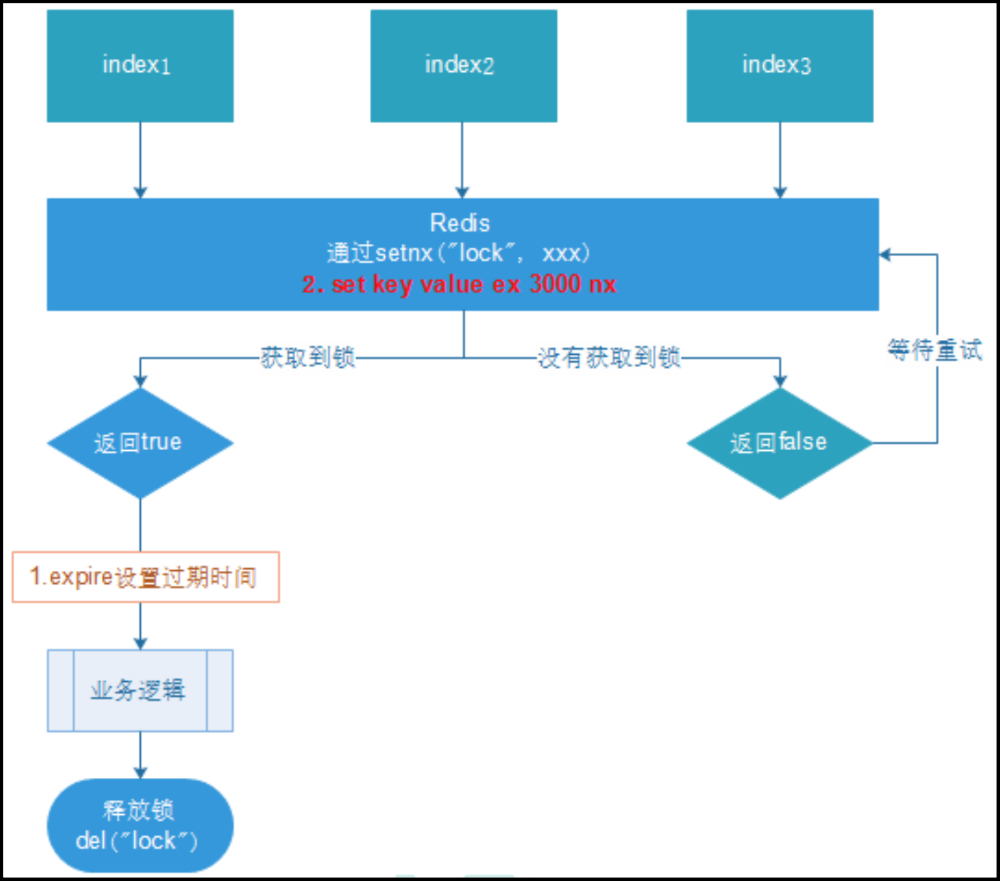

# 1、NoSQL数据库

## 1.1、概述

NoSQL=Not Only SQL，即不仅仅是SQL，泛指非关系型数据库。

NoSQL 不依赖业务逻辑方式存储，而以简单的key-value模式存储。因此大大的增加了数据库的扩展能力。

- 不遵循SQL标准；
- 不支持ACID（事务四大特性：原子性、一致性、隔离性、持久性）；
- 远超于SQL性能；

## 1.2、适用场景

- 对数据高并发的读写；
- 海量数据的读写；
- 对数据高可扩展性的读写；

## 1.3、不适用场景

- 需要事务支持；
- 基于SQL的结构化查询存储，处理复杂的关系，需要即席查询；
- 用着SQL和用了SQL也不行的情况，请考虑用NoSQL；

## 1.4、产品介绍

### 1.4.1、Memcache

- 很**早**出现的NoSQL数据库；
- 数据都在内存中，一般**不持久化**；
- 支持简单的key-value模式，**支持类型单一**；
- 一般是作为**缓存数据库**辅助持久化的数据库；

### 1.4.2、Redis

- 几乎覆盖了Memcached的绝大部分功能；
- 数据都在内存中，**支持持久化**，主要用作备份恢复；
- 除了支持简单的key-value模式，还**支持多种数据结构的存储**，比如**list、set、hash、zset**等；
- 一般是作为**缓存数据库**辅助持久化的数据库；

### 1.4.3、MongoDB

- 高性能、开源、模式自由（schema free）的文档型数据库；
- 数据都在内存中，如果内存不足，把不常用的数据保存到硬盘；
- 虽然是key-value模式，但是对value（尤其是**json**）提供了丰富的查询功能；
- 支持二进制数据及大型对象；
- 可以根据数据的特点**替代RDBMS**，成为独立的数据库。或者配合RDBMS，存储特定的数据；

# 2、Redis安装

> 官网下载

http://redis.io

http://redis.cn

> gcc编译器检查和安装

```shell
#安装C语言的编译环境
yum install centos-release-scl scl-utils-build
yum install -y devtoolset-8-toolchain
scl enable devtoolset-8 bash
#测试gcc版本
gcc --version
```

> 上传、解压、安装

```shell
#下载、上传
[root@ryualvin100 redis]# pwd
/home/ryualvin/redis
[root@ryualvin100 redis]# ls
clusternodes  masterslave  postfile  redis-6.2.1  redis-6.2.1.tar.gz
#解压
tar -zxvf redis-6.2.1.tar.gz
#进入到解压后的目录中安装
make
#如果没有准备好C语言环境，make会报错—Jemalloc/jemalloc.h：没有那个文件
#解决方案：安装好C语言环境后
make distclean
make
make install
#安装目录
[root@ryualvin100 redis-6.2.1]# cd /usr/local/bin
[root@ryualvin100 bin]# ls
dump.rdb  pcre-config  pcregrep  pcretest  redis-benchmark  redis-check-aof  redis-check-rdb  redis-cli  redis-sentinel  redis-server
```

| redis-benchmark  | 性能测试工具，可以在自己本子运行，看看自己本子性能如何 |
| ---------------- | ------------------------------------------------------ |
| redis-check-aof  | 修复有问题的AOF文件，rdb和aof后面讲                    |
| redis-check-dump | 修复有问题的dump.rdb文件                               |
| redis-sentinel   | Redis集群使用，监视主机运行状况，如果宕机则切换主机    |
| redis-server     | Redis服务器启动命令                                    |
| redis-cli        | 客户端，操作入口                                       |

> 启动

```shell
#备份配置文件
[root@ryualvin100 bin]# cp redis.conf /etc/redis.conf
#将配置文件中的daemonize no改为yes，即后台启动
[root@ryualvin100 bin]# redis-server /etc/redis.conf
#查看是否启动
[root@ryualvin100 bin]# ps -ef|grep redis
#客户端访问
[root@ryualvin100 bin]# redis-cli -p 6379
```

> 关闭

```shell
#单实例关闭
[root@ryualvin100 bin]# redis-cli shutdown
#也可以进入终端扣再关闭
127.0.0.1:6379> shutdown
not connected>
```

# 3、Redis介绍

## 3.1、Redis概述

- Redis是一个**开源**的**key-value**存储系统；
- 和Memcached类似，它支持存储的value类型相对更多，包括**string**（字符串）、**list**（链表）、**set**（集合）、**zset**（sorted set有序集合）和**hash**（哈希类型）；
- 这些数据类型都支持push/pop、add/remove及取交集、并集、差集，以及更丰富的操作，而且这些操作都是**原子性**的；
- 在此基础上，Redis支持各种不同方式的**排序**；
- 与Memcached一样，为了保证效率，数据都是**缓存在内存**中；
- 区别的是Redis会**周期性**的把更新的**数据写入磁盘**或者把修改操作写入追加的记录文件；
- 并且在此基础上实现了**master-slave（主从）**同步；

## 3.2、应用场景

### 3.2.1、配合关系型数据库做高速缓存

- 高频次，热门访问的数据，降低数据库IO；

- 分布式架构，做session共享；

  

### 3.2.2、多样的数据结构存储持久化数据


## 3.3、单线程+IO多路复用


Redis是单线程+多路IO复用技术。多路复用是指使用一个线程来检查多个文件描述符（Socket）的就绪状态，比如调用select和poll函数，传入多个文件描述符，如果有一个文件描述符就绪，则返回，否则阻塞直到超时。得到就绪状态后进行真正的操作可以在同一个线程里执行，也可以启动线程执行（比如使用线程池）。

## 3.4、基本命令

```shell
#查看当前库所有key，可以用匹配符号
keys *
#判断某个key是否存在
exists key
#查看类型
type key
del key
#根据value选择非阻塞删除，仅将keys从keyspace元数据中删除，真正的删除会在后续异步操作
unlink key
#为给定的key设置过期时间
expire key 10
#查看还有多少秒过期，-1表示永不过期，-2表示已经过期
ttl key
#切换数据库
select [index]
#查看当前库的key数量
dbsize
#清空当前库
flushdb
#清空所有库
flushall
```

# 4、常用五大数据类型

## 4.1、字符串String

> 简介&数据结构

String是Redis最基本的类型，你可以理解成与Memcached一摸一样的类型，一个key对应一个value，value最多可以是**512M**。

String类型**是二进制安全的**。意味着Redis的String可以包含任何数据类型。比如jpg图片或者序列化的对象。

String的数据结构为简单动态字符串（Simple Dynamic String，缩写SDS）。是可以修改的字符串，内部结构实现上类似于Java的ArrayList，采用**预分配冗余空间**的方式来减少内存的频繁分配。

如下图中所示，内部为当前字符串实际分配的空间capacity，一般要高于实际字符串长度len。当实际字符串长度小于1M时，扩容都是加倍现有的空间。如果超过1M，扩容时一次只会多扩1M的空间。需要注意的是字符串最大长度为512M。


> 使用场景

1. 缓存热点数据，比如首页新闻、讯息等，可以显著提升热点数据的访问速度，同时减轻DB压力；
2. 分布式session；
3. 分布式锁；
4. 通过递增递减做计数器，或者限流（以访问者的IP和其他信息作为key，访问一次增加一次，超过次数则返回false）；

> 常用命令

```shell
127.0.0.1:6379> set k1 v1
OK
#只有当k1不存在时才能设置成功
127.0.0.1:6379> setnx k1 v1
(integer) 0
#k2不存在，可以设置，所以返回0
127.0.0.1:6379> setnx k2 v2
(integer) 1
#为k1设置过期时间，格式：键 过期时间 值
127.0.0.1:6379> setex k1 10 v1
OK
127.0.0.1:6379> set k3 v3
OK
127.0.0.1:6379> get k3
"v3"
#像k3的值尾部追加内容
127.0.0.1:6379> append k3 helloworld
(integer) 12
127.0.0.1:6379> get k3
"v3helloworld"
#获取k3的值的内容长度
127.0.0.1:6379> strlen k3
(integer) 12
127.0.0.1:6379> set num 1
OK
#递增
127.0.0.1:6379> incr num
(integer) 2
#按步长递增
127.0.0.1:6379> incrby num 10
(integer) 12
#递减
127.0.0.1:6379> decr num
(integer) 11
#按步长递减
127.0.0.1:6379> decrby num 5
(integer) 6
#同时设置多个key-value
127.0.0.1:6379> mset k1 v1 k2 v2
OK
#同时获取多个key
127.0.0.1:6379> mget k1 k2
1) "v1"
2) "v2"
#同时设置多个不存在的key-value，以key为基准判断，存在返回0
127.0.0.1:6379> msetnx k1 v11 k2 v22
(integer) 0
#同时设置多个不存在的key-value，以key为基准判断，不存在返回1
127.0.0.1:6379> msetnx k3 v3 k4 v4
(integer) 1
127.0.0.1:6379> set k1 hellowold
OK
#根据指定范围返回部分内容，[start,end]，0到-1即返回所有内容
127.0.0.1:6379> getrange k1 0 -1
"hellowold"
#根据指定范围返回部分内容，[start,end]
127.0.0.1:6379> getrange k1 0 3
"hell"
#从指定位置开始替换成新的内容
127.0.0.1:6379> setrange k1 3 111
(integer) 9
127.0.0.1:6379> get k1
"hel111old"
#以新换旧，用新值代替旧值，同时返回旧值
127.0.0.1:6379> getset k1 aoao
"hel111old"
127.0.0.1:6379> get k1
"aoao"
```

> 注意点

案例：java中的i++是否是原子操作？让i=0，两个线程分别对i进行++100次，值是什么？

- i++不是原子操作，值会超过100；

**INCR key**，这个命令是对存储在指定key的数值执行原子的加1操作。

**所谓原子操作是指不会被线程调度机制打断的操作。**

这种操作一旦开始，就一直运行到结束，中间不会有任何context switch（切换到另一个线程）。

1. 在单线程中，能够在单条指令中完成的操作都可以认为是原子操作，因为中断只能发生于指令之间；
2. 在多线程中，不能被其他进程（线程）打断的操作就叫原子操作；

Redis单命令的原子性主要得益于Redis的单线程。

而在Redis中，mset、mget、msetnx命令都具有原子性，有一个失败则都失败。

## 4.2、列表List

> 简介&数据结构

单键多值。Redis列表是简单的字符串列表，按照插入顺序排序。你可以添加一个元素到列表的头部（左边）或者尾部（右边）。

它的底层实际是个双向链表，对两端的操作性能很高，通过索引下标操作中间的节点性能会较差。


List的数据结构为快速链表**quicklist**。

首先在列表元素较少的情况下会使用**一块连续的内存存储**，这个结构是**ziplist**，即**压缩列表**。

它将所有的元素紧挨着一起存储，分配的是一块连续的内存。

当**数据量比较多**的时候才会改成quicklist。

因为普通的链表需要的附加指针空间太大，会比较浪费空间。比如这个列表里存的只是int类型的数据，结构上还需要两个额外的指针pre和next。


Redis将链表和ziplist结合起来组成了quicklist。也就是将多个ziplist使用**双向指针串起来使用。**这样即满足了快速的插入删除性能，又不会出现太大的空间冗余。

> 使用场景

1. 列表：用户的消息列表、网站的公告列表、活动列表、博客的文章列表、评论列表等；
2. 队列/栈：分布式环境的队列/栈使用；

> 常用命令

```shell
#从左边插入数据，k1：v3、v2、v1
127.0.0.1:6379> lpush k1 v1 v2 v3
(integer) 3
#从右边插入数据，k1：v3、v2、v1、a1、a2、a3
127.0.0.1:6379> rpush k1 a1 a2 a3
(integer) 6
#从左边弹出两个元素，k1：v1、a1、a2、a3
127.0.0.1:6379> lpop k1 2
1) "v3"
2) "v2"
#从右边弹出两个元素，k1：v1、a1
127.0.0.1:6379> rpop k1 2
1) "a3"
2) "a2"
#从左边插入数据，k2：33、22、11
127.0.0.1:6379> lpush k2 11 22 33
(integer) 3
#从k1的右侧弹出一个元素往k2的左侧插入，k2：a1、33、22、11
127.0.0.1:6379> rpoplpush k1 k2
"a1"
127.0.0.1:6379> lrange k1 0 -1
1) "v1"
127.0.0.1:6379> lrange k2 0 -1
1) "a1"
2) "33"
3) "22"
4) "11"
127.0.0.1:6379> lpush k3 aa bb cc dd
(integer) 4
#返回元素个数
127.0.0.1:6379> llen k3
(integer) 4
#返回指定索引上的元素，k3：dd、cc、bb、aa
127.0.0.1:6379> lindex k3 2
"bb"
#在元素cc前插入元素11，k3：dd、11、cc、bb、aa
127.0.0.1:6379> linsert k3 before cc 11
(integer) 5
127.0.0.1:6379> lrange k3 0 -1
1) "dd"
2) "11"
3) "cc"
4) "bb"
5) "aa"
#从左侧删除k3中的2个cc元素，k3：dd、11、bb、aa
127.0.0.1:6379> lrem k3 2 cc
(integer) 1
127.0.0.1:6379> lrange k3 0 -1
1) "dd"
2) "11"
3) "bb"
4) "aa"
#设置k3的索引1上的值为22，k3：dd、22、bb、aa
127.0.0.1:6379> lset k3 1 22
OK
127.0.0.1:6379> lrange k3 0 -1
1) "dd"
2) "22"
3) "bb"
4) "aa"
```

## 4.3、集合Set

> 简介&数据结构

Set对外提供的功能与List类似是一个列表的功能，特殊之处在于Set是可以**自动排重**的。当你需要存储一个列表数据，又不希望出现重复数据时，Set是一个很好的选择，并且Set提供了判断某个成员是否在一个Set集合内的重要接口（sismember k1 v1），这个也是List所不能提供的。

Redis的Set是String类型的无序集合。它底层其实就是一个value为null的hash表，所以添加、删除、查找的复杂度都是O(1)。

一个算法，随着数据的增加，执行时间的长短，如果是O(1)，数据增加，查找数据的时间不变。

Set数据结构是dict字典，字典使用哈希表实现的。

Java中的HashSet的内部实现使用的是HashMap，只不过所有的value都指向同一个对象。Redis的Set结构也是一样，它的内部也使用Hash结构，所有的value都指向同一个内部值。

> 使用场景

1. 抽奖：随机获取元素；

2. 点赞、签到、打卡，以微博举例子，假设一条微博ID是wb0001，用户ID是u开头的字符串，那么：

   ```shell
   #某某用户点赞了这条微博
   127.0.0.1:6379> sadd favorite:wb0001 u0101 u0202 u0303
   (integer) 3
   #取消点赞
   127.0.0.1:6379> srem favorite:wb0001 u0202
   (integer) 1
   #是否点赞
   127.0.0.1:6379> sismember favorite:wb0001 u0101
   (integer) 1
   #点赞的所有用户
   127.0.0.1:6379> smembers favorite:wb0001
   1) "u0101"
   2) "u0303"
   #点赞数
   127.0.0.1:6379> scard favorite:wb0001
   (integer) 2
   ```

3. 商品标签、商品筛选等；

> 常用命令

```shell
#往set中添加元素，自动排重
127.0.0.1:6379> sadd k1 a1 a2 a1 a3 a4
(integer) 4
#获取set中的所有元素
127.0.0.1:6379> smembers k1
1) "a4"
2) "a3"
3) "a2"
4) "a1"
#判断set中是否含有某个元素，存在则返回1，不存在则返回0
127.0.0.1:6379> sismember k1 a1
(integer) 1
127.0.0.1:6379> sismember k1 b1
(integer) 0
#返回set的元素个数
127.0.0.1:6379> scard k1
(integer) 4
#移除set中的元素，可任意多个，返回移除个数
127.0.0.1:6379> srem k1 a1 a4
(integer) 2
127.0.0.1:6379> smembers k1
1) "a3"
2) "a2"
#k1中此时不存在a1，移除0个，返回0
127.0.0.1:6379> srem k1 a1
(integer) 0
127.0.0.1:6379> sadd k1 a1 a4 a5 a6
(integer) 4
127.0.0.1:6379> smembers k1
1) "a3"
2) "a1"
3) "a2"
4) "a4"
5) "a5"
6) "a6"
#任意从k1中获取一个元素
127.0.0.1:6379> spop k1
"a4"
#随机从k1中获取3个元素
127.0.0.1:6379> srandmember k1 3
1) "a3"
2) "a6"
3) "a1"
#从k1中移除元素a6至k2
127.0.0.1:6379> smove k1 k2 a6
(integer) 1
127.0.0.1:6379> smembers k2
1) "a6"
#求两个集合的交集
127.0.0.1:6379> sinter k1 k2
(empty array)
127.0.0.1:6379> sadd k2 a1 a3
(integer) 2
127.0.0.1:6379> sinter k1 k2
1) "a3"
2) "a1"
#求两个集合的并集
127.0.0.1:6379> sunion k1 k2
1) "a1"
2) "a2"
3) "a3"
4) "a5"
5) "a6"
127.0.0.1:6379> smembers k1
1) "a3"
2) "a5"
3) "a2"
4) "a1"
127.0.0.1:6379> smembers k2
1) "a3"
2) "a1"
3) "a6"
#求两个集合的差集
127.0.0.1:6379> sdiff k1 k2
1) "a5"
2) "a2"
```

## 4.4、哈希Hash

> 简介&数据结构

Redis Hash是一个键值对集合。

Redis Hash是一个String类型的**field**和**value**的映射表，Hash特别适用于存储对象。类似Java里面的Map<String, Object>。

用户ID为查找的key，存储的value用户对象包含姓名，年龄，生日等信息，如果用普通的key/value结构来存储，主要有以下2中存储方式：

|  |  |
| ------------------------------------------------------------ | ------------------------------------------------------------ |
| 每次修改用户的某个属性都需要先**反序列化**，改好后再**序列化**回去，开销较大。 | 用户ID数据冗余。                                             |

|  |
| ------------------------------------------------------------ |
| 通过**key（用户ID）+field（属性标签）**就可以操作对应属性数据了，既不需要重复存储数据，也不会带来序列化和并发修改控制的问题。 |

Hash类型对应的数据结构是两种：ziplist（压缩列表）、hashtable（哈希表）。当field-value长度较短且个数较少时，使用ziplist，否则使用hashtable。

> 使用场景

String可以做的Hash都能做，只不过Hash可以用一个键指向一整个对象。

> 常用命令

```shell
#给user:1001赋值
127.0.0.1:6379> hset user:1001 name ryu age 18 email ryualvin@aliyun.com
(integer) 3
#获取user:1001中的name的值
127.0.0.1:6379> hget user:1001 name
"ryu"
#获取user:1001中的所有value
127.0.0.1:6379> hvals user:1001
1) "ryu"
2) "18"
3) "ryualvin@aliyun.com"
#获取user:1001中的所有key
127.0.0.1:6379> hkeys user:1001
1) "name"
2) "age"
3) "email"
127.0.0.1:6379> hmset user:1002 name alvin age 20 email lsben1014@gmail.com
OK
#判断user:1001中是否存在name字段，存在返回1
127.0.0.1:6379> hexists user:1001 name
(integer) 1
#判断user:1001中是否存在phone字段，不存在返回0
127.0.0.1:6379> hexists user:1001 phone
(integer) 0
#递增某字段值
127.0.0.1:6379> hincrby user:1001 age 10
(integer) 28
127.0.0.1:6379> hget user:1001 age
"28"
#当且仅当某字段不存在时，才可以设置，否则返回0
127.0.0.1:6379> hsetnx user:1001 age 10
(integer) 0
#当且仅当某字段不存在时，才可以设置，设置成功返回1
127.0.0.1:6379> hsetnx user:1001 sex male
(integer) 1
```

## 4.5、有序集合Zset（sorted set）

> 简介&数据结构

Redis有序集合Zset与普通集合Set非常相似，是一个**没有重复元素**的字符串集合。

不同之处是有序集合的每个成员都关联了一个**评分（score）**，这个评分（score）被用来按照从最低分到最高分的方式排序集合中的成员。集合的成员是唯一的，但是评分是可以重复的。

因为元素是有序的，所以你也可以很快的根据评分（score）或者次序（position）来获取一个范围的元素。

访问有序集合的中间元素也是非常快的，因此你能够使用有序集合作为一个没有重复成员的智能列表。

SortedSet（Zset）是Redis提供个一个非常特别的数据结构，一方面它等价于Java的数据结构Map<String, Double>，可以给每一个元素value赋予一个权重score，另一方面它又类似于TreeSet，内部的元素会按照权重score进行排序，可以得到每个元素的名次，还可以通过score的范围来获取元素的列表。

Zset底层使用了两个数据结构：

1. Hash，Hash的作用就是关联元素value和权重score，保障元素value的唯一性，可以通过元素value找到响应的score值；
2. 跳跃表，跳跃表的目的在于给元素value排序，根据score的范围获取元素列表；（跳跃表介绍：略）

> 使用场景

排行榜。

> 常用命令

```shell
#将一个或多个member元素及其score值加入到有序集合中
127.0.0.1:6379> zadd k1 10 a1 20 a2 40 a3 60 a4 80 a5 80 a5 90 a6 100 a7
(integer) 7
#返回某个索引范围内的元素，0到-1即返回所有元素
127.0.0.1:6379> zrange k1 0 -1
1) "a1"
2) "a2"
3) "a3"
4) "a4"
5) "a5"
6) "a6"
7) "a7"
#返回索引2到5之间的元素
127.0.0.1:6379> zrange k1 2 5
1) "a3"
2) "a4"
3) "a5"
4) "a6"
#返回索引2到5之间的元素，并将score一起返回
127.0.0.1:6379> zrange k1 2 5 withscores
1) "a3"
2) "40"
3) "a4"
4) "60"
5) "a5"
6) "80"
7) "a6"
8) "90"
#返回score在20到50之间的元素
127.0.0.1:6379> zrangebyscore k1 20 50
1) "a2"
2) "a3"
#返回score在50到20之间的元素，逆向
127.0.0.1:6379> zrevrangebyscore k1 50 20
1) "a3"
2) "a2"
#将集合中的元素a1的score递增100
127.0.0.1:6379> zincrby k1 100 a1
"110"
#递增之后a1的score变为最大，a1就排在最后了
127.0.0.1:6379> zrange k1 0 -1
1) "a2"
2) "a3"
3) "a4"
4) "a5"
5) "a6"
6) "a7"
7) "a1"
#计算score为0到200之间的元素个数
127.0.0.1:6379> zcount k1 0 200
(integer) 7
#计算score为20到70之间的元素个数
127.0.0.1:6379> zcount k1 20 70
(integer) 3
#计算元素a3在集合中排在第几位，即索引
127.0.0.1:6379> zrank k1 a3
(integer) 1
127.0.0.1:6379> zrank k1 a6
(integer) 4
```

# 5、配置文件介绍

## 5.1、缓存单位

配置缓存大小单位，定义了一些基本的度量单位，只支持bytes，不支持bit，大小写不敏感。

```shell
# 1k => 1000 bytes
# 1kb => 1024 bytes
# 1m => 1000000 bytes
# 1mb => 1024*1024 bytes
# 1g => 1000000000 bytes
# 1gb => 1024*1024*1024 bytes
```

## 5.2、INCLUDES

类似jsp的include，多实例的情况可以把公用的配置文件提取出来。

```shell
# include /path/to/local.conf
# include /path/to/other.conf
```

## 5.3、NETWORK

### 5.3.1、bind

```shell
#在配置文件redis.conf中，默认的bind接口是127.0.0.1，也就是本地回环地址。这样的话，访问redis服务只能通过本机的客户端连接，而无法通过远程连接。这样可以避免将redis服务暴露于危险的网络环境中，防止一些不安全的人随随便便通过远程客户端连接到redis服务
#如果bind选项为空的话，那会接受所有来自于可用网络接口的连接
bind 127.0.0.1 -::1
#在bind中可以配置多个ip地址，以下配置即允许来自本地和192.168.182.100的客户端的访问
bind 192.168.182.100 127.0.0.1
```

### 5.3.2、protected-mode

```shell
#以下为默认配置
protected-mode yes
#访问情况1：【protected-mode yes】+【#bind】+【#requirepass】的情况下，reids只接受本机的访问
#访问情况2：【protected-mode yes】+【requirepass xxx】的情况下，redis可接受来自其他ip的客户端通过密码访问
#访问情况3：【protected-mode no】的情况下，可接受来自任何ip的客户端访问
#访问情况4：【protected-mode no】+【requirepass xxx】的情况下，通过任何ip的客户端访问都必须使用密码
redis-cli -p 6379 --pass xxx
```

### 5.3.3、port

```shell
#端口号，默认6379
port 6379
```

### 5.3.4、tcp-backlog

设置tcp的backlog。backlog其实是一个连接队列，backlog队列总和=未完成三次握手队列 + 已经完成三次握手队列。

在高并发环境下你需要一个高backlog值来避免慢客户端连接问题。

注意Linux内核会将这个值减小到/proc/sys/net/core/somaxconn的值（128），所以需要确认增大/proc/sys/net/core/somaxconn和/proc/sys/net/ipv4/tcp_max_syn_backlog（128）两个值来达到想要的效果。

### 5.3.5、timeout

一个空闲的客户端维持多少秒会关闭，0表示关闭该功能，即**永不关闭客户端连接**。

### 5.3.6、tcp-keepalive

对访问客户端的一种**心跳检测**，每隔n秒检测一次。

单位为秒，如果设置为0，则不会进行keepalive检测，建议设置成60，即每隔60秒进行一次心跳检测。

## 5.4、GENERAL

### 5.4.1、daemonize

是否为后台进程。设置为yes，即为守护进程，redis-server在后台启动。

### 5.4.2、pidfile

存放pid文件的位置，每隔实例会产生一个不同的pid文件。

将redis-server的进程号保存进文件中。

### 5.4.3、loglevel

指定日志记录级别，Redis总共支持四个级别：debug、verbose、notice、warning，默认为**notice**。

**四个级别根据使用阶段来选择，生产环境选择notice或者warning。**

### 5.4.4、logfile

指定日志文件名称。

### 5.4.5、database

Redis库的数量默认为16，默认当前数据库为0，可以使用select [index]命令在客户端连接上指定数据库。

## 5.5、SECURITY

### 5.5.1、requirepass

访问密码的查看、设置和取消。

在命令中设置密码，只是临时的。重启redis-serer，密码就还原了。

永久设置需要在配置文件中进行设置。

```shell
#在客户端连接中查看密码
127.0.0.1:6379> config get requirepass
#在客户端连接中设置米啊
127.0.0.1:6379> config set requirepass "123456"
```

## 5.6、LIMITS

### 5.6.1、maxclients

设置redis-server可以同时与多少个客户端进行连接，默认情况下为10000个客户端。如果达到了限制，redis则会拒绝新的连接请求，并且向这些连接请求放发出**"max number of clients reached"**以做出回应。

### 5.6.2、maxmemory

设置最大内存。建议设置，否则，将内存占满，会造成服务器宕机，从而失去缓存数据。

设置可以使用的内存量。一旦到达内存使用上限，Redis将会试图移除内部数据，移除规则可以通过maxmemory-policy来指定。

如果redis无法根据移除规则来移除内存中的数据，或者设置了不允许移除，那么Redis则会针对那些需要申请内存的指令返回错误信息，比如set、lpush等。

但是对于无内存申请的指定，仍然会正常响应，比如get等。如果你的Redis是主Redis（说明你的Redis有从Redis），那么在设置内存使用上限时，需要在系统中留出一些内存空间给同步队列缓存，只有在你设置的是不移除的情况下，才不用考虑这个因素。

### 5.6.3、maxmemory-policy

- volatile-lru：使用LRU算法移除key，只对设置了过期时间的键（最近最少使用）；
- allkeys-lru：在所有集合key中，使用LRU算法移除key；
- volatile-random：在过期集合中移除随机的key，只对设置了过期时间的键；
- allkeys-random：在所有集合key中，移除随机的key；
- volatile-ttl：移除那些TTL值最小的key，即那些最近要过期的key；
- noeviction：不进行移除。针对写操作，只是返回错误信息；

### 5.6.4、maxmemory-samples

设置样本数量，LRU算法和最小TTL算法都并非是精确的算法，而是估算值。所以，你可以设置样本的大小，Redis默认会检查这么多个key并选择其中LRU的那个。一般设置3到7的数字，数值越小样本越不准确，但性能消耗越小。

# 6、发布和订阅

## 6.1、什么是发布和订阅

Redis发布订阅（pub/sub）是一种消息通信模式：发送者（pub）发送消息，订阅者（sub）接受消息。

Redis客户端可以订阅任意数量的频道。

## 6.2、Redis的发布和订阅

1. 客户端可以订阅频道如下图，可能存在多个频道：

   

2. 当给这个频道发布消息后，消息就会发送给订阅的客户端：

   

## 6.3、使用场景

## 6.4、发布订阅命令行实现

1. 打开两个客户端；

2. 客户端1订阅频道channel1：

   ```shell
   127.0.0.1:6379> subscribe channel1
   Reading messages... (press Ctrl-C to quit)
   1) "subscribe"
   2) "channel1"
   3) (integer) 1
   ```

3. 客户端2发布消息至频道channel1：

   ```shell
   127.0.0.1:6379> publish channel1 helloworld
   (integer) 1
   127.0.0.1:6379> 
   ```

4. 再返回客户端1查看订阅到的消息：

   ```hello
   127.0.0.1:6379> subscribe channel1
   Reading messages... (press Ctrl-C to quit)
   1) "subscribe"
   2) "channel1"
   3) (integer) 1
   1) "message"
   2) "channel1"
   3) "helloworld"
   ```

**注意：发布的消息没有持久化，接收方只能收到在订阅之后发送方发送的消息。**

# 7、新数据类型

## 7.1、Bitmaps

> 简介&数据结构

现代计算机用二进制（位）作为信息的基础单位，1个字节等于8位。例如字符串"abc"是由3个字节组成，但实际在计算机存储时将其用二进制表示。"abc"分别对应的ASCII码分别是97、98、99，所以对应的二进制分别是01100001、 01100010和01100011：


合理地使用操作位能够有效地提高内存使用率和开发率。

Redis提供了Bitmaps这个数据类型可以实现对应的位操作：

1. Bitmaps本身不是一种数据类型，实际上它就是**字符串**（key-value），但是它可以对字符串的位进行操作；

2. Bitmaps单独提供了一套命令，所以在Redis中使用Bitmaps和使用字符串的方法不太相同。可以把Bitmaps想象成一个以位为单位的数组，数组的每个单元只能存储0和1，数组的下标在Bitmaps中叫做偏移量：

   

> 使用场景

1. 连续七天在线用户；
2. 应用访问统计、在线用户统计；

> 常用命令

假设现在一个网站有20个用户，我们将每个独立用户是否访问过网站的结果存放在Btimaps中。

```shell
127.0.0.1:6379> setbit users:20220202 1 1
(integer) 0
127.0.0.1:6379> setbit users:20220202 6 1
(integer) 0
127.0.0.1:6379> setbit users:20220202 11 1
(integer) 0
127.0.0.1:6379> setbit users:20220202 15 1
(integer) 0
127.0.0.1:6379> setbit users:20220202 19 1
(integer) 0
#统计字符串数组上被设置为1的位数，即bit数
127.0.0.1:6379> bitcount users:20220202
(integer) 5
```

用户ID=1，6，11，15，19的用户对网站进行了访问，那么当前的Bitmaps的初始化结果如下图所示：


**注意：**

1. **很多应用的用户ID以一个指定数字（例如10000） 开头。 直接将用户ID和Bitmaps的偏移量对应势必会造成一定的浪费， 通常的做法是每次做setbit操作前将用户ID减去某个指定数字。例如：ID=10001，10006，10011，10015，10019，在setbit前都统一减去10000，剩下的值拿来坐偏移量的话就可以合理地利用Bitmaps的底层数组空间了；**
2. **在第一次初始化Bitmaps，假如偏移量非常大，那么整个初始化执行过程会比较慢，可能会造成Redis阻塞；**

------

```shell
#获取某个偏移量上的值
127.0.0.1:6379> getbit users:20220202 6
(integer) 1
127.0.0.1:6379> getbit users:20220202 5
(integer) 0
#由于偏移量100上没有设置过值，显然肯定也是返回0
127.0.0.1:6379> getbit users:20220202 100
(integer) 0
```

------

```shell
#指定字节上为1的位数，[start,end]，前后包含，即第一和第二字节上为1的位数，看下图
127.0.0.1:6379> bitcount users:20220202 0 1
(integer) 4
#第一和第二字和第三字节上为1的位数，看下图
127.0.0.1:6379> bitcount users:20220202 0 2
(integer) 5
```


**注意：Redis的setbit设置的是bit位置，而bitcount计算的byte位置。**

------

```shell
127.0.0.1:6379> setbit users:20201104 1 1
(integer) 0
127.0.0.1:6379> setbit users:20201104 3 1
(integer) 0
127.0.0.1:6379> setbit users:20201104 7 1
(integer) 0
127.0.0.1:6379> setbit users:20201104 9 1
(integer) 0
127.0.0.1:6379> setbit users:20201104 13 1
(integer) 0
127.0.0.1:6379> setbit users:20201105 2 1
(integer) 0
127.0.0.1:6379> setbit users:20201105 3 1
(integer) 0
127.0.0.1:6379> setbit users:20201105 7 1
(integer) 0
127.0.0.1:6379> setbit users:20201105 8 1
(integer) 0
127.0.0.1:6379> setbit users:20201105 11 1
(integer) 0
127.0.0.1:6379> setbit users:20201105 13 1
(integer) 0
#取交集，计算两天都访问网站的用户数
127.0.0.1:6379> bitop and users:2day:and users:20201104 users:20201105
(integer) 2
127.0.0.1:6379> bitcount users:2day:and
(integer) 3
```


------

```shell
#取并集，计算这两天网站用户的活跃数量
127.0.0.1:6379> bitop or users:2day:or users:20201104 users:20201105
(integer) 2
127.0.0.1:6379> bitcount users:2day:or
(integer) 8
```


**注意：bitop是一个复合操作，它可以做多个Bitmaps的and（交集）、or（并集）、not（非）、xor（异或）操作并将结果保存在destkey中。**

> Bitmaps与Set对比

假设网站有1亿用户，每天独立访问的用户有5千万，如果每天用集合类型和Bitmaps分别存储活跃用户可以得到表：

| 数据类型 | 每个用户ID占用空间 | 需要存储的用户量  | 全部内存量             |
| -------- | ------------------ | ----------------- | ---------------------- |
| 集合类型 | 64位               | 50000000（5千万） | 64位*50000000 = 400MB  |
| Bitmaps  | 1位                | 100000000（1亿）  | 1位*100000000 = 12.5MB |

很明显，这种情况下使用Bitmaps能节省很多的内存空间，尤其是随着时间推移节省的内存还是非常可观：

| 数据类型 | 一天   | 一个月 | 一年  |
| -------- | ------ | ------ | ----- |
| 集合类型 | 400MB  | 12GB   | 144GB |
| Bitmaps  | 12.5MB | 375MB  | 4.5GB |

但Bitmaps并不是万金油，假如该网站每天的独立访问用户很少，例如只有10万（大量的僵尸用户）。那么两者的对比如下表所示，很显然，这时候使用Bitmaps就不太合适了，因为基本上大部分位都是0。

| 数据类型 | 每个用户ID占用空间 | 需要存储的用户量 | 全部内存量             |
| -------- | ------------------ | ---------------- | ---------------------- |
| 集合类型 | 64位               | 100000（10万）   | 64位*100000 = 800KB    |
| Bitmaps  | 1位                | 100000000（1亿） | 1位*100000000 = 12.5MB |

## 7.2、HyperLogLog

> 简介&数据结构

在工作当中，我们经常会遇到与统计相关的功能需求，比如统计网站PV（PageView页面访问量），可以使用Redis的incr、incrby轻松实现。但像UV（UniqueVisitor，独立访客）、独立IP数、搜索记录数等需要去重和计数的问题如何解决？这种求集合中不重复元素个数的问题称为基数问题。

解决基数问题有很多种方案：

1. 数据存储在MySQL表中，使用distinct count计算不重复个数；
2. 使用Redis提供的Hash、Set、Bitmaps等数据结构来处理；

以上的方案结果精确，但随着数据不断增加，导致占用空间越来越大，对于非常大的数据集是不切实际的。能否能够降低一定的精度来平衡存储空间？Redis推出了HyperLogLog。

Redis的HyperLogLog 是用来做基数统计的算法。HyperLogLog 的优点是在输入元素的数量或者体积非常非常大时，计算基数所需的空间总是固定的、并且是很小的。

在Redis里面，每个HyperLogLog键只需要花费12 KB内存，就可以计算接近2^64个不同元素的基数。这和计算基数时，元素越多耗费内存就越多的集合形成鲜明对比。但是，因为HyperLogLog只会根据输入元素来计算基数，而不会储存输入元素本身，所以 HyperLogLog 不能像集合那样，返回输入的各个元素。

什么是基数？

比如数据集{1, 3, 5, 7, 5, 7, 8}，那么这个数据集的基数集为{1, 3, 5 ,7, 8}，基数（不重复元素）为5。 基数估计就是在误差可接受的范围内，快速计算基数。

> 使用场景

Hyperloglog 提供了一种不太精确的基数统计方法，用来统计一个集合中不重复的元素个数，比如统计网站的UV，或者应用的日活、月活，存在一定的误差。

> 常用命令

```shell
127.0.0.1:6379> pfadd k1 1 1 2 3 4 5 1 7 9 5
(integer) 1
#重复，基数发生变化则返回0
127.0.0.1:6379> pfadd k1 1
(integer) 0
#不重复，基数发生变化则返回1
127.0.0.1:6379> pfadd k1 10
(integer) 1
#k1：1，2，3，4，5，7，9，10
#可将一周内网站的访客ID（存在重复访问的情况）都丢到集合中，最后统计这一周内的UV（UniqueVisitor，独立访客）
#只能做统计，无法返回具体元素
127.0.0.1:6379> pfcount k1
(integer) 8
#k2：4，5，8，11
127.0.0.1:6379> pfadd k2 4 5 8 11
(integer) 1
127.0.0.1:6379> pfmerge k3 k1 k2
OK
#合并后，将基数放入k3中，1，2，3，4，5，7，8，9，10，11，总共10个
127.0.0.1:6379> pfcount k3
(integer) 10
```

## 7.3、Geospatial

> 简介&数据结构

Redis3.2中增加了对GEO类型的支持。GEO，Geographic，地理信息的缩写。该类型就是元素的2维坐标，在地图上就是经纬度。Redis基于该类型提供了经纬度设置，查询，范围查询，距离查询，经纬度Hash等常见操作。

> 使用场景

与地理位置相关，附近的人等。

> 常用命令

```shell
#经度，纬度，名称
#两极无法直接添加，一般会下载城市数据，直接通过Java程序一次性导入
#有效的经度从-180度到180度，有效的纬度从-85.05112878度到85.05112878度
#当坐标位置超出指定范围时，该命令将会返回一个错误
#已经添加的数据，是无法再次往里面添加的
127.0.0.1:6379> geoadd china:city 121.47 31.23 shanghai 106.50 29.53 chongqing 114.05 22.52 shenzhen 116.38 39.90 beijing
(integer) 4
#获取指定地区的经纬度坐标
127.0.0.1:6379> geopos china:city shanghai shenzhen
1) 1) "121.47000163793563843"
   2) "31.22999903975783553"
2) 1) "114.04999762773513794"
   2) "22.5200000879503861"
#获取指定坐标的直线距离，单位：米（默认值）
127.0.0.1:6379> geodist china:city shanghai shenzhen
"1215922.3698"
#也可指定单位，m：米，km：千米，mi：英里，ft：英尺
127.0.0.1:6379> geodist china:city shanghai shenzhen km
"1215.9224"
#找出以经纬度110,30为中心，半径1000km内的坐标
127.0.0.1:6379> georadius china:city 110 30 1000 km
1) "chongqing"
2) "shenzhen"
```

# 8、Jedis

## 8.1、Jedis连接测试

> 引入依赖

```xml
<dependencies>
    <dependency>
        <groupId>redis.clients</groupId>
        <artifactId>jedis</artifactId>
        <version>3.2.0</version>
    </dependency>
</dependencies>
```

> 服务器设置

```shell
#开放6379端口
firewall-cmd --permanent --add-port=6379/tcp
#重启防火墙
firewall-cmd --reload
#检查端口是否已开放
firewall-cmd --list-ports
#阿里云还需要在安全组中开放端口
```

> redis.conf

```shell
#注释掉bind
#bind 127.0.0.1 -::1
#关闭保护模式
protected-mode no
#为了安全加个密码，客户端通过密码访问
requirepass xxx
```

> 连接实例

```java
Jedis jedis = new Jedis("192.168.182.100", 6379);
// 如果redis.conf中没有设置requirepass的话，则不用通过密码访问redis-server
jedis.auth("xxx");
String ping = jedis.ping();
System.out.println(ping);
jedis.close();
```

## 8.2、Jedis实例-手机验证码

> 需求

1. 输入手机号，点击发送后随机生成6位数字码，2分钟有效；
2. 输入验证码，点击验证，返回成功或失败；
3. 每个手机号每天只能输入3次；

> 实现

```java
public class VerifyCodeDemo {
    public static void main(String[] args) {
//        code2Redis("14759762077", getCode());
        verifyCode("14759762077", "319565");
    }

    private static String getCode() {
        // 生成6位数字验证码
        Random r = new Random();
        StringBuilder sb = new StringBuilder();
        for (int i = 0; i < 6; i++) {
            int num = r.nextInt(10);
            sb.append(num);
        }
        return sb.toString();
    }

    private static void code2Redis(String phone, String code) {
        // 将验证码存入redis，过期时间2分钟
        String key = "verify:" + phone + ":code";
        Jedis jedis = new Jedis("192.168.182.100", 6379);
        jedis.auth("xxx");
        jedis.setex(key, 120, code);
        jedis.close();
    }

    private static boolean count2Redis(String phone, Jedis jedis) {
        // 比对验证码次数不能超过3次
        String key = "verify:" + phone + ":count";
        String count = jedis.get(key);
        if (count == null) {
            // 比对次数存入redis，过期时间为1天
            jedis.setex(key, 60 * 60 * 24, "1");
        } else if (Integer.parseInt(count) > 2) {
            // 当比对次数大于3次，则不进行比对
            System.out.println("失败：每天只能输入3次！");
            return false;
        } else {
            // 当比对次数小于3次，则++
            jedis.incr(key);
        }
        return true;
    }

    private static void verifyCode(String phone, String code) {
        String key = "verify:" + phone + ":code";
        Jedis jedis = new Jedis("192.168.182.100", 6379);
        jedis.auth("xxx");
        // 先校验比对次数是否大于3次
        if (!count2Redis(phone, jedis)) {
            jedis.close();
            return;
        }
        // 比对次数小于3次，可以进行比对
        String redisCode = jedis.get(key);
        if (redisCode.equals(code)) {
            System.out.println("成功：验证通过！");
        } else {
            System.out.println("失败：验证码不一致！");
        }
        jedis.close();
    }
}
```

# 9、Redis与Spring Boot整合

> 引入依赖

```xml
<dependencies>
	<dependency>
		<groupId>org.springframework.boot</groupId>
		<artifactId>spring-boot-starter-web</artifactId>
	</dependency>
	<dependency>
		<groupId>org.springframework.boot</groupId>
		<artifactId>spring-boot-starter-test</artifactId>
		<scope>test</scope>
	</dependency>
	<!-- redis -->
	<dependency>
		<groupId>org.springframework.boot</groupId>
		<artifactId>spring-boot-starter-data-redis</artifactId>
	</dependency>
	<!-- spring2.X集成redis所需common-pool2-->
	<dependency>
		<groupId>org.apache.commons</groupId>
		<artifactId>commons-pool2</artifactId>
		<version>2.6.0</version>
	</dependency>
</dependencies>
```

> 配置文件

```properties
#Redis服务器地址
spring.redis.host=192.168.182.100
#Redis服务器连接端口
spring.redis.port=6379
#Redis访问密码
spring.redis.password=xxx
#Redis数据库索引（默认为0）
spring.redis.database= 0
#连接超时时间（毫秒）
spring.redis.timeout=1800000
#连接池最大连接数（使用负值表示没有限制）
spring.redis.lettuce.pool.max-active=20
#最大阻塞等待时间(负数表示没限制)
spring.redis.lettuce.pool.max-wait=-1
#连接池中的最大空闲连接
spring.redis.lettuce.pool.max-idle=5
#连接池中的最小空闲连接
spring.redis.lettuce.pool.min-idle=0
```

> RedisTemplate和CacheManager注入

```java
@EnableCaching
@Configuration
public class RedisConfig extends CachingConfigurerSupport {

    @Bean
    public RedisTemplate<String, Object> redisTemplate(RedisConnectionFactory factory) {
        RedisTemplate<String, Object> template = new RedisTemplate<>();
        RedisSerializer<String> redisSerializer = new StringRedisSerializer();
        Jackson2JsonRedisSerializer jackson2JsonRedisSerializer = new Jackson2JsonRedisSerializer(Object.class);
        ObjectMapper om = new ObjectMapper();
        om.setVisibility(PropertyAccessor.ALL, JsonAutoDetect.Visibility.ANY);
        om.enableDefaultTyping(ObjectMapper.DefaultTyping.NON_FINAL);
        jackson2JsonRedisSerializer.setObjectMapper(om);
        template.setConnectionFactory(factory);
//key序列化方式
        template.setKeySerializer(redisSerializer);
//value序列化
        template.setValueSerializer(jackson2JsonRedisSerializer);
//value hashmap序列化
        template.setHashValueSerializer(jackson2JsonRedisSerializer);
        return template;
    }

    @Bean
    public CacheManager cacheManager(RedisConnectionFactory factory) {
        RedisSerializer<String> redisSerializer = new StringRedisSerializer();
        Jackson2JsonRedisSerializer jackson2JsonRedisSerializer = new Jackson2JsonRedisSerializer(Object.class);
//解决查询缓存转换异常的问题
        ObjectMapper om = new ObjectMapper();
        om.setVisibility(PropertyAccessor.ALL, JsonAutoDetect.Visibility.ANY);
        om.enableDefaultTyping(ObjectMapper.DefaultTyping.NON_FINAL);
        jackson2JsonRedisSerializer.setObjectMapper(om);
// 配置序列化（解决乱码的问题）,过期时间600秒
        RedisCacheConfiguration config = RedisCacheConfiguration.defaultCacheConfig()
                .entryTtl(Duration.ofSeconds(600))
                .serializeKeysWith(RedisSerializationContext.SerializationPair.fromSerializer(redisSerializer))
                .serializeValuesWith(RedisSerializationContext.SerializationPair.fromSerializer(jackson2JsonRedisSerializer))
                .disableCachingNullValues();
        RedisCacheManager cacheManager = RedisCacheManager.builder(factory)
                .cacheDefaults(config)
                .build();
        return cacheManager;
    }
}
```

> Controller

```java
@RestController
@RequestMapping("/redisTest")
public class RedisTestController {

    @Autowired
    RedisTemplate redisTemplate;

    @GetMapping
    public String redisTest(){
        redisTemplate.opsForValue().set("k1","hello world");
        String value = (String)redisTemplate.opsForValue().get("k1");
        return value;
    }
}
```

# 10、事务

## 10.1、Redis事务的定义

Redis事务是一个单独的隔离操作：事务中的**所有命令都会序列化、按顺序地执行**。事务在执行的过程中，不会被其他客户端发送来的命令请求所打断。

Redis事务的主要作用就是**串联多个命令**防止被别的的命令插队。

## 10.2、Multi、Exec、Discard

从输入Multi命令开始，输入的命令都会依次进入命令队列中，但不会执行。直到输入Exec后，Redis会将之前的命令队列中的命令依次执行。组队的过程中可以通过discard来放弃组队。 


## 10.3、事务的错误处理

**组队中某个命令出现了报告错误**，执行时整个的所有队列都会被取消。



```shell
#1、开始组队
127.0.0.1:6379> multi
OK
#第一个指令，只设置了键，没有设置值，报错
127.0.0.1:6379(TX)> set k1
(error) ERR wrong number of arguments for 'set' command
#第二个指令，无异常
127.0.0.1:6379(TX)> set k2 v2
QUEUED
#2、执行
#因为组队阶段的报错，执行阶段整个指令队列都被废弃
127.0.0.1:6379(TX)> exec
(error) EXECABORT Transaction discarded because of previous errors.
127.0.0.1:6379> keys *
(empty array)
```

------

如果执行阶段某个命令报出了错误，则**只有报错的命令不会被执行，而其他的命令都会执行，不会回滚**。


```shell
#1、开始组队
127.0.0.1:6379> multi
OK
#第一个指令，无异常
127.0.0.1:6379(TX)> set k1 v1
QUEUED
#第二个指令，无异常，但对非数字类型的值做递增，
127.0.0.1:6379(TX)> incr k1
QUEUED
#2、执行
#第一个指令，正常执行
#第二个指令，报异常
#整体指令队列无回滚
127.0.0.1:6379(TX)> exec
1) OK
2) (error) ERR value is not an integer or out of range
127.0.0.1:6379> keys *
1) "k1"
```

## 10.4、事务冲突的问题

### 10.4.1、实际例子

三个请求同时操作一个账户。第一个请求想给账户扣款8000，第二个请求想给账户扣款5000，第三个请求想给账户扣款1000。


### 10.4.2、悲观锁

悲观锁（Pessimistic Lock），顾名思义就是很悲观，**每次去拿数据的时候都认为会被别人修改，所以每次在拿到数据的时候都会上锁**，这样别人想拿这个数据就会阻塞，直到它拿到锁。传统的关系型数据库里边就用到了很多这种锁机制，比如行锁、表锁、读锁、写锁等，都是在做操作之前先上锁。


### 10.4.3、乐观锁

乐观锁（Optimistic Lock)，顾名思义就是很乐观，**每次去拿数据的时候都认为不会被别人修改，所以不会上锁**，但是在更新的时候会判断一下在此期间别人有没有去更新这个数据，可以使用版本号等机制。**乐观锁适用于多读的应用类型，这样可以提高吞吐量**。Redis就是利用这种check-and-set机制实现事务的。


### 10.4.4、WATCH指令实现乐观锁

在执行multi之前，先执行watch key1 [key2]，可以监视一个（或多个）key ，如果在事务执行之前这个（或这些）key 被其他命令所改动，那么事务将被打断。

> 没加watch的事务操作

客户端一：

```shell
127.0.0.1:6379> get balance
"100"
127.0.0.1:6379> multi
OK
127.0.0.1:6379(TX)> incrby balance 10
QUEUED
#在执行前，balance已经先被客户端二操作，balance-50=50
#所以，此时客户端一执行exec，实际上是在balance=50的基础上进行操作
127.0.0.1:6379(TX)> exec
1) (integer) 60
```

客户端二：

```shell
127.0.0.1:6379> get balance
"100"
127.0.0.1:6379> multi
OK
127.0.0.1:6379(TX)> decrby balance 50
QUEUED
127.0.0.1:6379(TX)> exec
1) (integer) 50
```

> 加watch（乐观锁）的事务操作

客户端一：

```shell
127.0.0.1:6379> set balance 100
OK
#给balance加锁
127.0.0.1:6379> watch balance
OK
#开始组队
127.0.0.1:6379> multi
OK
#balance-10=100-10
127.0.0.1:6379(TX)> incrby balance 10
QUEUED
#执行
127.0.0.1:6379(TX)> exec
1) (integer) 110
#由于给balance加锁，成功更改数据
127.0.0.1:6379> get balance
"110"
```

客户端二：

```shell
#在此之前，客户端一已经给balance加锁了
127.0.0.1:6379> watch balance
OK
127.0.0.1:6379> multi
OK
127.0.0.1:6379(TX)> decrby balance 50
QUEUED
#客户端二先于客户端一执行exec，但由于balance已经被客户端一加锁，客户端二拿不到锁，所以操作不了数据，返回空
127.0.0.1:6379(TX)> exec
(nil)
#客户端这儿没办法操作数据，balance还是100
127.0.0.1:6379> get balance
"100"
```

### 10.4.5、UNWATCH

取消WATCH命令对所有key的监视。

如果在执行WATCH命令之后，EXEC命令或DISCARD 命令先被执行了的话，那么就不需要再执行UNWATCH 了。

参考：http://doc.redisfans.com/transaction/exec.html

### 10.4.6、Redis事务三特性

1. 单独的隔离操作：
   - 事务中的所有指令都会序列化，按顺序地执行。事务在执行过程中，不会被其他客户端所发来的指令请求所打断；
2. 没有隔离级别的概念：
   - 队列中的所有指令在没有提交前都不会被实际执行，因为事务提交前任何指令都不会被实际执行；
3. 不保证原子性：
   - 只有在组队的时候没有任何命令报异常，那么队列中的指令都可以执行。但在执行过程中有问题的指令不会执行，其余指令都能照常执行，并且没有回滚；

# 11、事务-秒杀案例

## 11.1、事务实现秒杀

1. Redis中设置两个key，一个key用来存储已经秒杀成功的用户，一个key用来存储库存；
2. 判断库存key是否为空，为空则说明秒杀活动还没开始；
3. 判断库存key是否小于等于0，小于等于0，则说明秒杀活动已结束；
4. 开启事务；
5. 减库存，加用户，执行；
6. 判断指令队列执行结果，执行结果为空 or 执行结果记录数小于1，则说明指令队列执行失败，秒杀失败；
7. 否则秒杀成功；

## 11.2、ab模拟高并发测试

### 11.2.1、ab安装

CentOS6默认已安装，CentOS7需要手动安装。

```shell
#联网安装
yum install httpd-tools
#验证是否安装成功
ab --help
```

### 11.2.2、ab测试

```shell
[root@ryualvin100 redis]# cat postfile
productId=pxxx&
#-n：代表请求数
#-c：代表并发数
[root@ryualvin100 redis]# ab -n 2000 -c 200 -k -p /home/ryualvin/redis/postfile -T application/x-www-form-urlencoded http://192.168.0.108:8080/seckill2
```

通过ab并发测试，会出现两个问题：

1. 超卖问题，即商品已经卖完了，还能进行秒杀，库存变负数。这个问题可以通过乐观锁解决；
2. 超时问题，即多个请求同时操作Redis，一个请求一个线程，一个线程在操作Redis的时候，其他请求可能会出现等待超时的问题。这个问题可以通过连接池解决；

## 11.3、超卖问题

> 问题

和10.4.1的balance的例子发生的现象一样。



> 利用乐观锁解决

1. Redis中设置两个key，一个key用来存储已经秒杀成功的用户，一个key用来存储库存；

2. **监视库存key，给库存key加锁；**

3. 判断库存key是否为空，为空则说明秒杀活动还没开始；

4. 判断库存key是否小于等于0，小于等于0，则说明秒杀活动已结束；

5. 开启事务；

6. 减库存，加用户，执行；

7. 判断指令队列执行结果，执行结果为空 or 执行结果记录数小于1，则说明指令队列执行失败，秒杀失败；

8. 否则秒杀成功；

   

   ```java
   @PostMapping("/seckill2")
   @ResponseBody
   public String seckill2(@RequestParam String productId) {
       String userId = UUID.randomUUID().toString().replace("-", "");
       // 0、两个键，product:商品ID=库存，user:用户ID=秒杀成功的用户集合
       String productKey = "sk:product:" + productId;
       String userSetKey = "sk:users";
       // 监视库存，即通过乐观锁解决超卖问题
       redisTemplate.watch(productKey);
       // 1、先去redis中取出库存，如果为null，则证明秒杀还未开始，则返回false
       String storeVal = redisTemplate.opsForValue().get(productKey) + "";
       if (storeVal == null) {
           System.out.println("秒杀还未开始！");
           return "秒杀还未开始";
       }
       // 2、通过传入用户ID去redis中校验是否存在，存在则证明该用户已秒杀成功，则返回false
       Set members = redisTemplate.opsForSet().members(userSetKey);
       if (redisTemplate.opsForSet().isMember(userSetKey, userId)) {
           System.out.println("该用户已经秒杀成功了，无法再参与活动！");
           return "该用户已经秒杀成功了，无法再参与活动！";
       }
       // 3、判断库存是否>0，大于0则--，并返回true
       if (Integer.parseInt(storeVal) <= 0) {
           System.out.println("很遗憾，秒杀活动已经结束！");
           return "很遗憾，秒杀活动已经结束！";
       }
       // redisTemplate中的事务支持功能需要手动开启
       redisTemplate.setEnableTransactionSupport(true);
       // 组队操作，将减库存的操作放在事务中去进行
       redisTemplate.multi();
       // 4、减去库存
       redisTemplate.opsForValue().decrement(productKey);
       // 5、保存已秒杀成功的用户
       redisTemplate.opsForSet().add(userSetKey, userId);
       List execResult = redisTemplate.exec();
       if (execResult == null || execResult.size() < 1) {
           System.out.println("秒杀失败");
           return "秒杀失败";
       }
       System.out.println("秒杀成功");
       return "秒杀成功！";
   }
   ```

## 11.4、连接超时问题

连接超时的问题可通过连接池解决。可节省每次连接Redis服务带来的消耗，把连接好的实例反复利用。

通过参数管理连接的行为：

- MaxTotal：控制一个Pool可分配多少个Jedis实例，通过pool.getResource()来获取；如果赋值为-1，则表示不限制；如果Pool已经分配了MaxTotal个Jedis实例，则此时pool的状态为exhausted；
- MaxIdle：控制一个Pool最多有多少个状态为idle（空闲）的Jedis实例；
- MaxWaitMillis：表示当Borrow一个Jedis实例时，最大的等待毫秒数，如果超过等待时间，则直接抛JedisConnectionException；
- TestOnBorrow：获得一个Jedis实例的时候是否检查连接可用性（ping()）。如果为true，则得到的Jedis实例均是可用的；

## 11.5、库存遗留问题

> 问题

增大库存，继续增加并发测试，会出现已经秒光，但Redis中还存在库存的情况。

原因是**乐观锁导致很多请求到失败**，先点的没秒到，后点的可能秒到了。

> 利用LUA脚本解决

### 11.5.1、LUA脚本介绍

Lua是一个小巧的脚本语言，Lua脚本可以很容易的被C/C++ 代码调用，也可以反过来调用C/C++的函数。Lua并没有提供强大的库，一个完整的Lua解释器不过200k，所以Lua不适合作为开发独立应用程序的语言，而是作为嵌入式脚本语言。

很多应用程序、游戏使用LUA作为自己的嵌入式脚本语言，以此来实现可配置性、可扩展性。

这其中包括魔兽争霸地图、魔兽世界、博德之门、愤怒的小鸟等众多游戏插件或外挂。

学习资料：https://www.w3cschool.cn/lua/

### 11.5.2、LUA脚本在Redis中的优势

将复杂的或者多步的Redis操作，**写为一个脚本，一次提交给Redis执行，减少反复连接Redis的次数，提升性能**。

LUA脚本是类似Redis事务，有一定的原子性，不会被其他命令插队，可以完成一些Redis事务性的操作。

但是，注意Redis的LUA脚本功能，只有在Redis 2.6以上的版本才可以使用。

可利用LUA脚本淘汰用户，解决超卖问题。

Redis 2.6版本以后，通过LUA脚本解决**争抢问题**，实际上是Redis利用其单线程的特性，用**任务队列**的方式解决多任务并发的问题。

将库存数调大至500，再通过ab测试，会比较明显地产生库存遗留问题。


```lua
local userid = KEYS[1];
local prodid = KEYS[2];
local qtkey = 'sk:product:' .. prodid .. '';
local usersKey = 'sk:users';
local userExists = redis.call('sismember', usersKey, userid);
if tonumber(userExists) == 1 then
    return 2;
end
local num = redis.call('get', qtkey);
if tonumber(num) <= 0 then
    return 0;
else
    redis.call('decr', qtkey);
    redis.call('sadd', usersKey, userid);
end
return 1
```

```java
@PostMapping("/seckill3")
@ResponseBody
public String seckill3(@RequestParam String productId) {
    // ab -n 2000 -c 100 -k -p /home/ryualvin/redis/postfile -T application/x-www-form-urlencoded http://192.168.0.108:8080/seckill3
    DefaultRedisScript<Long> redisScript = new DefaultRedisScript();
    redisScript.setScriptSource(new ResourceScriptSource(new ClassPathResource("redis/seckill.lua")));
    redisScript.setResultType(Long.class);
    String userId = UUID.randomUUID().toString().replace("-", "");
    // redisScript，key列表，arg（可多个）,参考redis eval 命令
    String result = redisTemplate.execute(redisScript, Arrays.asList(userId, productId)) + "";
    if ("2".equals(result)) {
        System.out.println("该用户已经秒杀成功了，无法再参与活动！");
        return "该用户已经秒杀成功了，无法再参与活动！";
    } else if ("0".equals(result)) {
        System.out.println("很遗憾，秒杀活动已经结束！");
        return "很遗憾，秒杀活动已经结束！";
    } else {
        System.out.println("秒杀成功");
        return "秒杀成功";
    }
}
```

# 12、Redis持久化之RDB

## 12.1、是什么

在指定的**时间间隔**内将内存中的**数据集快照**写入磁盘，也就是行话讲的Snapshot快照，它恢复时是将快照文件直接读到内存里。


## 12.2、RDB持久化流程

Redis会单独创建（fork）一个子进程来进行持久化，会先将数据写入到一个临时文件中，待持久化过程都结束了，再用这个**临时文件替换上次持久化好的文件。**整个过程中，主进程是不进行任何IO操作的，这就确保了极高的性能。

如果需要进行大规模数据的恢复，且对于数据恢复的完整性不是非常敏感，那RDB方式要比AOF方式更加的高效。

RDB的缺点是最后一次持久化后的数据可能丢失。可能存在当数据写入临时文件的过程中，突然断电或者服务器宕机，那最后一次的数据并没有写全到临时文件中，同时，临时文件也没办法替换上次持久化好的文件。


> Fork

- Fork的作用是复制一个与当前进程一样的进程。新进程的所有数据（变量、环境变量、程序计数器等）数值都和原进程一致，但是是一个全新的进程，并作为原进程的子进程存在；
- 在Linux程序中，Fork会产生一个和父进程完全相同的子进程，但子进程在此后都会exec系统调用，出于效率考虑，Linux中引入了**写时复制技术**；
- 一般情况父进程和子进程会共用同一段物理内存，只有进程空间各段的内容要发生变化时，才会将父进程的内容复制一份给子进程；

## 12.3、dump.rdb文件

可在redis.conf中配置rdb文件名称以及保存位置。

```shell
dbfilename dump.rdb
dir ./
```

> 备份dump.rdb文件

```shell
#1、通过下列命令可以查询rdb文件的目录；
#2、将*.rdb文件拷贝到别的地方，进行备份；
#3、关闭Redis服务；
#4、将备份的*.rdb文件拷贝回来；
#5、启动Redis，备份数据会直接加载；
127.0.0.1:6379> config get dir
1) "dir"
2) "/home/ryualvin/redis/test"
```

## 12.4、RDB持久化配置

### 12.4.1、如何触发RDB持久化

在指定时间间隔内，至少有多少个key被改变，那就会触发RDB持久化。即Fork子进程将数据集写入临时文件，持久化完毕后，再将此次临时文件替换上次临时文件。

```shell
# Unless specified otherwise, by default Redis will save the DB:
#   * After 3600 seconds (an hour) if at least 1 key changed
#   * After 300 seconds (5 minutes) if at least 100 keys changed
#   * After 60 seconds if at least 10000 keys changed
#
# You can set these explicitly by uncommenting the three following lines.
#
# save 3600 1
# save 300 100
# save 60 10000
```

在客户端通过下列命令可手动禁用保存策略：

```shell
#save后给空值
config set save ""
```

### 12.4.2、save & bgsave

save：阻塞服务器并创建RDB文件，即save时只管保存，其它不管。

bgsave：以非阻塞方式创建RDB文件。即Redis会在后台异步进行快照操作，快照同时还可以响应客户端请求。

也可以通过lastsave命令获取最后一次成功执行快照的时间。

执行flushall命令，也会产生dump.rdb文件，但里面是空的，无意义。

### 12.4.3、stop-writes-on-bgsave-error

当Redis无法写入磁盘的时候，直接关掉Redis的写操作，推荐yes。

```shell
stop-writes-on-bgsave-error yes
```

### 12.4.4、rdbcompression

对于存储到磁盘中的快照，可以设置是否进行压缩存储。如果是的话，Redis会采用LZF算法进行压缩。

如果你不想消耗CPU来进行压缩的话，可以设置为关闭此功能，推荐yes。

```shell
rdbcompression yes
```

### 12.4.5、rdbchecksum

在存储快照后，还可以让Redis使用CRC64算法来进行数据校验。但是这样做会增加大约10%的性能消耗，如果希望获取到最大的性能提升，可以关闭此功能。

```shell
rdbchecksum yes
```

## 12.5、优劣势

### 12.5.1、优势

- 适合大规模的数据恢复；
- 对数据完整性和一致性要求不高更适合使用；
- 节省磁盘空间；
- 恢复速度快；

### 12.5.2、劣势

- Fork的时候，内存中的数据被克隆了一份，大致**2倍的膨胀性**需要考虑；
- 虽然Redis在Fork时使用了**写时复制技术**，但是如果数据庞大时还是比较消耗性能；
- 在一定的时间间隔内做备份，如果Redis意外宕机的话，就会丢失最后一次快照后的所有修改；

## 12.6、总结

- RDB是一个非常紧凑的文件；
- RDB在保存RDB文件时，父进程唯一需要做的就是Fork出一个子进程，接下来的工作全部由子进程来做，父进程不需要再做其他IO操作。所以RDB持久化方式可以最大化Redis的性能；
- 与AOF相比，在恢复大数据集的时候，RDB方式会更快一些；
- 数据丢失风险大；
- RDB需要经常Fork子进程来保存数据集到磁盘上，当数据集较大的时候，Fork的过程是非常耗时的，可能会导致Redis在一些毫秒级不能响应客户端请求；

# 13、Redis持久化只AOF

## 13.1、是什么

以日志的形式来记录每个写操作（**增量保存**）。

将Redis执行过的所有写指令记录下来（**读操作不记录**），只许追加文件但不可以改写文件。

Redis启动之初会读取该文件重新构建数据，换言之，Redis重启的话就根据日志文件的内容将写指令从前到后执行一次以完成数据的恢复工作。


## 13.2、AOF持久化流程

1. 客户端的请求写命令会被追加到AOF缓冲区内；
2. AOF缓冲区根据AOF持久化策略（always，everysec，no）将操作同步到磁盘的AOF文件中；
3. AOF文件大小超过重写策略或手动重写时，会对AOF文件重写，压缩AOF文件容量；
4. Redis服务重启时，会重新加载AOF文件中的写操作达到数据恢复的目的；


## 13.3、appendonly.aof文件

AOF文件的保存路径同RDB文件的路径一致。

**AOF和RDB同时开启，系统默认取AOF文件的数据（数据不会存在丢失）。**

```shell
appendfilename "appendonly.aof"
dir ./
```

> 备份appendonly.aof文件

正常恢复：

```shell
#1、通过下列命令可以查询rdb文件的目录；
#2、将*.aof文件拷贝到别的地方，进行备份；
#3、关闭Redis服务；
#4、将备份的*.aof文件拷贝回来；
#5、启动Redis，重新加载；
127.0.0.1:6379> config get dir
1) "dir"
2) "/home/ryualvin/redis/test"
```

异常恢复：

```shell
#1、先通过以下工具修复损坏的AOF文件
#其他步骤同上
[root@ryualvin100 test]# /usr/local/bin/redis-check-aof-fix appendonly.aof
```

## 13.4、AOF持久化配置

开启AOF持久化，设置AOF同步策略：

```shell
appendonly yes
#始终同步，每次Redis的写入都会立刻记入日志。性能较差，但数据完整性比较好
# appendfsync always
#每秒同步，每秒记录日志一次。如果宕机，本秒的数据可能丢失
appendfsync everysec
#Redis不主动进行同步，把同步时机交给操作系统
# appendfsync no
```

## 13.5、Rewrite压缩

### 13.5.1、是什么

AOF采用文件追加方式，文件会越来越大，为避免出现此种情况，新增了重写机制。当AOF文件的大小超过所设定的阈值时，Redis就会启动AOF文件的内容压缩，只保留可以恢复数据的最小指令集（多条指令整合成一条指令），可以使用命令bgrewriteaof。

### 13.5.2、重写原理

AOF文件持续增长而过大时，会Fork出一条新进程来将文件重写（也是先写临时文件最后再rename）。Redis4.0版本后的重写，实际上就是把RDB的快照，以二进制的形式附在新的AOF头部，作为已有的历史数据，替换掉原来的流水账操作。

### 13.5.3、重写流程

1. bgrewriteaof触发重写，判断当前是否有bgsave或bgrewriteaof在运行，如果有，则等待该命令结束后再继续执行；
2. 主进程Fork出子进程执行重写操作，保证主进程不会阻塞；
3. 子进程遍历Redis内存中数据到临时文件，客户端的写请求同时写入aof_buf缓冲区和aof_rewrite_buf重写缓冲区，保证原AOF文件完整以及新AOF文件生成期间的新的数据修改动作不会丢失；
4. （4.1）子进程写完新的AOF文件后，向主进程发信号，父进程更新统计信息。（4.2）主进程把aof_rewrite_buf中的数据写入到新的AOF文件；
5. 使用新的AOF文件覆盖旧的AOF文件，完成AOF重写；


## 13.6、优劣势

### 13.6.1、优势

- 备份机制更稳健，丢失数据概率更低；
- 可读的日志文件，通过操作AOF文件，可以处理误操作；

### 13.6.2、劣势

- 比起RDB占用更多的磁盘空间；
- 恢复备份速度要慢；
- 每次读写都同步的话，有一定的性能压力；
- 存在个别Bug，造成不能恢复；

## 13.7、总结

- **AOF文件是一个只进行追加的日志文件；**
- Redis看可以在AOF文件体积变得过大时，自动地在后台对AOF进行重写；
- AOF文件有序地保存了对数据库执行的所有写入操作，这些写入操作以Redis协议的格式保存，因此AOF文件的内容非常容易被人读懂，对文件进行分析也很轻松；
- 对于相同的数据集来说，AOF文件的体积通常要大于RDB文件的体积；
- 根据所使用的sync策略，AOF的速度可能会慢于RDB；

## 13.8、RDB与AOF用哪个好

- 官方推荐两个都启用；
- 如果对数据不敏感，可以单独选用RDB；
- 不建议单独使用AOF，因为可能会出现Bug；
- 如果只是做纯内存缓存，可以都不用；

# 14、主从复制

## 14.1、是什么

主机数据更新后根据配置和策略，自动同步到备机的master/slaver机制。

master以写为主，slave以读为主，读写分离。

只能有一个主机，不能存在多个主机。比如有两台主服务器，两台主服务器都对同一个key设置不同的值，那从服务器这时候就不知道该听谁的了，即不知道该同步哪个值。但是主机存在宕机的可能性，因此需要配置集群，每个集群里都是一主多从的模式，再让每个集群产生关联。


## 14.2、为什么要主从复制

- 读写分离，性能扩展；
- 容灾快速恢复（当某一台从机宕机后，应用在读取缓存时，可以很快切换到别的从机）；

## 14.3、怎么玩

1. 准备redis.conf文件：

   ```shell
   #开启守护进程运行redis-server，即后台运行
   daemonize yes
   #关闭AOF持久化
   appendonly no
   #或者，开启AOF持久化，但需要在每个主从机的配置文件中区分aof文件
   appendfilename "appendonly.aof"
   masterauth xxx
   requirepass xxx
   ```

2. 准备redis6379.conf：

   ```shell
   include /home/ryualvin/redis/masterslave/redis.conf
   pidfile "/var/run/redis6379.pid"
   port 6379
   dbfilename "dump6379.rdb"
   ```

3. 准备redis6380.conf：

   ```shell
   include /home/ryualvin/redis/masterslave/redis.conf
   pidfile "/var/run/redis6380.pid"
   port 6380
   dbfilename "dump6380.rdb"
   ```

4. 准备redis6381.conf：

   ```shell
   include /home/ryualvin/redis/masterslave/redis.conf
   pidfile "/var/run/redis6381.pid"
   port 6381
   dbfilename "dump6381.rdb"
   ```

5. 除了以上这些配置以外，

   - 也可分别指定日志文件：

     ```
     logfile "6379.log"
     logfile "6380.log"
     logfile "6381.log"
     ```

   - 还有从机的优先级，值得越小，优先级越高，用于选举主机时使用，默认值100：

     ```shell
     slave-priority 10
     ```

6. 启动三台Redis服务并用客户端连接：

   ```shell
   [root@ryualvin100 masterslave]# /usr/local/bin/redis-server /home/ryualvin/redis/masterslave/redis6379.conf
   [root@ryualvin100 masterslave]# /usr/local/bin/redis-server /home/ryualvin/redis/masterslave/redis6380.conf
   [root@ryualvin100 masterslave]# /usr/local/bin/redis-server /home/ryualvin/redis/masterslave/redis6381.conf
   
   [root@ryualvin100 masterslave]# /usr/local/bin/redis-cli -p 6379 --pass xxx
   [root@ryualvin100 masterslave]# /usr/local/bin/redis-cli -p 6380 --pass xxx
   [root@ryualvin100 masterslave]# /usr/local/bin/redis-cli -p 6381 --pass xxx
   ```

7. 通过客户端查看三台Redis服务主从复制的相关信息：

   ```shell
   info replication
   ```

8. 为预想的从机配置它的主机：

   ```shell
   #在客户端操作，如果在别的服务器上，则用服务器的IP地址
   slaveof 127.0.0.1 6379
   #配置完成后，查看主从信息
   info replication
   ```

9. 主机若宕机后，重启之后，自动做为主机；

10. 从机重启之后，需要重新设置`slaveof 127.0.0.1 6379`

## 14.4、常用三招

### 14.4.1、一主二仆

> 从机切入点问题

从服务器6381宕机了以后，主服务有新增操作，再重启从服务器6381之后，他不会自动变为6379的从服务器，还需要重新设置`slaveof 127.0.0.1 6379`。重新设置了以后，从服务器会将主服务器上的数据从头复制过来。

> 主机宕机问题

即使主机宕机后，从服务依然认这个大哥，不会上位，等待大哥重启。

> 主从如何同步数据

1. 当从服务连接上主服务之后，从服务向主服务发送一个消息，告诉主服务：可以进行数据同步了；
2. **【全量】**主服务接到从服务发送来的消息后，把主服务上的数据进行持久化成rdb文件，接着把rdb文件发送给从服务，从服务拿到rdb文件后读取至内存中；
3. **【增量】**每次主服务进行写操作之后，都会和从服务进行数据同步；

### 14.4.2、薪火相传

通过`slaveof <ip> <port>`，slave1可以是slave2的master，那么该slave1作为了链条中下一个的master，可以有效减轻master的写压力，去中心化降低风险。

但是，一旦某个slave宕机，整个链条就断开了，它之后的slave都没法备份。

### 14.4.3、反客为主（手动）

当master宕机后，通过手动设置`slaveof no one`，可以将slave立刻升为master，其他slave不用做任何修改。

## 14.5、复制原理

1. slave启动成功连接到master后会发送一个sync命令；

2. master接到命令，启动后台的存盘进程，同时收集所有接收到的用于修改数据集命令，在后台进程执行完毕之后，master将传送整个数据文件到slave，以完成一次完全同步；

3. 全量复制：而slave服务在接收到数据库文件数据后，将其存盘并加载到内存中；

4. 增量复制：master继续将新的所有收集到的修改命令依次传给slave，完成同步；

5. 但是只要是重新连接master，一次完全同步（全量复制）将被自动执行；

   

## 14.6、哨兵模式（sentinel）

### 14.6.1、是什么

**反客为主的自动版**，能够后台监控主机是否故障，如果主机故障，根据投票数自动将从库转换为主库。



### 14.6.2、怎么玩

1. 首先，创建一主二从模式，6380和6381为从机，跟着6379主机；

2. 创建sentinel.conf文件：

   ```shell
   [root@ryualvin100 ~]# cd /home/ryualvin/redis/masterslave
   [root@ryualvin100 masterslave]# vim sentinel.conf
   #从机派出一个哨兵，监视主机127.0.0.1 6379，给主机起别名mymaster，最后的1表示的是至少有1哨兵同意才进行主机切换
   sentinel monitor mymaster 127.0.0.1 6380 1
   sentinel auth-pass mymaster xxx
   ```

3. 启动哨兵，启动后可在当前窗口查看哨兵日志：

   ```shell
   [root@ryualvin100 masterslave]# /usr/local/bin/redis-sentinel sentinel.conf
   ```

4. 将主机关闭，大概10秒左右可以看到哨兵窗口日志，切换了新的主机，这时候再通过客户端去连接各服务，通过`info replication`查看主从信息；

5. **原主机重启后，不再是主机，会变为从机；**

**注意：哪个从机会被选举为主机呢？根据优先级别：replica-priority or slave-priority**

### 14.6.3、故障恢复

1. 新主登基：从下线的主服务的所有从服务里面挑选一个从服务，将其转换成主服务。选择条件依次为：
   - 选择优先级靠前的。优先级在redis.conf中默认：`slave-priority 100`，值越小优先级越高；
   - 选择偏移量最大的。偏移量是指获得原主机数据最全的；
   - 选择runid最小的从服务。每个redis实例启动后都会随机生成一个40位的runid；
2. 群仆俯首：挑选出新的主服务之后，sentinel向原主服务的从服务发送`slaveof 新主服务`的命令，复制新master；
3. 旧主俯首：当已下线的主服务重新上线时，sentinel会向其发送`slave of`命令，让其称为新主服务的从服务；

### 14.6.4、代码实现

```java
public static Jedis getJedisFromSentinel() {
    if (jedisSentinelPool == null) {
        Set<String> sentinelSet = new HashSet<>();
        sentinelSet.add("192.168.11.103:26379");
        JedisPoolConfig jedisPoolConfig = new JedisPoolConfig();
        jedisPoolConfig.setMaxTotal(10); //最大可用连接数
        jedisPoolConfig.setMaxIdle(5); //最大闲置连接数
        jedisPoolConfig.setMinIdle(5); //最小闲置连接数
        jedisPoolConfig.setBlockWhenExhausted(true); //连接耗尽是否等待
        jedisPoolConfig.setMaxWaitMillis(2000); //等待时间
        jedisPoolConfig.setTestOnBorrow(true); //取连接的时候进行一下测试 ping pong
        jedisSentinelPool = new JedisSentinelPool("mymaster", sentinelSet, jedisPoolConfig);
        return jedisSentinelPool.getResource();
    } else {
        return jedisSentinelPool.getResource();
    }
}
```

## 14.7、复制延时

由于所有的写操作都是先在master上操作，然后同步更新到slave上，所以从master同步到slave机器有一定的延迟。

当系统很繁忙的时候，延迟问题会更加严重，slave机器数量的增加也会使这个问题更加严重。

# 15、集群

## 15.1、问题

容量不够，redis如何进行扩容？

并发写操作，redis如何分摊？

另外，主从模式，薪火相传模式中，主机宕机，导致ip地址发生变化，**应用程序**中配置需要修改对应的主机地址，端口等信息。

------

之前一般是通过代理主机来解决：


------

但是redis3.0中提供了解决方案，就是无中心化集群配置。集群中的每个节点都能作为入口，例如：通过订单服务入口，但是请求的是用户数据，订单服务则会去用户服务请求数据。



## 15.2、什么是集群

Redis集群实现了对redis的水平扩容，即启动N个节点，将整个数据库分布存储在这N个节点中，每个节点存储总数居的1/N。

Redis集群通过分区（partition）来提供一定程度的可用性（availability）：即使集群中有一部分节点失效或者无法进行通讯，集群也可以继续处理命令请求。

## 15.3、怎么玩

1. 删除持久化数据rdb和aof；

2. 准备redis.conf文件：

   ```shell
   #开启守护进程运行redis-server，即后台运行
   daemonize yes
   #关闭AOF持久化
   appendonly no
   #或者，开启AOF持久化，但需要在每个主从机的配置文件中区分aof文件
   appendfilename "appendonly.aof"
   masterauth xxx
   requirepass xxx
   ```

3. 制作6个实例：6379（主）&6389（从）、6380（主）&6390（从）、6381（主）&6391（从），在拷贝&更改其他实例配置文件的时候可以替换更改`%s/6379/6380`

   ```shell
   include /home/ryualvin/redis/masterslave/redis.conf
   pidfile "/var/run/redis6379.pid"
   port 6379
   dbfilename "dump6379.rdb"
   #打开集群模式
   cluster-enabled yes
   #设定节点配置文件名
   cluster-config-file nodes-6379.conf
   #设定节点失联时间，超过该时间（毫秒），集群自动进行主从切换
   cluster-node-timeout 15000
   ```

4. 启动6个redis服务，确保所有的节点配置文件都正常生成，例如：`nodes-6379.conf`

5. 进入redis的解压包目录下的src中，用下列命令设置集群：

   ```shell
   [root@ryualvin100 src]# pwd
   /home/ryualvin/redis/redis-6.2.1/src
   #此处不用127.0.0.1，要用真实ip地址
   #--cluster-replicas 1 =>采用最简单的方式配置集群，一台主机，一台从机，正好三组，分配原则尽量保证每个主数据库运行在不同的ip地址，每个从库和主库不在一个ip地址上
   [root@ryualvin100 src]# redis-cli --cluster create --cluster-replicas 1 192.168.182.100:6379 192.168.182.100:6380 192.168.182.100:6381 192.168.182.100:6389 192.168.182.100:6390 192.168.182.100:6391 -a xxx
   ```

6. 集群设置成功后，用`cluster nodes`命令查看集群信息；

## 15.4、什么是slots

一个redis集群包含16384个插槽（hash slot），数据库中的每个键都属于这16384个插槽的其中一个。

集群中的每个节点负责处理一部分插槽，例如：

- 节点A负责处理0~5460号插槽；
- 节点B负责处理5461~10922号插槽；
- 节点C负责处理10923~16383号插槽；

## 15.5、在集群中操作键

在redis-cli每次录入、查询键值，redis都会计算出该key应该送往的插槽，如果不是该客户端对应服务器的插槽，redis会报错，并告知前往的redis实例地址和端口。

redis-cli客户端提供了`-c`参数实现自动重定向。

如`redis-cli -c -p 6379`登入后，再录入，查询键值对可以自动重定向。

不在一个插槽下的键值，是不能使用mget、mset等多键操作。

可以通过`{}`来定义组的概念，从而使key中`{}`内相同内容的键值对放到一个插槽中去。

```shell
mset k1{cust} v1 k2{cust} v2 k3{cust} v3
```

```shell
#查询组cust位于哪个插槽，会返回插槽编号
cluster keyslot cust
#通过插槽编号返回该插槽中的键个数
cluster countkeysinslot 4847
#通过查抄编号返回该插槽中10个键
cluster getkeysinslot 4847 10
```

## 15.6、故障恢复

如果主节点下线？从节点能否自动升为主节点？会，但是注意：15秒超时。

主节点恢复后，主从关系会如何？和上面哨兵模式中提到的一样，主节点恢复后，变为从节点。

如果某一段插槽所属的主从节点都宕机，redis服务是否还能继续？如果某一段插槽所属的主从节点都宕机，而`cluster-require-full-coverage`设置为yes的话，那么整个集群都挂掉。如果设置为no的话，该插槽数据全部都不能使用，也无法存储。

## 15.7、代码实现

即使连接的不是主机，集群会自动切换成主机存储。主机写，从机读。

无中心化主从集群。无论从哪台主机写的数据，从其他主机上都能读到数据。

```java
// 由于是无中心化，所以可以指向任何一个端口，如果是多服务器的话，可以指向任意一个主机的IP+端口
JedisPoolConfig config = new JedisPoolConfig();
config.setMaxTotal(500);
config.setMinIdle(2);
config.setMaxIdle(500);
config.setMaxWaitMillis(10000);
config.setTestOnBorrow(true);
config.setTestOnReturn(true);
HostAndPort hap = new HostAndPort("192.168.182.100", 6379);
JedisCluster jedisCluster = new JedisCluster(hap, 10000, 10000, 100, "xxx", config);
jedisCluster.set("k1", "v1");
String k1 = jedisCluster.get("k1");
System.out.println(k1);
jedisCluster.close();
```

## 15.8、优劣势

### 15.8.1、优势

实现扩容、分摊压力、无中心配置相对简单。

### 15.8.2、劣势

- 多键操作是不被支持的；
- 多键的Redis事务是不被支持的。LUA脚本不被支持；
- 由于集群方案出现较晚，很多公司已经采用了其他的集群方案，而代理或者客户端分片的方案想要迁移至redis cluster，需要整体迁移而不是逐步过渡，复杂度较大；

# 16、应用问题解决

## 16.1、缓存穿透

### 16.1.1、问题描述

key对应的数据在数据源并不存在，每次针对此key的请求从缓存获取不到，请求都会压到数据源，从而可能压垮数据源。比如用一个不存在的用户ID获取用户信息，不论缓存还是数据库都没有，若黑客利用此漏洞进行功能可能压垮数据库。


> 现象

1. 应用服务器压力变大，请求骤增；
2. redis命中率降低，很多key在redis中查询不到；
3. 一直查询数据库，数据库访问压力增大导致宕机；

> 排查

1. redis查询不到数据；
2. 出现很多非正常url访问，被携带缓存中不存在的key作为参数，做大量访问，进行恶意攻击；

### 16.1.2、解决方案

由于缓存是在数据库中查询到数据以后才写入缓存的，那么一个不存在的数据每次请求都要到数据库查询，这将失去缓存的意义。

解决问题：

1. **对空值缓存**：如果一个查询返回的数据为空（不管数据是否不存在），我们仍然把这个空结果（null）进行缓存，设置空结果的过期时间会很短，最长不超过5分钟；

2. **设置可访问的名单（白名单）**：使用bitmaps类型定义一个可以访问的名单，名单ID作为bitmaps的偏移量，每次访问和bitmaps里面的ID进行比较，如果访问ID不在bitmaps里面，进行拦截，不允许访问。但是每次访问都要先去访问bitmaps，效率不是很高；

3. **采用布隆过滤器**：布隆过滤器实际上是一个很长的二进制向量（位图）和一系列随机映射函数（哈希函数）。布隆过滤器可以用于检索一个元素是否在一个集合中。它的优点是空间效率和查询时间都远远超过一般的算法，缺点是有一定的错误识别率和删除困难。

   将所有可能存在的数据哈希到一个足够大的bitmaps中，一个一定不存在的数据会被这个bitmaps拦截掉，从而避免了对底层存储系统的查询压力；

4. **进行实时监控**：当发现redis的命中率开始急速降低，需要排查访问对象和访问的数据，和运维人员配合，可以设置黑名单限制服务；

## 16.2、缓存击穿

### 16.2.1、问题描述

key对应的数据存在，但在redis中过期，此时若有大量并发请求过来，这些请求发现缓存过期一般都会从后端DB加载数据并回设到缓存，这个时候大并发的请求可能会瞬间把后端DB压垮。


> 现象

1. 数据库访问压力瞬时增加；
2. redis里面没有出现大量key过期；
3. redis正常运行；

> 排查

redis某个key过期了，恰巧大量访问使用这个key。

### 16.2.2、解决方案

key可能会在某些时间点被高并发地访问，是一种非常热点的数据。这个时候，需要考虑一个问题：缓存被击穿的问题。

解决问题：

1. **预先设置热门数据**：在redis高峰访问之前，把一些热门数据提前存入到redis里面，加大这些热门数据key的时长；

2. **实时调整**：现场监控哪些数据热门，实时调整key的过期时长；

3. **使用锁（效率低）**：

   1. 就是在缓存失效的时候（判断拿出来的值为空），不是立即去DB查询；

   2. 先使用缓存工具的某些带成功返回值的操作，比如：用redis的setnx去set一个mutex key（互斥锁）；

   3. 当操作返回成功时，再进行DB查询的操作，并回设缓存，最后删除mutex key；

   4. 当操作返回失败，证明有线程在进行DB查询，当前线程睡眠一段时间再重试获取缓存的方法；

      

## 16.3、缓存雪崩

### 16.3.1、问题描述

key对应的数据存在，但在redis中过期，此时若有大量并发请求过来，这些请求发现缓存过期一般都会从后端DB加载数据并回设到缓存，这个时候大并发的请求可能会瞬间把后端DB压垮。

缓存雪崩与缓存击穿的区别在于这里针对很多key缓存，前者则是某一个key。

> 正常访问


> 缓存失效瞬间


> 现象

数据库压力变大，响应缓慢，使得应用服务器响应也变得缓慢，最后数据库宕机，应用服务器也宕机，即使重启也不会有太大的改善。

> 排查

在极少的时间段，查询的大量key存在集中过期情况。

### 16.3.2、解决方案

缓存失效时的雪崩效应对底层系统的冲击非常可怕。

解决方案：

1. **构建多级缓存架构**：nginx缓存+redis缓存+其他缓存（ehcache等）；
2. **使用锁或队列（效率低）**：用加锁或者队列的方式来保证不会有大量的线程对数据库一次性进行读写，从而避免失效时大量的并发请求落到底层存储系统上（不适用高并发情况）；
3. **设置过期标志更新缓存**：记录缓存数据是否过期（设置提前量），如果过期会触发通知另外的线程在后台去更新实际key的缓存；
4. **将缓存失效时间分散开**：比如我们可以在原有的失效时间基础上增加一个随机值，比如1~5分钟随机，这样每一个缓存的过期时间的重复率就会降低，就很难引发集体失效的事件；

## 16.4、分布式锁

### 16.4.1、问题描述

随着业务发展的需要，原单体单机部署的系统被演化成分布式集群系统后，由于分布式系统多线程、多进程并且分布在不同机器上，这将使原单机部署情况下的并发控制锁策略失效，单纯的Java API并不能提供分布式锁的能力。为了解决这个问题就需要一种跨JVM的互斥机制来控制共享资源的访问，这就是分布式锁要解决的问题。

> 分布式锁主流的实现方案

1. 基于数据库实现分布式锁；
2. 基于缓存（Redis等）。就分布式锁的性能来说，Redis最高；
3. 基于Zookeeper。就分布式锁的可靠性来说活，Zookeeper最高；

### 16.4.2、通过redis实现分布式锁

实现方式一：

```shell
127.0.0.1:6379> setnx k1 v1
(integer) 1
127.0.0.1:6379> expire k1 300
(integer) 1
127.0.0.1:6379> del k1
(integer) 1
```

实现方式二：

```shell
#nx：只在键不存在时，才对键进行设置操作，效果等同于set k1 v1 nx = setnx k1 v1
#ex：second
#px：millisecond
127.0.0.1:6379> set k1 v1 nx ex 300
OK
```


### 16.4.3、代码实现（加锁不加过期时间）

> 设置初始值

```shell
127.0.0.1:6379> set num 0
OK
```

> 编写请求去递增num

1. 先设置值（获取锁）；
2. 判断是否获取到锁；
3. 获取到锁的话，则判断获取的num是否为空，不为空则对num做++，操作完之后再删除锁；
4. 获取不到的话，则休息一段事件，再去设置值（抢锁）；

```java
@GetMapping("/numPlus")
public void numPlus() {
    // ab -n 5000 -c 100 http://192.168.1.5:8080/numPlus
    // 1、获取锁
    Boolean lock = redisTemplate.opsForValue().setIfAbsent("lock", "111");
    if (lock) {
        // 2、获取成功，对key=num做++，递增之后释放锁
        Object num = redisTemplate.opsForValue().get("num");
        if (StringUtils.isEmpty(num)) {
            return;
        }
        redisTemplate.opsForValue().increment("num");
        redisTemplate.delete("lock");
    } else {
        // 3、获取失败，等待0.1秒
        try {
            Thread.sleep(200);
            numPlus();
        } catch (InterruptedException e) {
            throw new RuntimeException(e);
        }
    }
}
```

> 通过ab进行5000高并发测试

```shell
[root@ryualvin100 ~]# ab -n 5000 -c 100 http://192.168.1.5:8080/numPlus
```

> 结果

```shell
127.0.0.1:6379> get num
"5000"
```

> 问题

setnx刚好获取到锁，业务逻辑出现异常，导致锁无法释放（在获取到锁至删除锁之前的这一段业务操作中发生异常）。

> 解决

设置过期时间，自动释放锁。

### 16.4.4、优化之设置过期时间（防一直阻塞）

> 设置过期时间有两种方式

1. 首先想到通过expire设置过期时间（缺乏原子性：如果再setnx和expire之间出现异常，锁也无法释放）；
2. 在set时指定过期时间（推荐）；

> 代码实现

```java
Boolean lock = redisTemplate.opsForValue().setIfAbsent("lock", "111", Duration.ofSeconds(300));
```

> 问题

通过压力测试没有问题，但是可能会释放其他请求的锁。如果业务逻辑的执行时间是7s，执行流程如下：

1. index1业务逻辑没执行完，3秒后锁被自动释放；

2. index2获取到锁，执行业务逻辑，3秒后锁被自动释放；

3. index3获取到锁，执行业务逻辑；

4. index1业务逻辑执行完成，开始调用del释放锁，这时释放的是index3的锁，导致index3的业务只执行1秒就被别人释放，最终等于没锁的情况；

   

> 解决

setnx获取锁时，设置一个指定的唯一值（例如：UUID），释放前获取这个值，判断是否是自己的锁。

### 16.4.5、优化之UUID防误删（加乐观锁）

> 代码实现


> 问题

删除锁的时候，缺乏原子性，例如下列场景：

1. index1执行删除时，查询到的锁的值确实和UUID相等，此时index1进入判断中：

   

2. index1执行删除前，锁刚好过期，被redis自动释放，那么此时就没有了锁；

3. index2获取到了锁，给锁设置了新的值，开始执行业务逻辑方法；

4. index1执行删除，此时就会把index2新设置的锁给删除了；

   

> 解决

将锁值的判断与删除锁操作放入LUA脚本中一起执行，保证了判断操作与删除操作都在一个操作命令中执行，具有原子性。

### 16.4.6、优化之LUA脚本保证删除的原子性

```java
@GetMapping("/numPlusWithLua")
public void numPlusWithLua() {
    // ab -n 5000 -c 100 http://192.168.1.5:8080/numPlus
    String uuid = UUID.randomUUID().toString().replace("-", "");
    // 1、获取锁
    Boolean lock = redisTemplate.opsForValue().setIfAbsent("lock", uuid, 3, TimeUnit.SECONDS);
    if (lock) {
        // 2、获取成功，对key=num做++，递增之后释放锁
        Object num = redisTemplate.opsForValue().get("num");
        if (StringUtils.isEmpty(num)) {
            return;
        }
        redisTemplate.opsForValue().increment("num");
        /*使用lua脚本来锁*/
        // 定义lua 脚本
        String script = "if redis.call('get', KEYS[1]) == ARGV[1] then return redis.call('del', KEYS[1]) else return 0 end";
        // 使用redis执行lua执行
        DefaultRedisScript<Long> redisScript = new DefaultRedisScript<>();
        redisScript.setScriptText(script);
        // 设置一下返回值类型 为Long
        // 因为删除判断的时候，返回的0,给其封装为数据类型。如果不封装那么默认返回String 类型，
        // 那么返回字符串与0 会有发生错误。
        redisScript.setResultType(Long.class);
        // 第一个要是script 脚本 ，第二个需要判断的key，第三个就是key所对应的值。
        redisTemplate.execute(redisScript, Arrays.asList("lock"), uuid);
    } else {
        // 3、获取失败，等待0.1秒
        try {
            Thread.sleep(200);
            numPlus();
        } catch (InterruptedException e) {
            throw new RuntimeException(e);
        }
    }
}
```

### 16.4.7、总结

为了确保分布式锁可用，我们至少要确保锁的实现同时满足以下四个条件：

1. 互斥性。在任意时刻，只有一个客户端能持有锁；
2. 不会发生死锁。即使有一个客户端在持有锁的期间崩溃而没有主动解锁，也能保证后续其他客户端能加锁（所以用过期时间）；
3. 解铃还须系铃人。加锁和解锁必须是同一个客户端，客户端自己不能把别人加的锁给解了；
4. 加锁和解锁必须具有原子性；

# 17、Redis6.0新功能

## 17.1、ACL

## 17.2、IO多线程

## 17.3、工具支持集群
