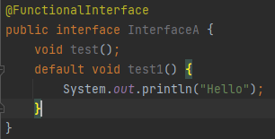

# Stream流

## 1、常用操作

### 1.1、创建流

#### 1.1.1、单列集合

```java
List<Author> authors = getAuthors();
Stream<Author> stream = authors.stream();
```

#### 1.1.2、数组

```java
Integer[] arr = {1, 2, 3, 4, 5,};
Stream<Integer> stream1 = Arrays.stream(arr);
Stream<Integer> Stream2 = Stream.of(arr);
```

#### 1.1.3、双列集合

转换成单列集合后才能创建Stream对象：

```java
Map<String, Integer> map = new HashMap<>();
map.put("A", 1);
map.put("B", 2);
map.put("C", 3);
Stream<Map.Entry<String, Integer>> stream3 = map.entrySet().stream();
```

### 1.2、中间操作

#### 1.2.1、filter

打印所有姓名长度大于1的作家的姓名：

```java
List<Author> authors = getAuthors();
authors.stream()
        .filter(x -> x.getName().length() > 1)
        .forEach(System.out::println);
```

#### 1.2.2、map

可对流中的元素进行计算或转换，提取你想要的数据（可看作重新装配或构造）。

第一个参数必须与流中成员同类型，第二个参数则是想提取的目标数据的类型。

```java
List<Author> authors = getAuthors();
authors.stream()
        .map(new Function<Author, Object>() {
            @Override
            public Object apply(Author author) {
                return null;
            }
        }).forEach(System.out::println);
```

打印所有作家的姓名：

```java
List<Author> authors = getAuthors();
authors.stream()
        .map(x -> x.getName())
        .forEach(System.out::println);
```

#### 1.2.3、distinct

distinct方法是依赖Object的equals方法来判断是否是相同对象的，所以需要注意重写equals方法。

```java
@Data
@NoArgsConstructor
@AllArgsConstructor
@EqualsAndHashCode//用于后期的去重使用
public class Author implements Comparable {
	// ...
}
```

打印所有作家的姓名，并且要求其中不能有重复元素：

```java
List<Author> authors = getAuthors();
authors.stream()
        .distinct()
        .forEach(x-> System.out.println(x.getName()));
```

#### 1.2.4、sorted

如果调用空参的`sorted()`方法，需要流中的元素是实现了`Comparable`接口，重写过排序规则。

```java
@Data
@NoArgsConstructor
@AllArgsConstructor
@EqualsAndHashCode//用于后期的去重使用
public class Author implements Comparable {
    // ...
    @Override
    public int compareTo(Object o) {
        int age = 0;
        if(o instanceof Author){
            Author author = (Author)o;
            age = author.getAge();
        }
        return age -this.age;
    }
}
```

对流中的元素按照年龄进行降序排序，并且要求不能有重复的元素：

```java
List<Author> authors = getAuthors();
authors.stream()
        .distinct()
        .sorted((o1, o2) -> o2.getAge() - o1.getAge())
        .forEach(System.out::println);
```

#### 1.2.5、limit

可以设置流的最大长度，超过的部分将被抛弃。

对流中的元素按照年龄进行降序排序，并且要求不能有重复的元素，然后打印其中年龄最大的两个作家的姓名：

```java
List<Author> authors = getAuthors();
authors.stream()
        .distinct()
        .sorted((o1, o2) -> o2.getAge() - o1.getAge())
        .limit(2)
        .forEach(x -> System.out.println(x.getName()));
```

#### 1.2.6、skip

跳过流中的前n个元素，返回剩下的元素。

打印除了年龄最大的作家外的其他作家，要求不能有重复元素，并且按照年龄降序排序：

```java
List<Author> authors = getAuthors();
authors.stream()
        .distinct()
        .sorted((o1, o2) -> o2.getAge() - o1.getAge())
        .skip(1l)
        .forEach(System.out::println);
```

#### 1.2.7、flatMap

map只能把一个对象转换成另一个对象来作为流中的元素。

```java
List<Author> authors = getAuthors();
authors.stream()
        .map(new Function<Author, List<Book>>() {
            @Override
            public List<Book> apply(Author author) {
                return author.getBooks();
            }
        })
        .forEach(System.out::println);
```


而flatMap可以把一个对象转换成多个对象作为流中的元素。

注意：使用flatMap的时候需要返回一个Stream类型的数据。

```java
List<Author> authors = getAuthors();
authors.stream()
        .flatMap(x -> x.getBooks().stream())
        .forEach(System.out::println);
```


打印所有书籍的名字，要求对重复的元素进行去重：

```java
List<Author> authors = getAuthors();
authors.stream()
        .flatMap(x -> x.getBooks().stream())
        .distinct()
        .forEach(x -> System.out.println(x.getName()));
```

打印所有书籍的所有分类，要求对分类进行去重。不能出现这种格式：“哲学,爱请”：

```java
List<Author> authors = getAuthors();
authors.stream()
        .flatMap(x -> x.getBooks().stream())
        .flatMap(x -> Arrays.stream(x.getCategory().split(",")))
        .distinct()
        .forEach(System.out::println);
```

#### 1.2.8、peek

调试用，可消费元素。

### 1.3、终结操作

#### 1.3.1、forEach

略

#### 1.3.2、count

获取当前流中元素的个数。

打印这些作家的所出书籍的数目，注意删除重复元素：

```java
List<Author> authors = getAuthors();
long count = authors.stream()
        .flatMap(x -> x.getBooks().stream())
        .distinct()
        .count();
System.out.println(count);
```

#### 1.3.3、max

分别获取这些作家的所出书籍的最高分和最低分并打印：

```java
List<Author> authors = getAuthors();
Optional<Integer> max = authors.stream()
        .flatMap(x -> x.getBooks().stream())
        .map(x -> x.getScore())
        .max((x1, x2) -> x1 - x2);
System.out.println(max.get());
```

#### 1.3.4、min

与max同理。

#### 1.3.5、collect

把当前流转换成一个集合。

获取一个存放所有作者名字的List集合：

```java
List<Author> authors = getAuthors();
List<String> list = authors.stream()
        .map(x -> x.getName())
        .collect(Collectors.toList());
System.out.println(list);
```

获取一个所有书名的Set集合：

```java
List<Author> authors = getAuthors();
Set<String> set = authors.stream()
        .flatMap(x -> x.getBooks().stream())
        .map(x -> x.getName())
        .collect(Collectors.toSet());
System.out.println(set);
```

获取一个Map集合，Map的key为作者名，value为书籍集合：

```java
List<Author> authors = getAuthors();
Map<String, Object> map = authors.stream()
        .distinct()
        .collect(Collectors.toMap(new Function<Author, String>() {
            @Override
            public String apply(Author author) {
                return author.getName();
            }
        }, new Function<Author, Object>() {
            @Override
            public List<Book> apply(Author author) {
                return author.getBooks();
            }
        }));
System.out.println(map);
```

#### 1.3.6、查找与匹配

##### 1.3.6.1、anyMatch

可以用来判断是否有任意符合匹配条件的元素，结果为布尔型。

判断是否有年龄在29以上的作家：

```java
List<Author> authors = getAuthors();
boolean match = authors.stream()
        .anyMatch(new Predicate<Author>() {
            @Override
            public boolean test(Author author) {
                return author.getAge() > 29;
            }
        });
System.out.println(match == true ? "有" : "没有");
```

##### 1.3.6.2、allMatch

可以判断流中的元素是否都不符合匹配条件，结果为布尔型。

判断作家是否都没有超过100岁：

```java
List<Author> authors = getAuthors();
boolean match = authors.stream()
        .allMatch(author -> author.getAge() < 100);
System.out.println(match == true ? "都小于100岁" : "有大于100岁的");
```

##### 1.3.6.3、findAny

获取流中的任意一个元素。该方法没有办法保证获取的一定是流中的第一个元素。

获取任意一个年龄大于18的作家，如果存在就输出他的名字：

```java
List<Author> authors = getAuthors();
Optional<Author> any = authors.stream()
        .filter(x -> x.getAge() > 18)
        .findAny();
any.ifPresent(x -> System.out.println(x.getName()));
```

##### 1.3.6.4、findFirst

获取流中第一个元素。

获取一个年龄最小的作家，并输出他的名字：

```java
List<Author> authors = getAuthors();
Optional<Author> first = authors.stream()
        .sorted((o1, o2) -> o1.getAge() - o2.getAge())
        .findFirst();
System.out.println(first.get());
```

#### 1.3.7、reduce

归并 or 缩减 操作。

reduce的作用是把stream中的元素给组合起来。我们可以传入一个初始值，它会按照我们的计算方式依次拿流中的元素和初始值进行计算，计算结果再和后面的元素计算。

reduce中具有3个重载方法，适用于不同场景，第三个方法比较复杂，适合在并行流中使用。


求所有作者年龄的和：

```java
List<Author> authors = getAuthors();
Integer result = authors.stream()
        .map(Author::getAge)
	    // .reduce(0, (result1, element) -> result1 + element);
        .reduce(0, new BinaryOperator<Integer>() {
            @Override
            public Integer apply(Integer result, Integer element) {
                return result + element;
            }
        });
System.out.println(result);
```

求所有作者中年龄的最大值：

```java
List<Author> authors = getAuthors();
Optional<Integer> max = authors.stream()
        .map(Author::getAge)
        // .reduce((result, element) -> result < element ? element : result);
        .reduce(new BinaryOperator<Integer>() {
            @Override
            public Integer apply(Integer result, Integer element) {
                return result < element ? element : result;
            }
        });
max.ifPresent(System.out::println);
```

## 2、注意事项

- 惰性求值（如果没有终结操作，没有中间操作是不会得到执行的）；

- 流是一次性的（一旦一个流对象经过一个终结操作后，这个流就不能再被使用）；

- 不会影响数据（我们在流中可以对数据做很多处理，但是正常情况下是不会影响原来集合中的元素的，这也是我们期望的）；

  - 不改变原数据：

    ```java
    List<Author> authors = getAuthors();
    authors.stream()
            .map(x->x.getAge())
            .map(age->age+10)
            .forEach(System.out::println);
    ```

  - 以下就会改变原数据了：

    ```java
    List<Author> authors = getAuthors();
    authors.stream()
            .map(new Function<Author, Author>() {
                @Override
                public Author apply(Author author) {
                    author.setAge(author.getAge() + 10);
                    return author;
                }
            }).forEach(System.out::println);
    ```

# Optional

## 1、概述

我们在编写代码的时候出现最多的就是空指针异常。所以在很多情况下我们需要做各种非空的判断。

过多的非空判断会让我们的代码显得臃肿不堪，所以在JDK8中引入了Optional。

养成使用Optional的习惯后你可以写出更优雅的代码来避免空指针异常。

并且在很多函数式编程相关的API中也都用到了Optional。

Optional就好像是包装类，可以把我们的具体数据封装到Optional对象内部，然后我们去使用Optional中封装好的方法操作封装进去的数据就可以非常优雅的避免空指针异常。

## 2、使用

### 2.1、创建对象

#### 2.1.1、Optional.ofNullable(x)

一般使用这种ofNullable来把数据封装成一个Optional对象，无论传入的参数是否为null都不会出现问题。

在实际开发中，很多数据都是从数据库获取的。而且MyBatis从3.5版本开始支持Optional，可以直接把Dao方法的返回值类型定义成Optional类型，MyBatis会自己把数据封装成Optional对象返回，封装的过程也不需要我们自己操作。

```java
Author author = getAuthor();
Optional<Author> authorOptional = Optional.ofNullable(author);
```

ofNullable的底层实现：

```java
public static <T> Optional<T> ofNullable(T value) {
    return value == null ? empty() : of(value);
}

public static<T> Optional<T> empty() {
    @SuppressWarnings("unchecked")
    Optional<T> t = (Optional<T>) EMPTY;
    return t;
}

private static final Optional<?> EMPTY = new Optional<>();

private Optional() {
    this.value = null;
}
```

#### 2.1.2、Optional.of(x)

如果确定一个对象不为空则可以使用of来把数据封装成Optional对象，但是如果传入的参数为null，则会出现空指针异常。

```java
Optional<Author> authorOptional = Optional.of(null);
```

```bash
Exception in thread "main" java.lang.NullPointerException
	at java.util.Objects.requireNonNull(Objects.java:203)
	at java.util.Optional.<init>(Optional.java:96)
	at java.util.Optional.of(Optional.java:108)
	at org.yeahicode.StreamNewDemo.test25(StreamNewDemo.java:47)
	at org.yeahicode.StreamNewDemo.main(StreamNewDemo.java:40)
```

#### 2.1.3、Optional.empty()

将null包装成Optional对象。

```java
Optional<Object> empty = Optional.empty();
```

底层实现：

```java
public static<T> Optional<T> empty() {
    @SuppressWarnings("unchecked")
    Optional<T> t = (Optional<T>) EMPTY;
    return t;
}

private static final Optional<?> EMPTY = new Optional<>();

private Optional() {
    this.value = null;
}
```

### 2.2、安全消费值 - ifPresent

```java
Author author = getAuthor();
Optional<Author> authorOptional = Optional.ofNullable(author);
// 当封装的数据不为空时才执行ifPresent中的代码
authorOptional.ifPresent(System.out::println);
```

### 2.3、不安全获取值 - get

当Optional内部的数据为空的时候，通过get获取值会出现异常：

```java
authorOptional.get();
```

```bash
Exception in thread "main" java.util.NoSuchElementException: No value present
	at java.util.Optional.get(Optional.java:135)
	at org.yeahicode.StreamNewDemo.test25(StreamNewDemo.java:49)
	at org.yeahicode.StreamNewDemo.main(StreamNewDemo.java:40)
```

### 2.4、安全获取值

#### 2.4.1、orElseGet


存在值则直接返回，不存在则返回orElseGet中特别设置的默认值（可返回子类）：

```java
// Author author1 = authorOptional.orElseGet(() -> new Author());
Author author1 = authorOptional.orElseGet(new Supplier<Author>() {
    @Override
    public Author get() {
        return new Author();
    }
});
```

#### 2.4.2、orElseThrow

存在值则直接返回，不存在则可根据你传入的参数来抛异常：

```java
// Author author1 = authorOptional.orElseThrow((Supplier<Throwable>) () -> new RuntimeException("error"));
Author author1 = authorOptional.orElseThrow(new Supplier<Throwable>() {
    @Override
    public Throwable get() {
        return new RuntimeException("error");
    }
});
```

### 2.5、过滤 - filter

如果原本有数据，则返回原Optional对象，如果不符合过滤条件，则返回一个无数据的Optional对象：

```
Optional<Author> author = Optional.ofNullable(getAuthor());
Optional<Author> authorOptional = author.filter(author1 -> author1.getAge() > 88);
System.out.println(authorOptional.orElse(new Author()));
```

### 2.6、判断 - isPresent

判断Optional对象是否存在数据，只是返回true或false，更推荐ifPresent。

### 2.7、数据转换 - map

和Stream流中的用法一致，可对数据进行计算和转换：

```java
Author author = getAuthor();
Optional<Author> author1 = Optional.ofNullable(author);
Optional<List<Book>> books = author1.map(author2 -> author2.getBooks());
books.ifPresent(x-> System.out.println(books));
```

# 函数式接口

## 1、概述

只有一个抽象方法的接口我们称之为函数接口。

JDK的函数式接口都加上了`@FunctionInterface`注解进行标识。但是无论是否加上该注解，只要接口中只有一个抽象方法，都是函数式接口。

若`@FunctionInterface`下的接口存在两个抽象方法，则报错：


可使用新特性，将其中一个方法设置成接口中的默认方法：



## 2、常见函数式接口

### 2.1、Consumer消费接口

只消费参数，不返回：


### 2.2、Function计算转换接口

消费参数，并返回：


### 2.3、Predicate判断接口

消费参数，并判断：


### 2.4、Supplier生产型接口

不消费，并生产返回值：


## 3、常用的默认方法

### 3.1、Predicate - and

打印作家中年龄大于17并且姓名的长度大于1的作家：

```java
List<Author> authors = getAuthors();
authors.stream()
        .filter(
                new Predicate<Author>() {
                    @Override
                    public boolean test(Author author) {
                        return author.getAge() > 17;
                    }
                }.and(new Predicate<Author>() {
                    @Override
                    public boolean test(Author author) {
                        return author.getName().length() > 1;
                    }
                })
        ).forEach(System.out::println);
```

```java
List<Author> authors = getAuthors();
authors.stream()
        .filter(
                ((Predicate<Author>) author -> author.getAge() > 17).and(author -> author.getName().length() > 1)
        ).forEach(System.out::println);
```

### 3.2、Predicate - or

打印作家中年龄大于17或者姓名的长度小于2的作家：

```java
List<Author> authors = getAuthors();
authors.stream()
        .filter(
                ((Predicate<Author>) author -> author.getAge() > 17).or(author -> author.getName().length() < 2)
        ).forEach(System.out::println);
```

### 3.3、Predicate - negate

打印作家中年龄不大于17的作家：

```java
List<Author> authors = getAuthors();
authors.stream()
        .filter(
                ((Predicate<Author>) author -> author.getAge() > 17).negate()
        ).forEach(System.out::println);
```

# 方法引用

## 1、引用类的静态方法

```java
List<Author> authors = getAuthors();
authors.stream().map(x -> x.getAge()).map(age -> String.valueOf(age)).forEach(System.out::println);
```

```java
List<Author> authors = getAuthors();
authors.stream().map(x -> x.getAge()).map(String::valueOf).forEach(System.out::println);
```

## 2、引用对象的实例方法

```java
List<Author> authors = getAuthors();
StringBuilder sb = new StringBuilder();
authors.stream().map(x -> x.getName()).forEach(name -> sb.append(name));
```

```java
List<Author> authors = getAuthors();
StringBuilder sb = new StringBuilder();
authors.stream().map(x -> x.getName()).forEach(sb::append);
```

## 3、引用类的实例方法

```java
interface UseString{
    String use(String str,int start,int length);
}

public static String subAuthorName(String str, UseString useString){
    int start = 0;
    int length = 1;
    return useString.use(str,start,length);
}

public static void main(String[] args) {
    subAuthorName("方法引用", new UseString() {
        @Override
        public String use(String str, int start, int length) {
            return str.substring(start,length);
        }
    });
}
```

```java
public static void main(String[] args) {
    subAuthorName("方法引用", String::substring);
}
```

## 4、构造器引用

```java
List<Author> authors = getAuthors();
authors.stream()
        .map(author -> author.getName())
        .map(name -> new StringBuilder(name))
        .map(sb -> sb.append("-Hello").toString())
        .forEach(str -> System.out.println(str));
```

# 高级用法

## 1、基本数据类型优化

之前用到的很多Stream方法由于都使用了泛型，所以涉及到的参数和返回值都是引用数据类型。

即使操作的是整数小数，但是实际用的都是他们的包装类。JDK5中引入的自动装箱和自动拆箱让我们在使用对应的包装类时就好像使用基本数据类型一样方便。但是装箱和拆箱肯定是要消耗时间，特别是在数据量大的情况下不断的装箱拆箱，就会有特别大的损耗了。

```java
List<Author> authors = getAuthors();
authors.stream()
        .map(new Function<Author, Integer>() {
            @Override
            public Integer apply(Author author) {
                return author.getAge();
            }
        })
        // 此时转换成了Integer
        .map(new Function<Integer, Integer>() {
            @Override
            public Integer apply(Integer age) {
                // 先拆箱，后装箱
                return age + 10;
            }
        })
        .filter(new Predicate<Integer>() {
            @Override
            public boolean test(Integer age) {
                // 这里又拆箱
                return age > 18;
            }
        })
        .map(new Function<Integer, Integer>() {
            @Override
            public Integer apply(Integer age) {
                // 先拆箱，后装箱
                return age + 2;
            }
        })
        .forEach(System.out::println);
```

为了对这部分消耗时间进行优化，Stream还提供了很多专门针对基本数据类型的方法。

例如：mapToInt，mapToLong，mapToDouble，flatMapToInt，flatMapToDouble等等。

```java
List<Author> authors = getAuthors();
authors.stream()
        // 将流中的数据类型转换成基本数据类型
        .mapToInt(author -> author.getAge())
        // 此后的流操作就统一使用基本数据，避免拆箱装箱产生的损耗
        .map(age -> age + 10)
        .filter(age -> age > 18)
        .map(age -> age + 2)
        .forEach(System.out::println);
```

## 2、并行流

### 2.1、概述

之前使用的都是串行流，在数据量不大的情况下，串行流和并行流区别不大，甚至在某些情况下，并行还要花费更多的时间（线程的上下文切换需要消耗时间）。

```java
Stream<Integer> integerStream = Stream.of(1, 2, 3, 4, 5, 6, 7, 8, 9);
System.out.println(
        integerStream.peek(new Consumer<Integer>() {
            @Override
            public void accept(Integer integer) {
                System.out.println(String.format("%s >>> %s", String.valueOf(integer), Thread.currentThread().getName()));
            }
        }).reduce((result, ele) -> result + ele).get());
```

使用串行流的情况下，打印结果显示都在同一个线程中操作：

```bash
1 >>> main
2 >>> main
3 >>> main
4 >>> main
5 >>> main
6 >>> main
7 >>> main
8 >>> main
9 >>> main
45
```

当流中有大量元素时，可以使用并行流去提高操作的效率。其实并行流就是把任务分配给多个线程去完成。如果我们自己去用代码实现的话会非常的复杂，并且需要对并发编程有足够的理解和认识。而如果使用Stream的话，我们只需要使用一个API，就能将串行流转换成并行流来帮我们实现，从而提高效率。

### 2.2、创建并行流

#### 2.2.1、创建 stream.parallel()

```java
Stream<Integer> integerStream = Stream.of(1, 2, 3, 4, 5, 6, 7, 8, 9);
System.out.println(
        integerStream.parallel().peek(new Consumer<Integer>() {
            @Override
            public void accept(Integer integer) {
                System.out.println(String.format("%s >>> %s", String.valueOf(integer), Thread.currentThread().getName()));
            }
        }).reduce((result, ele) -> result + ele).get());
```

```bash
2 >>> ForkJoinPool.commonPool-worker-6
9 >>> ForkJoinPool.commonPool-worker-13
4 >>> ForkJoinPool.commonPool-worker-15
1 >>> ForkJoinPool.commonPool-worker-8
3 >>> ForkJoinPool.commonPool-worker-9
7 >>> ForkJoinPool.commonPool-worker-4
5 >>> ForkJoinPool.commonPool-worker-11
6 >>> main
8 >>> ForkJoinPool.commonPool-worker-2
45
```

#### 2.2.2、集合.parallelStream()

```java
List<Author> authors = getAuthors();
authors.parallelStream()
        .peek(new Consumer<Author>() {
            @Override
            public void accept(Author author) {
                System.out.println(Thread.currentThread().getName() + " >>> " + author);
            }
        }).forEach(System.out::println);
```
