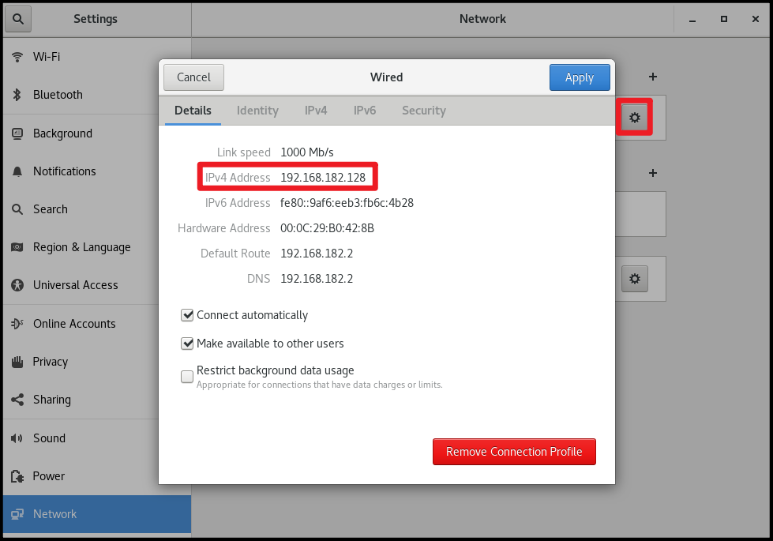
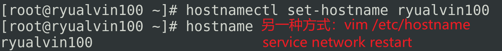

# 1、下载&创建虚拟机

# 2、安装CentOS

# 3、网络设置

## 3.1、网络连接模式

### 3.1.1、桥接模式

虚拟机直接连接外部物理网络的模式，主机起到了网桥的作用。这种模式下，虚拟机可以直接访问外部网络，并且对外部网络是可见的。（不安全，不推荐）

### 3.1.2、仅主机模式

虚拟机只与主机共享一个专用网络，与外部网络无法通信。

### 3.1.3、NAT模式

Network Address Transition。虚拟机和主机构建一个专用网络，并通过虚拟网络地址转换（NAT）设备对IP进行转换。虚拟机通过共享主机IP可以访问外部网络，但外部网络无法访问虚拟机。(简单说，也就是通过VMnet8构建了一个虚拟子网)

## 3.2、设置静态IP

## 3.3、设置主机名

# 4、克隆（创建完整克隆）

https://blog.csdn.net/u013916029/article/details/126557005

http://t.zoukankan.com/snhk-p-10850061.html

